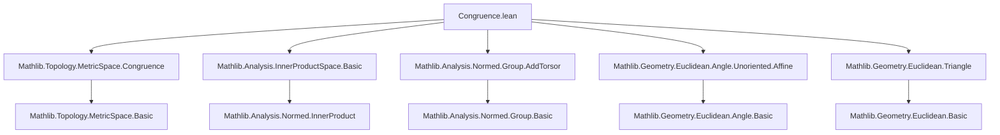
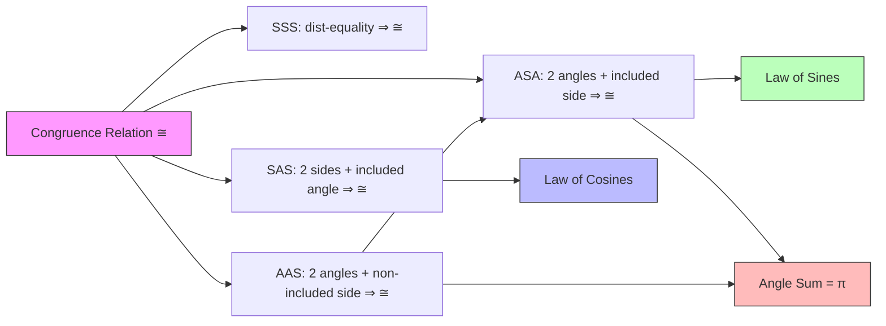

**Technical Brief: Triangle Congruence in Euclidean Geometry (Lean 4)**  
*Based on `Congruence.lean` (Mathlib)*

---

### 1. **Key Definitions & Theorems**

| Name | Type / Signature | Purpose |
|------|------------------|---------|
| `triangle_congruent_iff_dist_eq` | `t₁ ≅ t₂ ↔ ∀ i j, dist (t₁ i) (t₁ j) = dist (t₂ i) (t₂ j)` | Characterizes triangle congruence via pairwise distances (for triangles indexed by `Fin 3`). |
| `side_side_side` (`SSS`) | `(hd₁ : dist a b = dist a' b') → (hd₂ : dist b c = dist b' c') → (hd₃ : dist c a = dist c' a') → ![a, b, c] ≅ ![a', b', c']` | Proves congruence from equality of all three side lengths; handles degenerate cases. |
| `side_angle_side` (`SAS`) | `(h : ∠ a b c = ∠ a' b' c') → (hd₁ : dist a b = dist a' b') → (hd₂ : dist b c = dist b' c') → ![a, b, c] ≅ ![a', b', c']` | Proves congruence from two sides and included angle; uses Law of Cosines. |
| `angle_side_angle` (`ASA`) | `(h : ¬Collinear ℝ {a, b, c}) → (ha₁ : ∠ a b c = ∠ a' b' c') → (hd : dist b c = dist b' c') → (ha₂ : ∠ b c a = ∠ b' c' a') → ![a, b, c] ≅ ![a', b', c']` | Proves congruence from two angles and included side; reduces to SAS via Law of Sines. Requires non-degeneracy of one triangle. |
| `angle_angle_side` (`AAS`) | `(h : ¬Collinear ℝ {a, b, c}) → (ha₁ : ∠ a b c = ∠ a' b' c') → (ha₂ : ∠ b c a = ∠ b' c' a') → (hd : dist c a = dist c' a') → ![a, b, c] ≅ ![a', b', c']` | Proves congruence from two angles and a non-included side; uses angle sum = π to reduce to ASA. |
| `angle_eq_of_congruent` | `v₁ ≅ v₂ → ∠ (v₁ i) (v₁ j) (v₁ k) = ∠ (v₂ i) (v₂ j) (v₂ k)` | Shows that congruent triangles have equal corresponding angles. |

---

### 2. **Naming Conventions**

- **Prefixes**:  
  - `side_`, `angle_`, `dist_`, `collinear_`, `angle_add_angle_add_angle_`, `dist_eq_dist_mul_sin_angle_div_sin_angle`  
  - `congruent_`, `law_cos`, `law_sin` (implicit via usage)
- **Suffixes**:  
  - `_eq` (equality statements), `_iff` (biconditionals), `_cong` (congruence), `_angle` (angle-related), `_dist` (distance-related)
- **Pattern**: `modus` + `condition` + `_cong` or `modus_condition` (e.g., `side_angle_side`, `angle_side_angle`)

---

### 3. **Tactic Stack**

| Tactic | Frequency | Role |
|--------|-----------|------|
| `rw` | High | Rewriting definitions (`triangle_congruent_iff_dist_eq`, `dist_comm`, `angle_comm`, etc.) |
| `simp` / `simp_rw` | High | Simplifying using lemmas about `dist`, `angle`, `vsub`, `norm`, inner product |
| `fin_cases` | Medium | Case analysis on `Fin 3` indices |
| `apply` | Medium | Applying known congruence theorems (e.g., `side_side_side`, `angle_side_angle`) |
| `have` / `have h' : ...` | High | Introducing intermediate facts (e.g., non-collinearity of primed triangle) |
| `grind` | Medium | Automated reasoning for collinearity/non-collinearity (e.g., `collinear_iff_eq_or_eq_or_angle_eq_zero_or_angle_eq_pi`) |
| `exact` | Medium | Finishing proofs with direct application |
| `add_right_cancel_iff`, `pow_two`, `sq_eq_sq₀` | Low | Algebraic simplifications (especially in SAS proof) |

---

### 4. **Proof Logic**

- **SSS**: Directly applies `triangle_congruent_iff_dist_eq`, then case splits on `i, j : Fin 3` and simplifies using symmetry of `dist`.
- **SAS**: Reduces to SSS by proving third side equality via Law of Cosines:  
  $$
  \|a - c\|^2 = \|a - b\|^2 + \|b - c\|^2 - 2\|a - b\|\|b - c\|\cos(\angle a b c)
  $$
  Equality of two sides and included angle implies equality of third side.
- **ASA**:  
  1. Derives non-collinearity of primed triangle from unprimed.  
  2. Uses angle sum = π to deduce third angle equality.  
  3. Proves equality of second side via Law of Sines:  
     $$
     \frac{\|a - b\|}{\sin(\angle b c a)} = \frac{\|b - c\|}{\sin(\angle c a b)} = \frac{\|c - a\|}{\sin(\angle a b c)}
     $$
  4. Applies SAS.
- **AAS**:  
  1. Uses angle sum = π to deduce third angle equality.  
  2. Applies ASA to a permuted triangle (e.g., swapping vertices to make the known side included).  
  3. Uses `angle_side_angle` twice (on permuted triangles) to conclude.

---

### 5. **Imports & Dependencies**

| Module | Role |
|--------|------|
| `Mathlib.Topology.MetricSpace.Congruence` | Defines `Congruent` (`≅`) and basic properties (e.g., `congruent_iff_dist_eq`) |
| `Mathlib.Analysis.InnerProductSpace.Basic` | Provides inner product space structure, norm, distance, `vsub`, `angle` definition |
| `Mathlib.Analysis.Normed.Group.AddTorsor` | Enables affine space (`P`) over vector space (`V`) via `NormedAddTorsor` |
| `Mathlib.Geometry.Euclidean.Angle.Unoriented.Affine` | Defines unoriented angles in affine Euclidean geometry (`∠ a b c`) |
| `Mathlib.Geometry.Euclidean.Triangle` | Provides triangle-specific lemmas: angle sum = π, Law of Cosines, Law of Sines, collinearity criteria |

---

### 6. **Mermaid Diagrams**

#### **Dependency Graph (Module-Level)**

#### **Overview of Theoretical Flow**

---

### 7. **Key Mathematical Identities Used**

- **Law of Cosines**:  
  $$
  \|a - c\|^2 = \|a - b\|^2 + \|b - c\|^2 - 2\|a - b\|\|b - c\|\cos(\angle a b c)
  $$
- **Law of Sines** (non-degenerate case):  
  $$
  \frac{\|a - b\|}{\sin(\angle b c a)} = \frac{\|b - c\|}{\sin(\angle c a b)} = \frac{\|c - a\|}{\sin(\angle a b c)}
  $$
- **Angle Sum**:  
  $$
  \angle a b c + \angle b c a + \angle c a b = \pi \quad \text{(for non-collinear } a,b,c\text{)}
  $$
- **Angle Symmetry**:  
  $\angle a b c = \angle c b a$, $\angle a b c = \angle b a c$? — *No!* Unoriented angles satisfy $\angle a b c = \angle c b a$, but not full symmetry.

---

### 8. **Notes on Formalization Quality**

- Handles **degenerate triangles** in SSS/SAS; requires **non-degeneracy** only for ASA/AAS (to apply Law of Sines and ensure angle sum = π).
- Uses `Fin 3`-indexed triangles for uniformity; `![a, b, c]` notation for `Fin 3 → P`.
- Leverages `grind` tactic for automated collinearity reasoning (based on `collinear_iff_eq_or_eq_or_angle_eq_zero_or_angle_eq_pi`).
- All proofs are constructive in the sense of Lean’s logic, but rely on classical analysis (e.g., real numbers, continuity).

--- 

*End of Technical Brief.*
