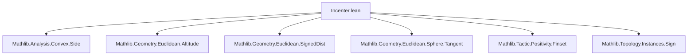
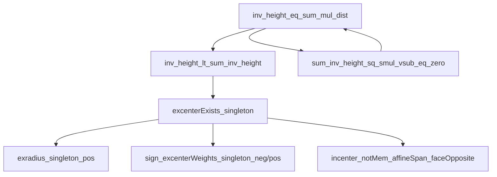

### Technical Brief: Incenter.lean — Formalization of Incenters and Excenters of Simplices

---

#### **1. Key Definitions & Theorems**

| Name | Type / Signature | Purpose |
|------|------------------|---------|
| `excenterWeightsUnnorm` | `Finset (Fin (n + 1)) → Fin (n + 1) → ℝ` | Unnormalized barycentric weights for excenters; sign depends on membership in `signs`. |
| `ExcenterExists` | `Finset (Fin (n + 1)) → Prop` | Predicate asserting existence of an excenter (i.e., nonzero sum of unnormalized weights). |
| `excenterWeights` | `Finset (Fin (n + 1)) → Fin (n + 1) → ℝ` | Normalized barycentric coordinates of the excenter (affine combination weights). |
| `exsphere` | `Finset (Fin (n + 1)) → Sphere P` | Sphere tangent to all faces of the simplex with signed distances determined by `signs`. |
| `insphere` | `Sphere P` | Special case of `exsphere ∅`, the unique insphere (always exists). |
| `excenter` | `Finset (Fin (n + 1)) → P` | Center of `exsphere signs`. |
| `incenter` | `P` | Center of `insphere`. |
| `exradius` | `Finset (Fin (n + 1)) → ℝ` | Radius of `exsphere signs`. |
| `inradius` | `ℝ` | Radius of `insphere`. |
| `touchpoint` / `touchpointWeights` | Not shown in excerpt but referenced | Point where exsphere touches a face and its barycentric coordinates. |
| `inv_height_lt_sum_inv_height` | `[Nat.AtLeastTwo n] → (s.height i)⁻¹ < ∑_{j ≠ i} (s.height j)⁻¹` | Key inequality implying existence of excenter opposite vertex `i`. |
| `excenterWeights_empty_lt_inv_two` | `[n.AtLeastTwo] → s.excenterWeights ∅ i < 2⁻¹` | Incenter lies strictly closer to face than vertex along angle bisector. |
| `ExcenterExists.excenterWeights_eq_excenterWeights_iff` | `(h₁ : s.ExcenterExists s₁) → (h₂ : s.ExcenterExists s₂) → ...` | Characterizes when two excenters coincide: iff their weight functions match, which happens iff `s₁ = s₂` or `s₁ = s₂ᶜ`. |

---

#### **2. Naming Conventions**

- **Prefixes**:
  - `excenterWeightsUnnorm`, `excenterWeights`, `exsphere`, `excenter`, `exradius`: for generalized excenters.
  - `incenter`, `inradius`, `insphere`: special cases for `signs = ∅`.
- **Suffixes**:
  - `_empty`: for incenter-related definitions (`excenterWeights_empty`, `exradius_empty`, etc.).
  - `_singleton`: for excenters opposite a single vertex (`excenterWeights_singleton`, `excenterExists_singleton`).
  - `_compl`: for complement symmetry (`excenterWeights_compl`, `exsphere_compl`, etc.).
  - `_map`, `_restrict`, `_reindex`: for invariance under affine isomorphisms, restrictions, and relabelings.
- **Predicate naming**:
  - `ExcenterExists`: capitalized predicate (not `excenter_exists`), indicating a nontrivial condition.

---

#### **3. Tactic Stack**

- **Core automation**:
  - `simp`, `simp_rw`, `ext`, `congr`, ` rfl`
- **Algebraic simplification**:
  - `ring`, `grw` (custom rewrite tactic from Mathlib), ` positivity`
- **Logic & case analysis**:
  - `by_cases`, `split_ifs`, `rcases`, `obtain`, `convert`, `apply_fun`
- **Geometry-specific reasoning**:
  - `vsub_mem_vectorSpan`, `altitudeFoot_mem_affineSpan`, `affineCombination_mem_affineSpan`
  - `inner_sum`, `inner_vsub_vsub_altitudeFoot_eq_height_sq`
- **Set-theoretic reasoning**:
  - `Finset.sum_add_sum_compl`, `Finset.filter_ne'`, `Finset.card_erase_of_mem`
- **Topological/affine geometry**:
  - `mem_affineSpan`, `interior`, `affineSpan`, `affineIndependent_iff_eq_of_fintype_affineCombination_eq`

---

#### **4. Proof Logic**

- **Inductive structure**:
  - Proofs often proceed by:
    1. Reducing to simpler cases via `simp` and symmetry (e.g., complement symmetry).
    2. Using algebraic identities (e.g., `inv_height_eq_sum_mul_inv_dist`) derived from inner product geometry.
    3. Applying positivity arguments (`positivity`, `lt_of_le_of_lt`) to deduce existence (e.g., `excenterExists_singleton`).
    4. Leveraging affine independence to prove uniqueness (`excenterWeights_eq_excenterWeights_iff`).
- **Common patterns**:
  - **Existence proofs**: Show sum of unnormalized weights ≠ 0 (e.g., via inequality `inv_height_lt_sum_inv_height`).
  - **Uniqueness**: Use affine independence of simplex vertices to equate weight functions.
  - **Symmetry**: Exploit complement symmetry (`signs ↔ signsᶜ`) to avoid duplication.
  - **Invariance**: Prove naturality under affine maps/restrictions via `map`, `restrict`, `reindex`.

---

#### **5. Imports & Dependencies**

| Module | Role |
|--------|------|
| `Mathlib.Analysis.Convex.Side` | For signed distance and side-of-hyperplane reasoning. |
| `Mathlib.Geometry.Euclidean.Altitude` | Altitude foot, height, orthogonality. |
| `Mathlib.Geometry.Euclidean.SignedDist` | Signed distance to affine subspaces. |
| `Mathlib.Geometry.Euclidean.Sphere.Tangent` | Sphere geometry, tangency conditions. |
| `Mathlib.Tactic.Positivity.Finset` | Positivity proofs over finite sums. |
| `Mathlib.Topology.Instances.Sign` | `SignType`, sign function, sign-based reasoning. |

---

#### **6. Mermaid Diagrams**

##### **Dependency Graph (Module-Level)**



##### **Conceptual Overview (Theory Flow)**

```mermaid
graph LR
  A[Simplex s] --> B[Heights h_i]
  B --> C[Unnormalized weights w̃_i = ±1/h_i]
  C --> D{Sum ≠ 0?}
  D -->|Yes| E[Excenter exists]
  D -->|No| F[No excenter]
  E --> G[Normalized weights w_i]
  G --> H[Excenter = affineCombination w]
  H --> I[Exsphere: center = H, radius = |sum w̃|⁻¹]
  I --> J[Tangency to faces]
  C --> K[Complement symmetry: w̃_signsᶜ = -w̃_signs]
  K --> L[Exsphere(signsᶜ) = Exsphere(signs)]
  C --> M[Empty set: always exists → insphere]
  M --> N[Incenter, Inradius]
```

##### **Key Logical Dependencies (Proof Structure)**



---

#### **7. Summary**

This file formalizes a **generalized theory of incircles and excircles for simplices in arbitrary dimension**, using barycentric coordinates and signed distances. It introduces:

- A uniform framework (`signs : Finset (Fin (n+1))`) to describe all excenters (including insphere as `signs = ∅`).
- Explicit formulas for weights, centers, and radii.
- Rigorous existence conditions (e.g., `excenterExists_singleton` in ≥2D).
- Symmetry properties (`signs ↔ signsᶜ`), invariance under affine maps, and geometric properties (e.g., incenter lies in interior, not in any proper face).

The formalization is highly structured, leveraging Lean’s typeclass infrastructure (`NormedAddCommGroup`, `InnerProductSpace`, `MetricSpace`, `Affine`) and extensive use of `simp`-based automation with geometric lemmas.
