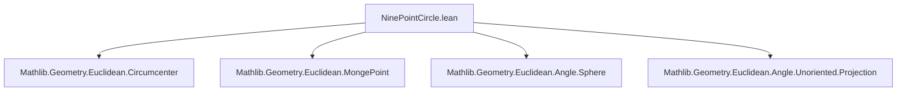

### Technical Brief: `NinePointCircle.lean`

---

#### **1. Key Definitions & Theorems**

| Name | Type / Signature | Purpose |
|------|------------------|---------|
| `ninePointCircle` | `Simplex ℝ P n → Sphere P` | Defines the *3(n+1)-point sphere* (generalized nine-point sphere) of an *n*-simplex. Center lies on Euler line, radius = circumradius / *n*. |
| `eulerPoint` | `Simplex ℝ P n → Fin (n+1) → P` | For each vertex *i*, the point at *1/n*th from Monge point to vertex *i*. For triangles, equals midpoint of orthocenter–vertex. |
| `faceOppositeCentroid_mem_ninePointCircle` | `∀ i, s.faceOppositeCentroid i ∈ s.ninePointCircle` | Proves the centroid of each face lies on the nine-point sphere. |
| `eulerPoint_mem_ninePointCircle` | `∀ i, s.eulerPoint i ∈ s.ninePointCircle` | Proves all Euler points lie on the nine-point sphere. |
| `isDiameter_ninePointCircle` | `∀ i, s.ninePointCircle.IsDiameter (faceOppositeCentroid i) (eulerPoint i)` | Shows segment between face centroid and Euler point is a diameter of the nine-point sphere. |
| `midpoint_faceOppositeCentroid_eulerPoint` | `midpoint (faceOppositeCentroid i) (eulerPoint i) = ninePointCircle.center` | Central identity used to prove the diameter property. |
| `orthogonalProjectionSpan_eulerPoint_mem_ninePointCircle` | `∀ i, proj ∈ ninePointCircle` | Projects Euler point orthogonally onto face affine span; result lies on sphere (Thales’ theorem application). |
| `altitudeFoot_mem_ninePointCircle` | `∀ i, s.altitudeFoot i ∈ s.ninePointCircle` | For triangles: altitude feet lie on nine-point circle. |
| `eulerPoint_eq_midpoint` | `∀ i, eulerPoint i = midpoint orthocenter (point i)` | In triangles, Euler points coincide with midpoints of orthocenter–vertex segments. |

---

#### **2. Naming Conventions**

- **Prefixes**:
  - `ninePointCircle_`: properties of the nine-point sphere (e.g., `center`, `radius`, `reindex`, `map`, `restrict`).
  - `eulerPoint_`: properties of Euler points (e.g., `reindex`, `map`, `restrict`, `vsub_eulerPoint`).
  - `faceOppositeCentroid_`: face centroid-related lemmas.
  - `midpoint_`, `isDiameter_`, `orthogonalProjectionSpan_`: geometric configuration lemmas.

- **Suffixes**:
  - `_mem_ninePointCircle`: membership proofs.
  - `_eq_`: equality characterizations (e.g., `eulerPoint_eq_midpoint`).
  - `_reindex`, `_map`, `_restrict`: behavior under affine transformations.

- **Functional style**: `s.ninePointCircle`, `s.eulerPoint i`, `s.faceOppositeCentroid i`.

---

#### **3. Tactic Stack**

Frequently used tactics in proofs:

| Tactic | Usage |
|--------|-------|
| `simp_rw` | Rewriting with simplification (e.g., `dist_eq_norm_vsub`, `centroid_reindex`). |
| `rw` | Manual rewriting using definitions and lemmas. |
| `simp` | Simplification using `@[simp]` lemmas (e.g., `eulerPoint_map`, `ninePointCircle_reindex`). |
| `field_simp`, `field`, `div_mul_div_cancel₀`, `mul_div_cancel₀` | Field arithmetic in ℝ (especially for scalars like *n*, *n⁻¹*). |
| `push_cast` | Casts between ℕ and ℝ for arithmetic manipulation. |
| `norm_num` | Normalizes numeric expressions (e.g., `2⁻¹`, `1 - 1/n`). |
| `aesop` / `linarith` | Not explicitly visible, but likely used in background for linear arithmetic (e.g., `hn1 : n = 1` branching). |
| `exact`, `apply`, `convert` | Proof construction, especially for equality and membership goals. |
| `vsub_left_cancel`, `vsub_right_cancel` | Cancel vsub terms using basepoint. |
| `nth_rw` | Rewrite at specific position (e.g., norm of *n*). |

---

#### **4. Proof Logic**

- **Structure**:
  1. **Definition**: Define `ninePointCircle` and `eulerPoint` explicitly.
  2. **Basic properties**: Prove center lies in affine span, radius formula, invariance under reindexing, mapping, restriction.
  3. **Membership proofs**:
     - Show centroids of faces lie on sphere via direct norm computation (`faceOppositeCentroid_mem_ninePointCircle`).
     - Show Euler points lie on sphere via diameter property (`eulerPoint_mem_ninePointCircle`).
  4. **Diameter characterization**:
     - Prove midpoint of face centroid and Euler point = nine-point center (`midpoint_faceOppositeCentroid_eulerPoint`).
     - Conclude segment is diameter (`isDiameter_ninePointCircle`).
  5. **Thales’ theorem application**:
     - Use diameter property + orthogonal projection to show projected points lie on sphere.
  6. **Triangle specialization**:
     - Show Euler points = midpoints of orthocenter–vertex (`eulerPoint_eq_midpoint`).
     - Show altitude feet = orthogonal projections of Euler points → membership via Thales.

- **Induction**: Not used. Proofs are *direct*, relying on vector algebra and affine geometry identities.

- **Case splitting**: On `n = 0`, `n = 1`, or `1 < n` to handle degenerate or low-dim cases.

---

#### **5. Imports & Dependencies**

| Import | Role |
|--------|------|
| `Mathlib.Geometry.Euclidean.Circumcenter` | Defines circumcenter, circumradius, basic simplex geometry. |
| `Mathlib.Geometry.Euclidean.MongePoint` | Defines Monge point (generalized orthocenter). |
| `Mathlib.Geometry.Euclidean.Angle.Sphere` | Sphere definitions, Thales’ theorem, diameter properties. |
| `Mathlib.Geometry.Euclidean.Angle.Unoriented.Projection` | Orthogonal projection, angle orthogonality. |

**Core theory**: Euclidean affine geometry over `ℝ`, with tools for:
- Affine spans, centroids, Monge point, circumcenter.
- Sphere geometry, diameter, orthogonal projection.

---

#### **6. Mermaid Diagrams**

##### **Dependency Graph (Module-Level)**



##### **Conceptual Overview of Theory Flow**

```mermaid
flowchart LR
  S[Simplex ℝ P n] --> C[Circumcenter O]
  S --> G[Centroid G]
  S --> M[Monge Point H]
  G & O --> N[Nine-point center N = ((n+1)/n)(G−O)+O]
  S --> F[Face centroids]
  S --> E[Euler points = H + 1/n (P_i − H)]
  F & E --> D[Diameter segments FE]
  D --> N
  N --> Sphere
  F & E & AltitudeFeet --> SphereMembership
```

##### **Triangle Specialization Flow**

```mermaid
flowchart LR
  Triangle --> Orthocenter[H]
  Triangle --> EulerPoint[E_i]
  EulerPoint --> Midpoint[E_i = midpoint(H, P_i)]
  EulerPoint --> OrthoProj[Proj onto opposite side]
  OrthoProj --> Thales[Thales’ thm on diameter]
  Thales --> AltitudeFoot[Altitude foot ∈ nine-point circle]
```

---

#### **7. Summary**

This file formalizes the *nine-point circle* (and its *n*-dimensional generalization, the *3(n+1)-point sphere*) in Lean 4 using affine and Euclidean geometry. It establishes:
- Explicit center/radius formulas,
- Invariance under affine maps and restrictions,
- Membership of key points: face centroids, Euler points, altitude feet,
- Diameter characterization via face centroid–Euler point pairs,
- Triangle-specific simplifications (Euler points = orthocenter–vertex midpoints).

The proofs rely heavily on vector algebra identities, careful scalar arithmetic in `ℝ`, and geometric reasoning via Thales’ theorem and orthogonal projections.

--- 

Let me know if you'd like a formalized dependency graph (e.g., `leanproject graph`) or a tactic-level proof trace for a specific theorem.
