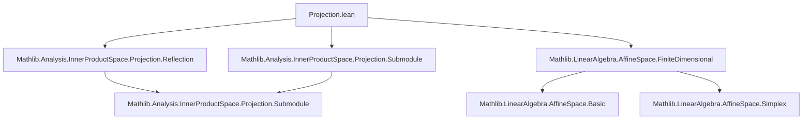

**Technical Brief: Projection.lean (Orthogonal Projection in Affine Spaces)**  
*Formalization Metadata Extracted for Domain-Specific AI Agent*

---

### 1. **Key Definitions & Theorems**

| Name | Type / Signature | Purpose |
|------|------------------|---------|
| `orthogonalProjection` | `s : AffineSubspace 𝕜 P [Nonempty s] [s.direction.HasOrthogonalProjection] → P →ᵃ[𝕜] s` | Defines the orthogonal projection of a point in affine space `P` onto a nonempty affine subspace `s`, using the linear orthogonal projection on the direction submodule. |
| `reflection` | `s : AffineSubspace 𝕜 P [Nonempty s] [s.direction.HasOrthogonalProjection] → P ≃ᵃⁱ[𝕜] P` | Defines reflection in an affine subspace as an affine isometry: `p ↦ 2·proj_s(p) - p`. |
| `orthogonalProjection_apply` | `orthogonalProjection s p = s.direction.orthogonalProjection (p -ᵥ x) +ᵥ x` (for any `x ∈ s`) | Explicit formula for the projection in terms of vector subtraction and addition. |
| `orthogonalProjection_eq_self_iff` | `↑(orthogonalProjection s p) = p ↔ p ∈ s` | Characterizes points fixed by projection as exactly those in the subspace. |
| `orthogonalProjection_mem` | `↑(orthogonalProjection s p) ∈ s` | Projection always lands in the subspace. |
| `orthogonalProjection_mem_orthogonal` | `↑(orthogonalProjection s p) ∈ mk' p s.directionᗮ` | The displacement vector `p - proj(p)` lies in the orthogonal complement. |
| `coe_orthogonalProjection_eq_iff_mem` | `proj_s(p) = q ↔ q ∈ s ∧ p -ᵥ q ∈ s.directionᗮ` | Core geometric characterization: projection is the unique point in `s` such that the displacement is orthogonal. |
| `orthogonalProjection_vsub_orthogonalProjection` | `s.direction.orthogonalProjection (p -ᵥ proj_s(p)) = 0` | The linear part annihilates the orthogonal component. |
| `dist_orthogonalProjection_eq_infDist` | `dist p (proj_s(p)) = infDist p s` | Connects orthogonal projection to metric infimum distance. |
| `reflection_apply'` | `reflection s p = (proj_s(p) -ᵥ p) +ᵥ proj_s(p)` | Reflection as point reflection across the subspace: `2·proj(p) - p`. |
| `reflection_eq_self_iff` | `reflection s p = p ↔ p ∈ s` | Fixed points of reflection are exactly points in the subspace. |
| `reflection_reflection` | `reflection s (reflection s p) = p` | Reflection is involutive. |
| `dist_eq_iff_dist_orthogonalProjection_eq` | Equidistance to points in `s` is equivalent to equidistance to their projections. | Enables reduction of symmetric distance problems to the subspace. |
| `orthogonalProjection_sup_of_orthogonalProjection_eq` | If projections onto `s₁` and `s₂` coincide, so does projection onto `s₁ ⊔ s₂`. | Useful for consistency across nested or joined subspaces. |
| `orthogonalProjection_orthogonalProjection_of_le` | If `s₁ ≤ s₂`, then `proj_{s₁} ∘ proj_{s₂} = proj_{s₁}`. | Projection is monotone under inclusion. |
| `orthogonalProjection_map` | `proj_{f(s)}(f(p)) = f(proj_s(p))` for `f : P →ᵃⁱ P₂`. | Projection commutes with affine isometries. |
| `orthogonalProjectionSpan` (in `Simplex`) | `Simplex 𝕜 P n → P →ᵃ[𝕜] affineSpan (range points)` | Projects onto the affine hull of a simplex (hyperplane). |

---

### 2. **Naming Conventions**

- **Prefixes**:
  - `orthogonalProjection_`: properties of projection.
  - `reflection_`: properties of reflection.
  - `dist_`: distance-related lemmas.
  - `mem_`: membership in subspaces or orthogonal complements.
  - `vsub_`, `vadd_`: vector subtraction/addition operations.
  - `coe_`: lemmas involving coercion `↑(·)` from subtype to ambient space.
- **Suffixes**:
  - `_apply`: evaluation form of definition.
  - `_apply'`: variant with explicit coercion to `P`.
  - `_eq_iff_`: biconditional characterizations.
  - `_of_le`, `_of_mem`, `_of_notMem`: conditional variants.
  - `_of_eq_subspace`: invariance under subspace equality.
  - `_vadd`, `_vsub`: action on vectors added/subtracted.
  - `_smul`: scalar multiplication variants.
  - `_mem_direction`, `_mem_direction_orthogonal`: membership in direction / orthogonal complement.

---

### 3. **Tactic Stack**

- **Core automation**:
  - `rfl`, `rw [·]`, `simp only [·]`, `simp_rw [·]`
  - `ext`, `subst`, `congr`
- **Algebraic simplification**:
  - `ring`, `norm_num`, `linarith`
- **Submodule/affine reasoning**:
  - `vsub_mem_direction`, `mem_mk'`, `direction_mk'`, `Submodule.*_mem_*`
  - `inner_right_of_mem_orthogonal`, `disjoint_def`, `isCompl_orthogonal`
- **Metric reasoning**:
  - `dist_eq_norm_vsub`, `norm_add_sq_eq_norm_sq_add_norm_sq_of_inner_eq_zero`
  - `infDist_le_dist_of_mem`, `le_ciInf`, `mul_self_inj_of_nonneg`
- **Proof structure**:
  - `obtain ⟨q, hq⟩ := ...`, `have h := ...`, `convert`, `exact`, `refine ?_`
  - `rw [eq_comm]`, `convert`, `symm`, `apply`, `intro`, `constructor`

---

### 4. **Proof Logic**

- **General pattern**:
  1. **Definition unfolding**: Use `orthogonalProjection_apply`, `reflection_apply'`, or `coe_orthogonalProjection_eq_iff_mem`.
  2. **Rewrite using vector arithmetic**: `vsub_vadd`, `vadd_vsub`, `sub_smul`, `add_comm`, etc.
  3. **Apply submodule orthogonality lemmas**: e.g., `inner_right_of_mem_orthogonal`, `Submodule.disjoint_def`.
  4. **Use uniqueness**: e.g., `inter_eq_singleton_orthogonalProjection`, `eq_of_vsub_eq_zero`.
  5. **Leverage metric properties**: inner product zero ⇒ Pythagorean theorem (`norm_add_sq_eq_norm_sq_add_norm_sq_of_inner_eq_zero`).
  6. **Conclude via biconditional reasoning** (`constructor`, `rw [← mul_self_inj]`, etc.).

- **Induction is not used** — proofs are mostly algebraic-geometric, relying on properties of inner product spaces and affine torsors.

---

### 5. **Imports & Dependencies**

| Import | Role |
|--------|------|
| `Mathlib.Analysis.InnerProductSpace.Projection.Reflection` | Defines linear orthogonal projection & reflection on submodules. |
| `Mathlib.Analysis.InnerProductSpace.Projection.Submodule` | Core theory of `HasOrthogonalProjection`, `orthogonalProjection`, `starProjection`. |
| `Mathlib.LinearAlgebra.AffineSpace.FiniteDimensional` | Affine geometry over `RCLike` fields, torsors, `affineSpan`, `Simplex`. |
| `MetricSpace`, `NormedAddCommGroup`, `InnerProductSpace`, `RCLike` | Analytic and algebraic structure. |

---

### 6. **Mermaid Diagrams**

#### **Dependency Graph (Module-Level)**



#### **Overview of Theory Flow**

```mermaid
flowchart LR
  Submodule[Submodule V] -->|orthogonal complement| Orthogonal[Submoduleᗮ]
  Orthogonal -->|HasOrthogonalProjection| Proj[orthogonalProjection : V → V]
  AffineSubspace[AffineSubspace P] -->|direction| Submodule
  AffineSubspace -->|nonempty| ProjAffine[orthogonalProjection : P → P]
  ProjAffine -->|2·proj - id| Reflection[reflection : P ≃ P]
  Reflection -->|involutive| Involution[reflection ∘ reflection = id]
  ProjAffine -->|dist minimizer| Metric[dist(p, proj(p)) = infDist(p, s)]
  Simplex -->|affineSpan(range)| AffineSubspace
  Simplex -->|orthogonalProjectionSpan| ProjAffine
```

---

### 7. **Domain-Specific AI Agent Guidance**

- **Key reasoning patterns**:
  - *Uniqueness via intersection*: Use `inter_eq_singleton_orthogonalProjection` to identify projection as unique intersection point.
  - *Orthogonality as kernel*: `proj(p) = q ⇔ p - q ∈ sᗮ`.
  - *Metric reduction*: Replace `dist(p, s)` with `dist(p, proj_s(p))` for algebraic manipulation.
  - *Affine invariance*: Projection and reflection commute with affine isometries (`orthogonalProjection_map`, `reflection_map`).

- **Common proof goals**:
  - Show `proj_s(p) = q` → use `coe_orthogonalProjection_eq_iff_mem`.
  - Show `proj_s(p) = p` → use `orthogonalProjection_eq_self_iff`.
  - Show `reflection_s(p) = p` → use `reflection_eq_self_iff`.
  - Show distances equal → use `dist_eq_iff_dist_orthogonalProjection_eq` or `dist_set_eq_iff_dist_orthogonalProjection_eq`.

- **Critical lemmas for automation**:
  - `orthogonalProjection_vsub_mem_direction_orthogonal`
  - `vsub_orthogonalProjection_mem_direction_orthogonal`
  - `orthogonalProjection_eq_orthogonalProjection_iff_vsub_mem`
  - `dist_sq_eq_dist_orthogonalProjection_sq_add_dist_orthogonalProjection_sq`

--- 

*End of Technical Brief.*
