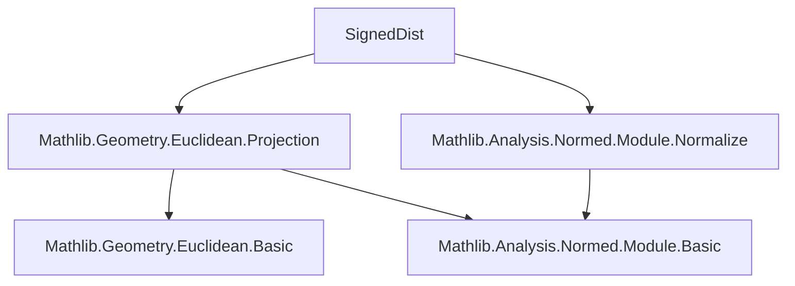

### Technical Brief: `SignedDist.lean`

---

#### **1. Key Definitions & Theorems**

| Name | Type / Signature | Purpose |
|------|------------------|---------|
| `signedDist` | `V → P →ᵃ[ℝ] P →ᴬ[ℝ] ℝ` | Computes signed distance between two points in direction of vector `v`. |
| `signedDist_apply_apply` | `signedDist v p q = ⟪normalize v, q -ᵥ p⟫` | Evaluates `signedDist` at points `p, q`. |
| `signedDist_smul` | `signedDist (r • v) p q = SignType.sign r * signedDist v p q` | Homogeneity under scalar multiplication of direction vector. |
| `signedDist_anticomm` | `-signedDist v p q = signedDist v q p` | Antisymmetry in point arguments. |
| `signedDist_triangle` | `signedDist v p q + signedDist v q r = signedDist v p r` | Additivity along a chain of points (like a linear functional). |
| `abs_signedDist_le_dist` | `|signedDist v p q| ≤ dist p q` | Bounding signed distance by Euclidean distance. |
| `abs_signedDist_eq_dist_iff_vsub_mem_span` | Equivalence with `q -ᵥ p ∈ ℝ ∙ v` | Characterizes when signed distance achieves full Euclidean distance. |
| `signedInfDist` | `AffineSubspace.signedInfDist s p : P →ᴬ[ℝ] ℝ` | Signed distance from affine subspace `s` to point, in direction of reference point `p`. |
| `signedInfDist_eq_signedDist_of_mem` | If `q ∈ s`, then `signedInfDist s p = signedDist (p -ᵥ proj s p) q` | Reduces `signedInfDist` to `signedDist` using any point in `s`. |
| `signedInfDist_apply_self` | `s.signedInfDist p p = ‖p -ᵥ proj s p‖` | Signed distance from `p` to `s` equals norm of orthogonal component. |
| `signedInfDist_apply_of_mem` | If `x ∈ s`, then `s.signedInfDist p x = 0` | Points in subspace have zero signed distance. |
| `signedInfDist` (for simplex face) | `Affine.Simplex.signedInfDist s i : P →ᴬ[ℝ] ℝ` | Signed distance from face opposite vertex `i` to a point, in direction of vertex `i`. |
| `signedInfDist_affineCombination` | Evaluates on affine combinations: `= w i * ‖…‖` | Generalizes trilinear coordinates: value proportional to barycentric weight. |
| `abs_signedInfDist_eq_dist_of_mem_affineSpan_range` | For `p` in affine span of simplex, `|signedInfDist i p| = dist p (faceOpposite i).proj p` | Relates signed distance to Euclidean distance to face. |

---

#### **2. Naming Conventions**

- **Prefixes**:
  - `signedDist_`: for basic properties of `signedDist`.
  - `signedInfDist_`: for properties of `AffineSubspace.signedInfDist`.
  - `signedInfDist_` (simplex): for `Affine.Simplex.signedInfDist`.
- **Suffixes**:
  - `_apply`, `_apply_apply`: for evaluation lemmas.
  - `_left`, `_right`: for point argument offsetting (e.g., `vadd_left`, `vadd_right`).
  - `_congr`: for congruence lemmas (e.g., `signedDist_left_congr`).
  - `_mem`, `_of_mem`: for lemmas assuming membership in subspace/simplex face.
  - `_span`, `_orthogonalProjection`: for lemmas involving projections.
- **Special**:
  - `_vsub_self`, `_vsub_self_rev`: canonical cases where direction vector is `q -ᵥ p`.
  - `_lineMap_*`: lemmas for behavior on line segments.

---

#### **3. Tactic Stack**

Frequent tactics used in proofs:

- `simp` / `simp only`: for simplifying definitions, especially inner products, normalization, and vsub.
- `rw`: rewriting using lemmas like `signedDist_apply_apply`, `dist_eq_norm_vsub'`.
- `ext`: extensionality for functions/maps (especially for `ContinuousAffineMap`/`AffineMap`).
- `by_cases h : v = 0`: case analysis on zero vector.
- `grw`: guarded rewriting (used in `abs_signedDist_le_dist`).
- `simp_rw`: for rewriting with `reindex_points`, `Set.image_*`, etc.
- `apply`, `exact`, `refine`: for structured proof construction.
- `ring`: for algebraic simplifications (e.g., in `signedDist_triangle`).
- ` positivity`: for verifying positivity in division steps.

---

#### **4. Proof Logic**

- **Structure**:
  - Definitions are built using `ContinuousAffineMap` and `innerSL` (symmetric bilinear form).
  - Most lemmas follow a pattern: expand definition → simplify inner product / vsub → apply known lemmas (`inner_add_right`, `vsub_add_vsub_cancel`, etc.).
  - For `signedInfDist`, proofs often reduce to `signedDist` lemmas via `orthogonalProjection_mem`, `vsub_mem_direction`, and `mem_affineSpan_insert_iff`.
  - For simplex case, proofs use:
    - `reindex_points` and `reindex` to handle relabeling.
    - `affineCombination` lemmas to reduce to line segment case.
    - `signedInfDist_apply_of_ne` to handle vertices not in the face.

- **Induction / recursion**: Not used directly; instead, structural reasoning via affine combinations and projections.

---

#### **5. Imports**

- `Mathlib.Geometry.Euclidean.Projection`: for `orthogonalProjection`, `orthogonalProjectionSpan`, `affineSpan`, `faceOpposite`.
- `Mathlib.Analysis.Normed.Module.Normalize`: for `normalize`, `innerSL`, `norm_normalize`.

---

#### **6. Mermaid Diagrams**

##### **Dependency Graph (Module-Level)**



##### **Overview of File Structure**

```mermaid
flowchart LR
  A[Module SignedDist] --> B[section signedDist]
  A --> C[namespace AffineSubspace]
  A --> D[namespace Affine.Simplex]

  B --> B1[Definition: signedDist]
  B --> B2[Lemmas: apply, smul, triangle, vadd, congr]
  B --> B3[Lemmas: relation to dist]

  C --> C1[Definition: signedInfDist]
  C --> C2[Lemmas: mem, apply_self, const, dist]

  D --> D1[Definition: signedInfDist (simplex)]
  D --> D2[Lemmas: reindex, apply_self, of_ne, affineCombination]
  D --> D3[Lemmas: dist on affine span]

  B -->|used in| C
  C -->|used in| D
```

##### **Theory Context**

- **Core theory**: Signed distance generalizes Euclidean distance to *directed* distance.
- **Applications**:
  - Trilinear coordinates (triangle case).
  - Quadriplanar coordinates (tetrahedron case).
  - Barycentric coordinate refinement via signed distances.
- **Related concepts**:
  - Orthogonal projection onto affine subspaces.
  - Inner product geometry over real Euclidean spaces.
  - Affine combinations and convex geometry.

--- 

Let me know if you'd like a formalized summary in Lean syntax or a dependency graph for the *entire* `Mathlib` geometry/analysis stack.
