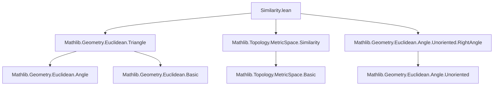
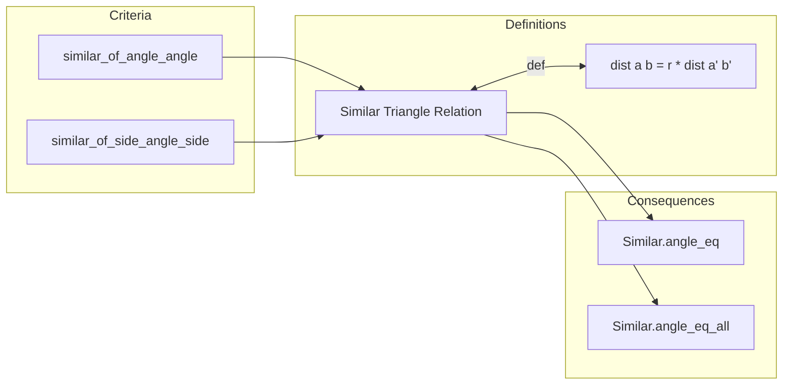

### Technical Brief: Triangle Similarity in Lean 4 (`Similarity.lean`)

---

#### **1. Key Definitions & Theorems**

| Name | Type / Signature | Purpose |
|------|------------------|---------|
| `similar_of_angle_angle` | `¬ Collinear ℝ {a, b, c} → ∠ a b c = ∠ a' b' c' → ∠ b c a = ∠ b' c' a' → ![a, b, c] ∼ ![a', b', c']` | AA similarity criterion: two equal angles imply triangle similarity. |
| `similar_of_side_angle_side` | `¬ Collinear ℝ {a, b, c} → ¬ Collinear ℝ {a', b', c'} → ∠ a b c = ∠ a' b' c' → dist a b * dist b' c' = dist b c * dist a' b' → ![a, b, c] ∼ ![a', b', c']` | SAS similarity criterion: proportional adjacent sides and equal included angle imply similarity. |
| `_root_.Similar.angle_eq` | `![a, b, c] ∼ ![a', b', c'] → ∠ a b c = ∠ a' b' c'` | Corresponding angles in similar triangles are equal. |
| `_root_.Similar.angle_eq_all` | `![a, b, c] ∼ ![a', b', c'] → ∠ a b c = ∠ a' b' c' ∧ ∠ b c a = ∠ b' c' a' ∧ ∠ c a b = ∠ c' a' b'` | All three corresponding angles in similar triangles are equal. |

> **Note**: `![a, b, c] ∼ ![a', b', c']` denotes triangle similarity (via `Similar` typeclass or predicate), defined as existence of a positive scaling factor `r` such that all pairwise distances scale by `r`.

---

#### **2. Naming Conventions**

- **Prefixes**:
  - `similar_of_`: Theorems stating sufficient conditions for similarity.
  - `_root_.Similar.`: Properties of the `Similar` relation (e.g., angle equality).
- **Suffixes**:
  - `_angle_angle`, `_side_angle_side`: Indicate which similarity criterion is used.
- **Variables**:
  - `v₁`, `v₂`: Indexed families of points (for general polygons).
  - `a b c`, `a' b' c'`: Vertices of two triangles.
- **Constants**:
  - `k`, `r`: Positive real scaling factors used in proofs.

---

#### **3. Tactic Stack**

Frequently used tactics in this file:

| Tactic | Role |
|--------|------|
| `grind` | Automated reasoning for basic algebraic/inequality goals (e.g., positivity, inequality simplification). |
| `simp` / `simp_rw` | Simplification using definitional equalities and lemmas (e.g., `dist_pos`, `angle_self_left`). |
| `field_simp` | Simplify field expressions (division, multiplication by nonzero scalars). |
| `rw` | Rewrite using equalities (e.g., law of sines/cosines, distance symmetry). |
| `apply`, `exact`, `refine` | Construct proofs by applying lemmas or constructing witnesses (e.g., `similar_of_side_side`). |
| `by_cases`, `rcases`, `fin_cases` | Case analysis and destructuring (e.g., zero/nonzero distances, index cases). |
| `law_sin`, `law_cos` | Apply Law of Sines / Cosines lemmas. |
| `mul_right_inj'`, `div_eq_div_iff`, `pow_left_inj₀` | Algebraic manipulations for proportional reasoning. |
| `Real.injOn_cos` | Injectivity of cosine on $[0, \pi]$, used to deduce angle equality from cosine equality. |

---

#### **4. Proof Logic**

- **Structure of proofs**:
  - **AA proof (`similar_of_angle_angle`)**:
    1. Show non-collinearity of primed triangle using angle equalities.
    2. Derive third angle equality via angle sum = $\pi$.
    3. Use Law of Sines on both triangles to derive proportionality of sides.
    4. Conclude similarity via `similar_of_side_side`.
  - **SAS proof (`similar_of_side_angle_side`)**:
    1. Define scaling factor $k = \frac{ab}{a'b'}$.
    2. Use given proportionality to show $bc = k \cdot b'c'$.
    3. Apply Law of Cosines to both triangles, substitute side lengths.
    4. Cancel terms using angle equality and positivity.
    5. Conclude similarity via `similar_iff_exists_pos_pairwise_dist_eq`.
  - **Angle equality from similarity (`Similar.angle_eq`)**:
    1. Unfold similarity as existence of $r > 0$ with scaled distances.
    2. Plug into Law of Cosines for both triangles.
    3. Cancel $r$ using field simplification.
    4. Use injectivity of cosine on $[0, \pi]$ to deduce angle equality.

- **Common subproof patterns**:
  - Positivity of distances from non-collinearity (`dist_pos`, `ne₁₂_of_not_collinear`).
  - Nonzero sines of angles in nondegenerate triangles (`sin_ne_zero_of_not_collinear`).
  - Symmetry of distance and angle notation (`dist_comm`, `angle_comm`).

---

#### **5. Imports & Dependencies**

| Import | Purpose |
|--------|---------|
| `Mathlib.Geometry.Euclidean.Triangle` | Triangle geometry basics (angles, distances, non-collinearity). |
| `Mathlib.Topology.MetricSpace.Similarity` | Definition of `Similar` and related predicates (e.g., `similar_iff_exists_pos_dist_eq`). |
| `Mathlib.Geometry.Euclidean.Angle.Unoriented.RightAngle` | Right angle lemmas (used in `grind`-based angle reasoning). |

> **Core dependencies**: `MetricSpace`, `InnerProductSpace ℝ`, `NormedAddTorsor` — standard Euclidean geometry infrastructure.

---

#### **6. Mermaid Diagrams**

##### **Dependency Graph (Module-Level)**



##### **Theoretical Overview (Triangle Similarity Theory)**



##### **Proof Strategy Flow (AA Case)**

```mermaid
flowchart TD
  start[Given: ∠ABC = ∠A'B'C', ∠BCA = ∠B'C'A', ¬Collinear ABC] 
  --> noncol'[¬Collinear A'B'C']
  --> angleC[∠CAB = ∠C'A'B' via angle sum]
  --> sin nonzero[sin(∠BCA), sin(∠CAB) ≠ 0]
  --> lawSin1[Law of Sines on △ABC]
  --> lawSin2[Law of Sines on △A'B'C']
  --> ratio1[ab/a'b' = bc/b'c']
  --> lawSin3[Law of Sines on △ABC again]
  --> ratio2[ab/a'b' = ac/a'c']
  --> sideSide[similar_of_side_side]
  --> end[△ABC ∼ △A'B'C']
```

---

#### **7. Summary**

This module formalizes foundational triangle similarity theory in Euclidean geometry:
- Two sufficient conditions (AA, SAS) for similarity.
- Necessary condition: similarity implies equal corresponding angles.
- Heavy reliance on trigonometric laws (Sine, Cosine) and metric properties (distance positivity, symmetry).
- Proofs are constructive and leverage Lean’s `grind` tactic for routine algebraic reasoning.

The formalization aligns with classical Euclidean geometry while maintaining rigor through metric and inner product space structures.
