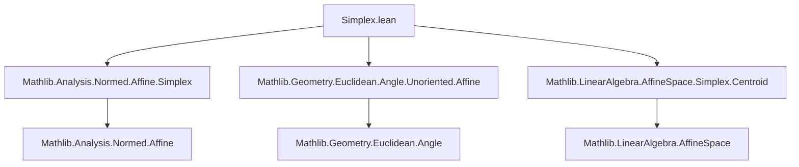
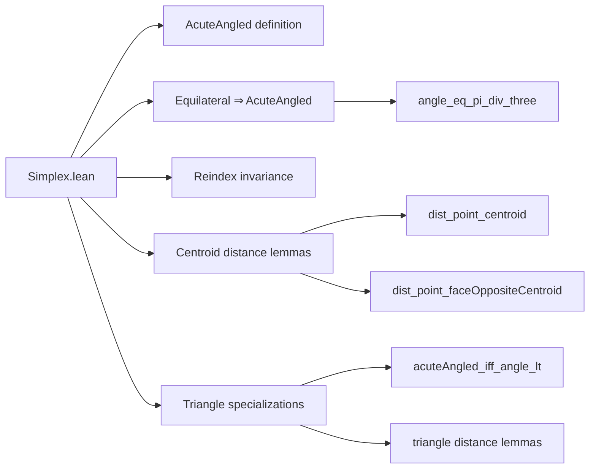

**Technical Brief: `Simplex.lean` (Lean 4)**  
*Domain: Euclidean geometry, affine simplices, angle properties, centroid relations.*

---

### 1. **Key Definitions & Theorems**

| Name | Type / Signature | Purpose |
|------|------------------|---------|
| `AcuteAngled` | `def AcuteAngled (s : Simplex ℝ P n) : Prop` | Defines that **all angles** of a simplex are strictly less than $ \pi/2 $. |
| `Equilateral.angle_eq_pi_div_three` | `lemma` | In an equilateral simplex, every angle equals $ \pi/3 $. |
| `Equilateral.acuteAngled` | `lemma` | Every equilateral simplex is acute-angled (since $ \pi/3 < \pi/2 $). |
| `acuteAngled_reindex_iff` | `lemma` | Acute-angledness is invariant under reindexing of vertices (bijection on index set). |
| `dist_point_centroid` | `lemma` | For $ n \ge 1 $, $ \operatorname{dist}(v_i, c) = n \cdot \operatorname{dist}(c, f_i) $, where $ c $ is centroid, $ f_i $ is centroid of face opposite $ v_i $. |
| `dist_point_faceOppositeCentroid` | `lemma` | For $ n \ge 1 $, $ \operatorname{dist}(v_i, f_i) = (n+1) \cdot \operatorname{dist}(c, f_i) $. |
| `Triangle.acuteAngled_iff_angle_lt` | `lemma` | For triangles ($ n=2 $), acuteness reduces to checking the three explicit angles. |
| `Triangle.dist_point_centroid`, `Triangle.dist_point_faceOppositeCentroid` | `lemmas` | Specializations of the above for $ n=2 $: distances scale by 2 and 3 respectively. |

---

### 2. **Naming Conventions**

- **Prefixes**:
  - `acuteAngled_`: properties of the `AcuteAngled` predicate.
  - `dist_point_`, `dist_point_faceOppositeCentroid`: distance relations involving vertices and special points.
  - `angle_`: angle-related lemmas (e.g., `angle_eq_pi_div_three`).
- **Suffixes**:
  - `_reindex_iff`: equivalence under reindexing.
  - `_reindex_iff` and `_reindex` used for invariance under permutation of vertices.
- **Constants**:
  - `π` (pi), `π_div_three`, `π_div_two` — standard real multiples of $ \pi $.

---

### 3. **Tactic Stack**

| Tactic | Usage Frequency | Purpose |
|--------|-----------------|---------|
| `simp_rw` | High | Rewriting with definitional equalities (e.g., `dist_eq_norm_vsub`, `norm_smul`). |
| `simp` | High | Simplifying goals using lemmas and `@[simp]`-annotated lemmas. |
| `rw` | Medium | Rewriting using specific lemmas (e.g., `angle`, `InnerProductGeometry.angle`). |
| `field` | Medium | Solving field equations (e.g., after simplifying inner products). |
| `linarith` | Medium | Linear arithmetic over real inequalities (e.g., bounding angles). |
| `fin_cases` | Medium | Case analysis on finite indices (especially in `Triangle` proofs). |
| `norm_cast` | Low | Normalizing coercions from `ℕ` to `ℝ`. |
| `convert ... using 1` | Low | Flexible unification with proof irrelevance. |

---

### 4. **Proof Logic**

- **Structure**:
  - **Equilateral ⇒ Acute**: Use exact angle value ($ \pi/3 $) and compare to $ \pi/2 $.
  - **Distance lemmas**: Reduce to vector norm identities via `dist_eq_norm_vsub`, then apply known vector identities (e.g., `point_vsub_centroid_eq_smul_vsub`), followed by `norm_smul` and simplification.
  - **Triangle acuteness equivalence**: Use symmetry (`angle_comm`) and exhaustive case analysis on indices (`fin_cases`) to reduce to three angles.
  - **Reindexing invariance**: Show both directions via substitution along `e` and `e.symm`, using `simp [*]` to discharge index inequalities.

- **Common pattern**:
  > *Rewrite → simplify → apply known vector/angle identities → conclude via linear/field arithmetic.*

---

### 5. **Imports & Dependencies**

| Module | Role |
|--------|------|
| `Mathlib.Analysis.Normed.Affine.Simplex` | Core definitions of simplices in normed affine spaces. |
| `Mathlib.Geometry.Euclidean.Angle.Unoriented.Affine` | Unoriented angles in Euclidean affine spaces (`∠`). |
| `Mathlib.LinearAlgebra.AffineSpace.Simplex.Centroid` | Centroid and face-opposite-centroid definitions. |

**Key underlying theories**:
- Normed vector spaces, inner product spaces, metric spaces.
- Affine geometry over $ \mathbb{R} $.
- Euclidean geometry (angle, distance, vsub, centroid).
- Finite index arithmetic (`Fin`, `NeZero`, `norm_cast`).

---

### 6. **Mermaid Diagrams**

#### **Dependency Graph (Module-Level)**

#### **Overview of File Structure**

---

### 7. **Summary**

This file formalizes foundational geometric properties of simplices in Euclidean spaces, with emphasis on:
- **Angle behavior** (especially acute vs. equilateral),
- **Centroid–vertex–face relations**, and
- **Invariance under relabeling**.

It leverages existing infrastructure for affine geometry and Euclidean angles, and uses standard tactics (`simp`, `rw`, `linarith`, `field`) to automate routine but critical steps. The triangle case is treated separately for clarity and convenience, with explicit indexing arguments.

--- 

*End of Technical Brief.*
