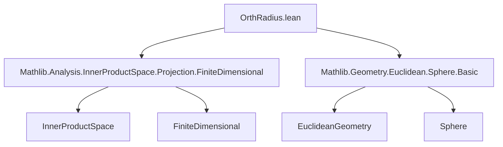

**Technical Brief: `OrthRadius.lean`**

---

### 1. **Key Definitions & Theorems**

| Name | Type / Signature | Purpose |
|------|------------------|---------|
| `orthRadius` | `Sphere P → P → AffineSubspace ℝ P` | Defines the affine subspace orthogonal to the radius vector at a point `p`, i.e., the polar of the inversion of `p` in the sphere (tangent space if `p ∈ s`). |
| `self_mem_orthRadius` | `p ∈ s.orthRadius p` | Shows that the point `p` lies in its own orthogonal radius subspace. |
| `mem_orthRadius_iff_inner_left` | `x ∈ s.orthRadius p ↔ ⟪x -ᵥ p, p -ᵥ s.center⟫ = 0` | Characterizes membership in `orthRadius` via vanishing inner product with the radius vector. |
| `mem_orthRadius_iff_inner_right` | `x ∈ s.orthRadius p ↔ ⟪p -ᵥ s.center, x -ᵥ p⟫ = 0` | Symmetric version of the above (inner product is symmetric over ℝ). |
| `direction_orthRadius` | `(s.orthRadius p).direction = (ℝ ∙ (p -ᵥ s.center))ᗮ` | Computes the direction (linear subspace) of the affine subspace. |
| `orthRadius_center` | `s.orthRadius s.center = ⊤` | The orthogonal radius at the center is the entire space. |
| `center_mem_orthRadius_iff` | `s.center ∈ s.orthRadius p ↔ p = s.center` | The center lies in `orthRadius p` only when `p` is the center. |
| `orthRadius_le_orthRadius_iff` | `s.orthRadius p ≤ s.orthRadius q ↔ p = q ∨ q = s.center` | Describes inclusion of orthogonal radius subspaces. |
| `orthRadius_eq_orthRadius_iff` | `s.orthRadius p = s.orthRadius q ↔ p = q` | Equality of orthogonal radius subspaces iff points coincide. |
| `finrank_orthRadius` | `p ≠ s.center ⇒ dim(orthRadius p) + 1 = dim(V)` | Dimension formula: orthogonal complement of a 1D subspace has codimension 1. |
| `orthRadius_map` | `f(s.center) = s.center ⇒ f(s.orthRadius p) = s.orthRadius (f p)` | Invariance under linear isometries fixing the center. |
| `direction_orthRadius_le_iff` | `(orthRadius p).direction ≤ (orthRadius q).direction ↔ ∃ r, q -ᵥ c = r • (p -ᵥ c)` | Direction inclusion iff radius vectors are colinear. |
| `orthRadius_parallel_orthRadius_iff` | `orthRadius p ∥ orthRadius q ↔ ∃ r ≠ 0, q -ᵥ c = r • (p -ᵥ c)` | Parallelism of affine subspaces iff radius vectors are scalar multiples (nonzero). |

---

### 2. **Naming Conventions**

- **Prefixes**:
  - `orthRadius_`: for definitions and lemmas about the `orthRadius` construction.
  - `mem_orthRadius_iff_`: for membership characterizations.
  - `direction_orthRadius_`: for properties of the direction subspace.
  - `center_mem_`, `center_eq_`, etc.: for center-related properties.

- **Suffixes**:
  - `_iff`: for biconditional characterizations.
  - `_le_iff`, `_eq_iff`: for inclusion/equality criteria.
  - `_map`: for behavior under maps.

- **Operators used**:
  - `p -ᵥ s.center`: radius vector from center to point.
  - `ℝ ∙ v`: span of vector `v`.
  - `ᗮ`: orthogonal complement.
  - `⟪·, ·⟫`: inner product.

---

### 3. **Tactic Stack**

- **Core tactics**:
  - `rw`, `simp`, `simp_rw`, `convert`, `rcases`, `cases`, `refine`, `nth_rw`, `grind`
- **Domain-specific**:
  - `submodule_*` lemmas (`mem_span_singleton`, `orthogonal_orthogonal`, `finrank_add_finrank_orthogonal`)
  - `vsub_*` lemmas (`vsub_ne_zero`, `vsub_left_cancel_iff`, `vsub_sub_vsub_cancel_right`)
  - `inner_*` lemmas (`inner_eq_zero_symm`, `inner_sub_left`, `real_inner_smul_left`, `inner_self_eq_zero`)
  - `mk'_nonempty`, `direction_mk'`, `map_mk'`, `map_span`

---

### 4. **Proof Logic**

- **Structure**:
  - Most proofs follow a pattern of:
    1. Unfolding definitions (`orthRadius`, `mem_mk'`, `direction_mk'`)
    2. Applying inner product properties (`inner_eq_zero_symm`, `inner_sub_left`, etc.)
    3. Using linear algebra lemmas about spans, orthogonal complements, and dimensions.
    4. Case analysis (`rcases`, `cases`) on scalar equations or equality conditions.
    5. For `orthRadius_le_orthRadius_iff`, a key step is reducing to scalar colinearity via `Submodule.orthogonal_le`.

- **Induction**: Not used directly; proofs rely on algebraic manipulation and module-theoretic properties.

- **Key reasoning patterns**:
  - Reducing affine subspace properties to linear subspace properties via `direction_*`.
  - Using `vsub` calculus to translate between points and vectors.
  - Exploiting symmetry of inner product over ℝ.

---

### 5. **Imports**

- `Mathlib.Analysis.InnerProductSpace.Projection.FiniteDimensional`: Provides finite-dimensional inner product space tools (e.g., `finrank_add_finrank_orthogonal`, `orthogonal_complement` properties).
- `Mathlib.Geometry.Euclidean.Sphere.Basic`: Defines spheres, centers, radius vectors, and basic Euclidean geometry.

---

### 6. **Mermaid Diagrams**

#### **Dependency Graph**



#### **Overview of Theory Flow**

```mermaid
flowchart LR
  Sphere[P] -->|center, radius| RadiusVector[p -ᵥ s.center]
  RadiusVector -->|span & orthogonal complement| OrthSubspace[(ℝ ∙ (p -ᵥ c))ᗮ]
  OrthSubspace -->|affine hull at p| orthRadius[s.orthRadius p]
  orthRadius -->|properties| MemChar[mem_orthRadius_iff_inner_*]
  orthRadius -->|inclusion/equality| InclEq[orthRadius_le_orthRadius_iff, orthRadius_eq_orthRadius_iff]
  orthRadius -->|dimension| FinRank[finrank_orthRadius]
  orthRadius -->|symmetry| MapInv[orthRadius_map]
```

---

### 7. **Summary**

This module formalizes the *orthogonal radius subspace* in Euclidean geometry — a central concept in inversion geometry and sphere geometry. It connects geometric intuition (tangent spaces, polars) with linear algebraic structure (orthogonal complements, spans), and provides a suite of lemmas for reasoning about inclusion, equality, dimension, and invariance under isometries. The formalization is clean, modular, and leverages Mathlib’s rich theory of inner product spaces and affine geometry.
