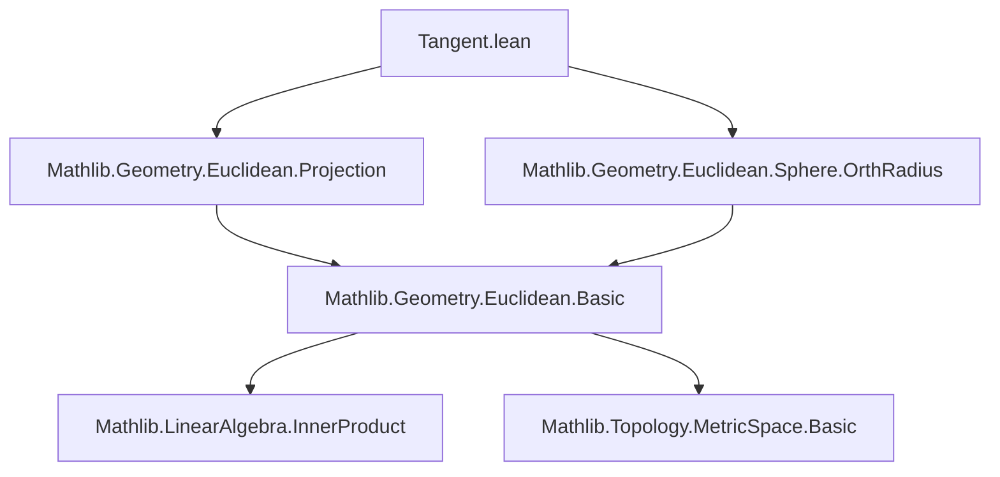

**Technical Brief: Tangent.lean — Tangency for Spheres in Euclidean Geometry**

---

### 1. KEY DEFINITIONS & THEOREMS

| Name | Type / Structure | Purpose |
|------|------------------|---------|
| `IsTangentAt s p as` | `Prop` | `as` is tangent to sphere `s` at point `p` (i.e., `p ∈ s ∩ as` and `as ≤ orthRadius s p`) |
| `IsTangent s as` | `Prop` | `as` is tangent to `s` at *some* point (`∃ p, IsTangentAt s p as`) |
| `tangentSet s` | `Set (AffineSubspace ℝ P)` | Set of all maximal tangent affine subspaces to `s`, i.e., image of `orthRadius s` over points of `s` |
| `tangentsFrom s p` | `Set (AffineSubspace ℝ P)` | Tangent subspaces to `s` that contain `p` |
| `commonTangents s₁ s₂` | `Set (AffineSubspace ℝ P)` | Intersection `tangentSet s₁ ∩ tangentSet s₂` |
| `commonIntTangents s₁ s₂` | `Set (AffineSubspace ℝ P)` | Common tangents containing a point *weakly between* centers (`Wbtw`) |
| `commonExtTangents s₁ s₂` | `Set (AffineSubspace ℝ P)` | Common tangents containing *no point strictly between* centers (`¬Sbtw`) |
| `IsExtTangentAt s₁ s₂ p` | `Prop` | Spheres externally tangent at `p`: `p ∈ s₁ ∩ s₂` and `Wbtw s₁.center p s₂.center` |
| `IsIntTangentAt s₁ s₂ p` | `Prop` | `s₁` internally tangent to `s₂` at `p`: `p ∈ s₁ ∩ s₂` and `Wbtw s₂.center s₁.center p` |
| `IsExtTangent s₁ s₂` | `Prop` | `∃ p, IsExtTangentAt s₁ s₂ p` |
| `IsIntTangent s₁ s₂` | `Prop` | `∃ p, IsIntTangentAt s₁ s₂ p` |

**Key Theorems:**
- `isTangentAt_orthRadius_iff_mem`: `s.IsTangentAt p (s.orthRadius p) ↔ p ∈ s`
- `IsTangentAt.eq_of_isTangentAt`: Two tangent points on same tangent space must coincide.
- `IsTangentAt.dist_sq_eq_of_mem`: Pythagorean relation: `dist q center² = radius² + dist q p²`
- `IsTangentAt.eq_orthogonalProjection`: Tangent point = orthogonal projection of center onto affine subspace.
- `isExtTangent_iff_dist_center`: External tangency ⇔ distance between centers = sum of radii (and nonnegative radii).
- `isIntTangent_iff_dist_center`: Internal tangency ⇔ distance = difference of radii (with ordering and nonnegativity).
- `commonIntTangents_union_commonExtTangents`: Union of internal and external common tangents = all common tangents.

---

### 2. NAMING CONVENTIONS

- **Prefixes:**
  - `is_`: Predicate definitions (`isTangent`, `isExtTangent`, `isIntTangent`, `isTangentAt`, etc.)
  - `mem_`: Membership lemmas (`mem_tangentSet`, `mem_tangentsFrom`, `mem_commonTangents`, etc.)
  - `dist_`: Distance-based characterizations (`dist_orthogonalProjection_eq_radius`, `dist_center`)
  - `infDist_`: Infimum distance lemmas (`infDist_eq_radius`)
- **Suffixes:**
  - `_iff_mem`: Equivalence with membership in sphere (`isTangentAt_orthRadius_iff_mem`)
  - `_iff_dist_center`: Characterization via center distance (`isExtTangent_iff_dist_center`)
  - `_of_mem`: From membership (`isTangent_of_mem_tangentSet`)
  - `_of_isTangent`: From tangency (`dist_eq_of_mem_of_mem`)
- **Structure names:** `IsTangentAt`, `IsExtTangentAt`, `IsIntTangentAt` — all use `Is_` + action + `At` for pointwise properties.

---

### 3. TACTIC STACK

Frequent tactics used:
- `simp` / `simp_rw`: Simplification with definitional lemmas (e.g., `mem_sphere'`, `orthRadius`, `dist_eq_norm_vsub`)
- `rw`: Rewriting using equivalences (`orthRadius_le_orthRadius_iff`, `mem_orthRadius_iff_inner_left`, etc.)
- `exact`, `refine`, `convert`: Goal-directed proof construction
- `cases` / `rcases`: Decomposing existential or conjunction hypotheses
- `contrapose!`: Contrapositive reasoning (e.g., `notMem_of_dist_lt`)
- `field`, `linarith`, ` positivity`: Arithmetic and field simplifications (especially in `isExtTangent_iff_dist_center`, `isIntTangent_iff_dist_center`)
- `aesop`: Not used heavily here — mostly manual reasoning
- `ext`: Extensionality for set equalities (`commonTangents_comm`, `commonIntTangents_union_commonExtTangents`)
- `conv_rhs`: Convolutional rewriting for RHS of equations

---

### 4. PROOF LOGIC

**Typical proof patterns:**
- **Pointwise tangency → uniqueness**: Use inner product orthogonality (`inner_left_eq_zero_of_mem`) to show two tangent points on same tangent space must coincide.
- **Projection-based characterization**: Leverage `orthogonalProjection` and `dist_orthogonalProjection_eq_radius_iff_isTangentAt` to reduce tangency to distance condition.
- **Metric geometry → algebra**: Convert geometric tangency (e.g., `Wbtw`, `Sbtw`) into algebraic conditions on radii and distances using `dist_add_dist_eq_iff`, `mem_sphere'`, and field arithmetic.
- **Case analysis on radius**: Many proofs split on `s.radius = 0` or `≠ 0`, especially when dealing with degenerate spheres (points).
- **Set-theoretic reasoning**: Use `ext` + `mem_` lemmas to prove set equalities (e.g., union of internal/external tangents = all common tangents).
- **Symmetry exploitation**: `IsExtTangentAt.symm`, `isExtTangent_comm`, etc., reduce redundancy.

---

### 5. IMPORTS & SCOPE

**Primary imports:**
- `Mathlib.Geometry.Euclidean.Projection`: Orthogonal projections, affine subspaces, inner products.
- `Mathlib.Geometry.Euclidean.Sphere.OrthRadius`: Orthogonal radius construction and basic properties.

**Scope:**  
This module formalizes *tangency* between affine subspaces and spheres, and between pairs of spheres, in a real inner product space setting. It builds on Euclidean geometry infrastructure in Mathlib, especially:
- `AffineSubspace`
- `Sphere`
- `orthRadius`
- `Wbtw` / `Sbtw` (weak/strict betweenness)

---

### 6. DEPENDENCY & THEORY OVERVIEW

#### Mermaid Diagram: Module Dependencies



#### Mermaid Diagram: Theory Flow (Tangency Concepts)

```mermaid
graph LR
  S[Sphere P] --> AS[AffineSubspace ℝ P]
  S -->|orthRadius| AS
  AS -->|IsTangentAt| S
  S -->|IsTangent| AS
  S -->|tangentSet| Set AS
  S -->|tangentsFrom p| Set AS
  S₁ & S₂ -->|commonTangents| Set AS
  S₁ & S₂ -->|commonIntTangents| Set AS
  S₁ & S₂ -->|commonExtTangents| Set AS
  S₁ & S₂ -->|IsExtTangentAt / IsIntTangentAt| S₁ & S₂
  S₁ & S₂ -->|IsExtTangent / IsIntTangent| Prop
```

#### Summary of Theory

- **Tangency of subspace & sphere** is defined via orthogonality to radius vector at point of contact.
- **Maximality** of tangent subspaces is encoded via inclusion in `orthRadius`, which is the largest affine subspace orthogonal to radius at a point.
- **Common tangents** are intersections of individual tangent sets; internal/external distinction uses betweenness relative to centers.
- **Sphere–sphere tangency** is reduced to collinearity and distance conditions, mirroring classical Euclidean geometry:
  - External: centers and tangency point collinear, with point *between* centers.
  - Internal: one center lies between the other and the tangency point.
- **Degenerate cases** (radius 0) are handled explicitly, often via `center_mem_iff` and `isExtTangentAt_center_iff`.

---

This file provides a rigorous foundation for classical tangency geometry in arbitrary finite-dimensional real Euclidean spaces, suitable for further development (e.g., Apollonius problems, inversion geometry, or mechanical linkages).
