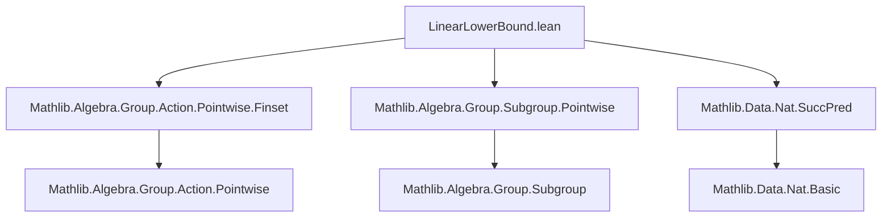

**Technical Brief: `LinearLowerBound.lean`**

---

### 1. **Key Definitions & Theorems**

| Name | Type / Signature | Purpose |
|------|------------------|---------|
| `pow_ssubset_pow_succ_of_pow_ne_closure` | `(1 ∈ X) → X.Nontrivial → (X ^ n ≠ closure X) → X ^ n ⊂ X ^ (n + 1)` | Shows strict inclusion of powers when the $n$-th power hasn’t yet reached the closure — key step in establishing growth. |
| `pow_right_strictMonoOn` | `(1 ∈ X) → X.Nontrivial → StrictMonoOn (λ n ↦ X ^ n) {n | X ^ (n - 1) ≠ closure X}` | Establishes strict monotonicity of the sequence $X^n$ on indices where the power hasn’t stabilized. |
| `pow_right_strictMono` | `(1 ∈ X) → (closure X).Infinite → StrictMono (λ n ↦ X ^ n)` | Extends strict monotonicity to all $n$ under the assumption that the closure is infinite. |
| `add_one_le_card_pow` | `(1 ∈ X) → (closure X).Infinite → ∀ n, n + 1 ≤ # (X ^ n)` | Main theorem: linear lower bound on cardinality of $X^n$. |

---

### 2. **Naming Conventions**

- **Prefixes**:
  - `pow_`: Relates to powers of a set under multiplication (e.g., `pow_ssubset`, `pow_right_strictMono`).
  - `card_`: Relates to cardinality (e.g., `card_lt_card`, `card_smul_finset`).
- **Suffixes**:
  - `_of_`: Indicates condition-based lemma naming (e.g., `pow_ssubset_pow_succ_of_pow_ne_closure`).
  - `_On`: For properties restricted to a subset (e.g., `pow_right_strictMonoOn`).
- **Other patterns**:
  - `smul_`, `inv_smul`, `mul_mem_mul`: Standard group-theoretic operations on finsets.
  - `coe_`, `mod_cast`: Used for coercion and type casting in set-theoretic contexts.

---

### 3. **Tactic Stack**

Frequently used tactics in proofs:
- `obtain rfl | hn := eq_or_ne n 0` — case analysis on equality with 0.
- `rw [...]` — rewriting using equalities, often with `←` for reverse direction.
- `simp` / `simp only [...]` — simplification with custom lemmas and context.
- `induction ... with | zero | succ` — structural induction on natural numbers.
- `contrapose!` — contrapositive reasoning.
- `wlog` — without loss of generality.
- `subst` — substitution after `eq_or_ne` or `eq_of_subset_of_card_le`.
- `apply ...` / `exact ...` — proof step application.
- `lia` — linear integer arithmetic solver.
- `card_lt_card` — used to compare cardinalities via strict inclusion.

---

### 4. **Proof Logic**

The logical flow follows a **progressive refinement strategy**:

1. **Base case analysis** (`n = 0` or `n > 0`) via `eq_or_ne`.
2. **Inductive or monotonic growth argument**:
   - First prove strict inclusion under the hypothesis that $X^n \ne \overline{X}$.
   - Then lift this to strict monotonicity on a domain where the power hasn’t stabilized.
   - Finally, use infiniteness of $\overline{X}$ to ensure the condition $X^{n-1} \ne \overline{X}$ holds for all $n$, giving full strict monotonicity.
3. **Cardinality bound derivation**:
   - Use strict monotonicity + base case (`#(X^0) = 1`) to inductively derive $n + 1 \le \#(X^n)$.

A recurring sub-proof pattern is:
- Assume equality of powers $X^n = X^{n+1}$,
- Derive that the closure is finite (contradiction),
- Conclude strict inclusion.

---

### 5. **Imports**

- `Mathlib.Algebra.Group.Action.Pointwise.Finset` — for `smul_finset`, `mem_inv_smul_finset_iff`, etc.
- `Mathlib.Algebra.Group.Subgroup.Pointwise` — for `pow`, `mul_mem_mul`, `one_mem_pow`, etc.
- `Mathlib.Data.Nat.SuccPred` — for arithmetic reasoning on naturals (e.g., `n.le_add_right`, `add_assoc`).

---

### 6. **Mermaid Diagrams**

#### **Dependency Graph (Module-Level)**



#### **Overview of Theoretical Flow**

```mermaid
flowchart LR
  A[Set X ⊆ G, 1 ∈ X, X nontrivial] --> B[Define X^n = X * ... * X]
  B --> C{X^n = closure X?}
  C -->|No| D[X^n ⊂ X^{n+1}]
  D --> E[Strict monotonicity on domain where X^{n-1} ≠ closure X]
  C -->|Yes| F[Closure finite ⇒ contradiction]
  E --> G[Strict monotonicity globally]
  G --> H[#(X^n) ≥ n+1]
```

---

### 7. **Summary**

This file formalizes a classical result in geometric group theory:  
> *If $X$ is a finite generating set of an infinite group $G$, then the cardinality of the $n$-fold product set $X^n$ grows at least linearly in $n$.*

The proof leverages:
- Finiteness of $X$ (via `Finset`),
- Group-theoretic closure properties,
- Strict monotonicity of powers under non-stabilization,
- Cardinality comparisons.

It is foundational for further work on growth functions, e.g., in the classification of groups of polynomial growth.

--- 

Let me know if you'd like a formalized statement in Lean syntax or a high-level sketch of the proof in natural language.
