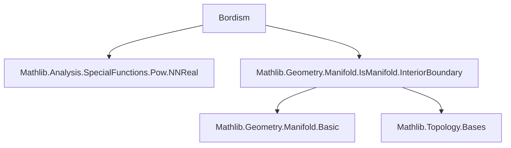

### Technical Brief: `Bordism.lean` — Singular Manifolds in Unoriented Bordism Theory

---

#### **1. Key Definitions & Theorems**

| Name | Type / Signature | Purpose |
|------|------------------|---------|
| `SingularManifold.{u} X k I` | `structure` | Bundled definition of a *singular manifold* over a space `X`: a compact, boundaryless, closed $C^k$-manifold `M` modelled on `I`, equipped with a continuous map `M → X`. |
| `map hφ` | `s.map hφ : SingularManifold Y k I` | Functorial pushforward of singular manifolds along a continuous map `φ : X → Y`. |
| `comap hφ` | `s.comap hφ : SingularManifold X k I` | Pullback of a singular manifold along a continuous map `φ : M → s.M` between manifolds. |
| `empty M I` | `SingularManifold X k I` | The empty manifold (as a singular manifold) over any space `X`. |
| `toPUnit` | `SingularManifold PUnit k I` | Embedding of any smooth manifold `M` as a singular manifold over the point `PUnit`. |
| `prod s t` | `SingularManifold PUnit k (I.prod I')` | Product of two singular manifolds over `PUnit`, yielding a singular manifold modelled on the product of model with corners. Used to define the *bordism ring*. |
| `sum s t` | `SingularManifold X k I` | Disjoint union of two singular `I`-manifolds over `X`. |

**Key Lemmas** (simplification rules):
- `map_f`, `map_M`: describe structure of `map`.
- `comap_M`, `comap_f`: describe structure of `comap`.
- `empty_M`: underlying type of `empty` is `M`.
- `sum_M`, `sum_f`: describe disjoint union structure.

---

#### **2. Naming Conventions**

- **Prefixes**:
  - `map_`, `comap_`, `prod_`, `sum_`, `empty_`: indicate construction names.
  - `is_`, `chartedSpace`, `topSpaceM`, `compactSpace`, `boundaryless`: internal structure fields (e.g., typeclass instances).
- **Suffixes**:
  - `_f`, `_M`: refer to the map and underlying manifold of a structure.
  - `_comp`, `_elim`: indicate composition or elimination (e.g., `map_comp`, `sum_f`).
- **Typeclass instances**:
  - `topSpaceM`, `chartedSpace`, `isManifold`, `compactSpace`, `boundaryless`: bundled structure fields.

---

#### **3. Tactic Stack**

Frequently used tactics in proofs and simplifications:
- `rfl`: for definitional equalities (e.g., `map_M`, `comap_M`, `sum_M`).
- `simp [Function.comp_def]`: for simplifying compositions.
- `rw [continuous_iff_continuousAt]`: for proving continuity of maps from empty domain.
- `unfold ...; infer_instance`: for instance resolution in `empty`.
- `exact fun x ↦ ...`: for constructing functions from empty types.

No heavy automation (`aesop`, `ring`, `linarith`) is used yet — this is a foundational module.

---

#### **4. Proof Logic**

- **Structure-based reasoning**: proofs are mostly definitional or rely on typeclass inference.
- **Continuity arguments**: often reduce to `continuous_id`, `continuous_const`, or composition/sum of continuous maps.
- **Empty domain handling**: use `IsEmpty.false x` and `elim` to construct functions/proofs.
- **Universe management**: universe parameters are kept explicit (e.g., `.{u}`) to avoid `ULift` complications.

No induction or case analysis is present yet — this file sets up *syntax*, not *semantics* (e.g., bordism relation not yet defined).

---

#### **5. Imports**

- `Mathlib.Analysis.SpecialFunctions.Pow.NNReal`: likely for future use in smooth manifold constructions (e.g., partitions of unity).
- `Mathlib.Geometry.Manifold.IsManifold.InteriorBoundary`: provides foundational manifold theory (e.g., `IsManifold`, `BoundarylessManifold`).

---

#### **6. Module Scope & Theory Overview**

This file defines the *syntax* of unoriented bordism theory:
- **Objects**: singular manifolds `(M → X)`.
- **Operations**: `map`, `comap`, `sum`, `prod`, `empty`, `toPUnit`.
- **Future work** (see `TODO`):
  - Define bordisms between singular manifolds.
  - Prove bordism is an equivalence relation.
  - Define bordism groups $\Omega_n(X)$ and prove they form an abelian group.
  - Define relative bordism $\Omega_n(X, A)$ and show it’s an extraordinary homology theory.

---

#### **7. Mermaid Diagrams**

##### **Dependency Graph (Module-Level)**



##### **Data Flow / Theory Overview**

```mermaid
flowchart LR
  A[SingularManifold X k I] --> B[map hφ]
  A --> C[comap hφ]
  A --> D[sum s t]
  A --> E[prod s t]
  A --> F[empty M I]
  A --> G[toPUnit]

  B --> H[Functoriality of bordism groups]
  D --> I[Abelian group structure]
  E --> J[Bordism ring structure on Ω_*(PUnit)]
  F & G --> K[Unit laws for sum/product]

  subgraph Future
    L[Bordism relation]
    M[Bordism groups Ω_n(X)]
    N[Relative bordism Ω_n(X,A)]
    O[Extraordinary homology theory]
  end

  H & I & J --> L
  L --> M
  M --> N
  N --> O
```

---

#### **8. Implementation Notes Summary**

- **Bundled design**: `SingularManifold` is a `structure`, not a predicate, to support group operations on bordism classes.
- **Model with corners `I` as type parameter**: necessary for `sum` and `prod` to be well-typed.
- **Universe `u` on `M`**: explicit to avoid `ULift` in `map`, even though `X` may live in `u=0`.
- **No smoothness assumption on `f : M → X`**: only continuity is required (bordism theory works in topological category).

---

#### **9. Tags**

`singular manifold`, `bordism`, `bordism group`, `unoriented bordism`, `extraordinary homology theory`, `model with corners`, `disjoint union`, `product of manifolds`, `functoriality`, `comap`, `map`.
