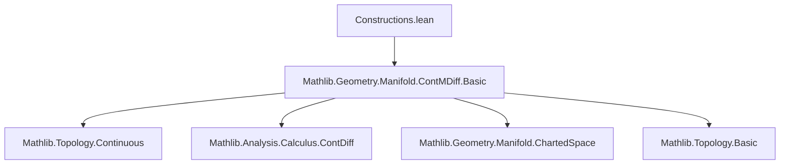
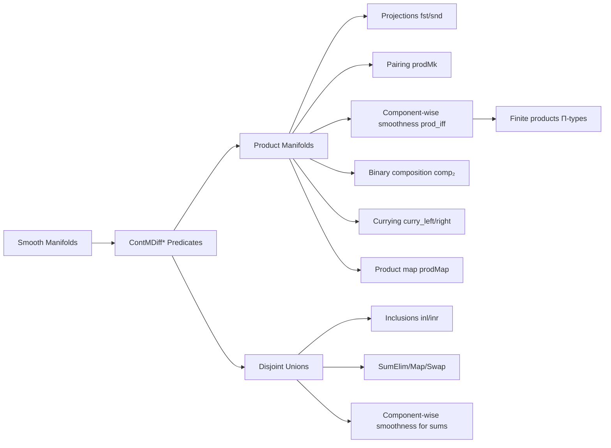
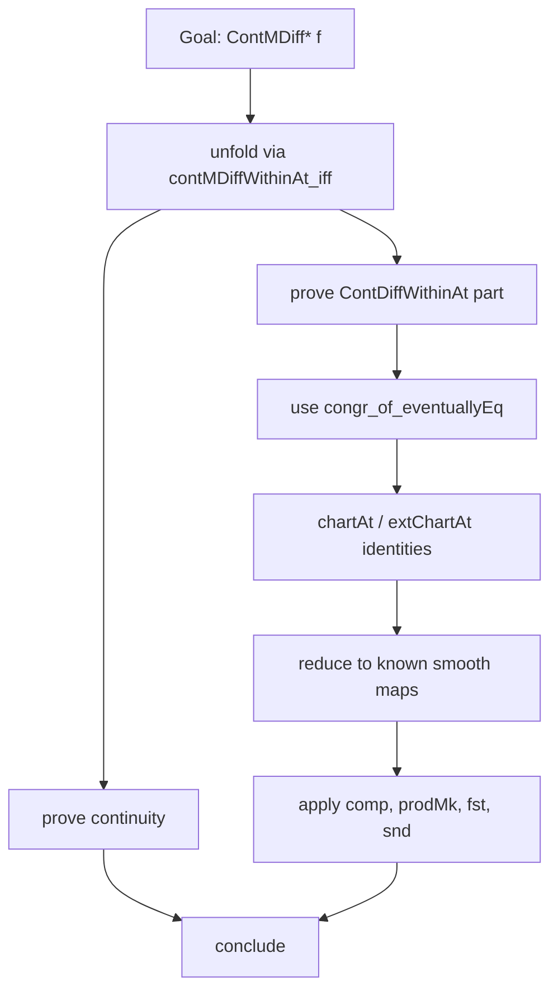

### Technical Brief: `Constructions.lean`

---

#### **1. Key Definitions & Theorems**

| Name | Type | Purpose |
|------|------|---------|
| `ContMDiffWithinAt` | `(f : M → N) → Set M → M → WithTop ℕ∞ → Prop` | Local $C^n$-smoothness of $f$ at a point *within* a set. |
| `ContMDiffAt` | `(f : M → N) → M → WithTop ℕ∞ → Prop` | Local $C^n$-smoothness of $f$ at a point. |
| `ContMDiffOn` | `(f : M → N) → Set M → WithTop ℕ∞ → Prop` | $C^n$-smoothness of $f$ *on* a set. |
| `ContMDiff` | `(f : M → N) → WithTop ℕ∞ → Prop` | Global $C^n$-smoothness of $f$. |
| `prodMk` | `ContMDiffWithinAt f s x → ContMDiffWithinAt g s x → ContMDiffWithinAt (λx, (f x, g x)) s x` | Pairing of smooth maps is smooth. |
| `fst`, `snd` | `ContMDiff (I.prod J) I n Prod.fst`, etc. | Projections from product manifolds are smooth. |
| `prod_iff` (e.g., `contMDiffWithinAt_prod_iff`) | `ContMDiffWithinAt f ↔ ContMDiffWithinAt (fst ∘ f) ∧ ContMDiffWithinAt (snd ∘ f)` | Characterization of smoothness into a product via components. |
| `comp₂` | `ContMDiffWithinAt h (f x, g x) → ContMDiffWithinAt f x → ContMDiffWithinAt g x → ContMDiffWithinAt (h ∘ (f, g)) x` | Chain rule for binary composition (i.e., $h(f(x), g(x))$). |
| `curry_left`, `curry_right` | `ContMDiffWithinAt (uncurry f) (x, y) → ContMDiffWithinAt (λx, f x y) x` | Currying preserves smoothness in each argument. |
| `prodMap` | `ContMDiff f → ContMDiff g → ContMDiff (Prod.map f g)` | Product of smooth maps is smooth. |
| `inl`, `inr` | `ContMDiff I I n Sum.inl`, `ContMDiff I I n Sum.inr` | Inclusions into disjoint union are smooth. |
| `sumElim`, `sumMap`, `swap` | Smoothness of sum constructors. | `Sum.elim`, `Sum.map`, and `Sum.swap` preserve smoothness. |
| `pi_space` lemmas (e.g., `contMDiff_pi_space`) | `ContMDiff f ↔ ∀ i, ContMDiff (f i)` | Smoothness into a finite product (Π-type) is equivalent to smoothness of all components. |

---

#### **2. Naming Conventions**

- **Prefixes**:
  - `contMDiff*`: General smoothness predicates (`ContMDiff`, `ContMDiffAt`, `ContMDiffOn`, `ContMDiffWithinAt`).
  - `prod*`: Product-related constructions (`prodMk`, `prodMap`, `prod_iff`).
  - `curry*`: Currying/uncurrying (`curry_left`, `curry_right`, `along_fst`, `along_snd`).
  - `inl`, `inr`, `sum*`: Disjoint union constructions.
  - `pi_space`: Π-type (finite product) codomain lemmas.

- **Suffixes**:
  - `WithinAt`, `At`, `On`, (none): Distinguish local, pointwise, and global smoothness.
  - `_space`: For maps into normed space models (e.g., `prodMk_space`, `pi_space`).
  - `_iff`: Biconditional characterizations.

---

#### **3. Tactic Stack**

- **Core tactics**:
  - `rw` / `simp_rw`: Rewriting using definitions and lemmas (especially `contMDiffWithinAt_iff`, `contMDiffAt_iff`, `mfld_simps`).
  - `exact`, `refine`, `convert`: Building proofs from existing lemmas.
  - `intro`, `cases`, `split`: Structural proof manipulation.
  - `congr`: Congruence reasoning (e.g., for chart equalities).
  - `filter_upwards`: Filter-based neighborhood arguments.
  - `set ... with hC`: Local definitions with hypotheses.
  - `simp only [mfld_simps]`: Simplification using manifold-specific simp lemmas.
  - `nontriviality`, `inhabited`: Handling nontriviality of types (e.g., for `Sum.elim` auxiliary maps).

- **Domain-specific automation**:
  - `contMDiffWithinAt_iff` and `contMDiffAt_iff` are repeatedly used to reduce smoothness to `ContDiffWithinAt` + continuity.
  - `mfld_simps` is heavily used for simplifying chart expressions.

---

#### **4. Proof Logic**

- **Induction/Case Analysis**:
  - Proofs often reduce to chart-level analysis via `contMDiffWithinAt_iff`.
  - For disjoint unions (`disjointUnion` section), proofs split into `inl`/`inr` cases.
  - For product codomains, proofs use component-wise analysis (`prod_iff`).

- **Common Pattern**:
  1. Unfold smoothness using `contMDiffWithinAt_iff` or `contMDiffAt_iff`.
  2. Prove continuity (often via `continuous_*` lemmas).
  3. Prove `ContDiffWithinAt` part using:
     - `congr_of_eventuallyEq` with chart identities (e.g., `sum_chartAt_inl`).
     - Known smoothness of chart maps (`extChartAt`, `chartAt`).
     - Composition rules (`comp`, `prodMk`, `fst`, `snd`).

- **Key Lemma Usage**:
  - `comp`, `prodMk`, `fst`, `snd` are used to build new smooth maps from existing ones.
  - `congr_of_eventuallyEq` is used to show chart representations agree with identity on chart domains.

---

#### **5. Imports**

- **Primary dependency**:
  ```lean
  import Mathlib.Geometry.Manifold.ContMDiff.Basic
  ```
  This provides:
  - `ContMDiff*` predicates.
  - `ChartedSpace`, `ModelWithCorners`.
  - Basic smooth calculus on manifolds.

- **Local opens**:
  - `Set`, `Function`, `Filter`, `ChartedSpace`.
  - `TopologicalSpace`, `Manifold` scopes.

---

#### **6. Mermaid Diagrams**

##### **Dependency Graph (Module-Level)**



##### **Overview of Theoretical Flow**



##### **Proof Strategy Template**



---

#### **7. Summary**

This file formalizes foundational smoothness properties of standard constructions in manifold theory: products, sums (disjoint unions), and finite products (Π-types). It establishes that:
- Smoothness is preserved under pairing, projection, composition, currying, and product/sum maps.
- Smoothness into a product or finite product is equivalent to smoothness of all components.
- Inclusions and eliminations for disjoint unions are smooth.

The proofs rely heavily on chart-based reasoning, leveraging `contMDiffWithinAt_iff` and `mfld_simps`, and are structured around modular composition rules (`comp`, `prodMk`, etc.). The naming and structure follow Lean’s manifold library conventions, emphasizing uniformity and reusability.
