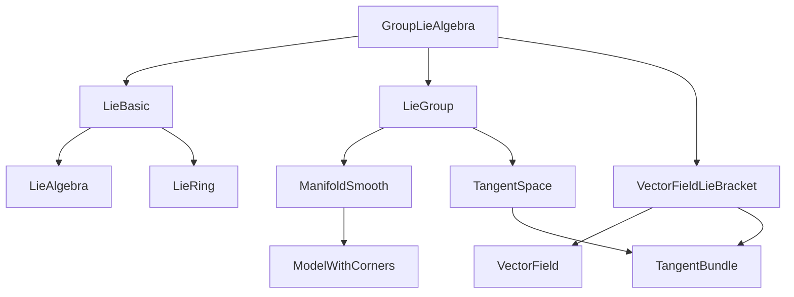

### Technical Brief: `GroupLieAlgebra.lean`

---

#### **1. Key Definitions & Theorems**

| Name | Type / Signature | Purpose |
|------|------------------|---------|
| `GroupLieAlgebra I G` | `abbrev GroupLieAlgebra : Type _ := TangentSpace I (1 : G)` | Defines the Lie algebra of a Lie group $G$ as its tangent space at the identity element. |
| `mulInvariantVectorField v g` | `def mulInvariantVectorField (v : GroupLieAlgebra I G) (g : G) : TangentSpace I g` | Constructs the left-invariant vector field associated to $v$, via pushforward by left multiplication: $X_v(g) = d(L_g)_e(v)$. |
| `Bracket (GroupLieAlgebra I G)` | `instance : Bracket (GroupLieAlgebra I G) (GroupLieAlgebra I G)` | Defines the Lie bracket on the Lie algebra via $[v,w] := [X_v, X_w](e)$. |
| `GroupLieAlgebra.bracket_def` | `lemma GroupLieAlgebra.bracket_def (v w : GroupLieAlgebra I G)` | Justifies the definition: $[v,w] = \mathcal{L}_{X_v} X_w (e)$. |
| `mulInvariantVector_mlieBracket` | `lemma mulInvariantVector_mlieBracket (v w : GroupLieAlgebra I G)` | Shows that the invariant vector field of the Lie bracket at identity equals the global Lie bracket of invariant fields: $X_{[v,w]} = [X_v, X_w]$. |
| `instLieRingGroupLieAlgebra` | `instance : LieRing (GroupLieAlgebra I G)` | Equips the tangent space with a Lie ring structure using properties of the vector field Lie bracket. |
| `instLieAlgebraGroupLieAlgebra` | `instance : LieAlgebra 𝕜 (GroupLieAlgebra I G)` | Promotes the Lie ring to a Lie algebra over the base field $\mathbb{K}$. |
| `contMDiff_mulInvariantVectorField` | `theorem contMDiff_mulInvariantVectorField (v : GroupLieAlgebra I G)` | Proves smoothness of the invariant vector field as a section of the tangent bundle. |
| `mpullback_mulInvariantVectorField` | `lemma mpullback_mulInvariantVectorField (g : G) (v : GroupLieAlgebra I G)` | Shows invariance under pullback: $g^* X_v = X_v$. |
| `inverse_mfderiv_mul_left` | `lemma inverse_mfderiv_mul_left {g h : G}` | Computes the inverse of the differential of left multiplication: $d(L_g)^{-1} = d(L_{g^{-1}}) \circ L_g$. |

---

#### **2. Naming Conventions**

- **Prefixes**:
  - `mulInvariantVectorField`: for left-invariant vector fields (multiplicative notation).
  - `addInvariantVectorField`: additive counterpart (used in `to_additive`-related lemmas).
  - `mpullback`, `mlieBracket`: denote manifold-theoretic pullback and Lie bracket of vector fields.
  - `contMDiff`, `mdifferentiable`: smoothness-related predicates.

- **Suffixes**:
  - `_def`: definitions or characterizations.
  - `_apply`: pointwise application of a global object (e.g., `leibniz_lie` vs `leibniz_identity_mlieBracket_apply`).
  - `_smul`, `_add`: compatibility with module or additive structure.

- **General pattern**: `X_Y_Z` often means “property/definition of `X` under operation `Y` at point `Z`”.

---

#### **3. Tactic Stack**

| Tactic | Frequency | Role |
|--------|-----------|------|
| `simp` | Very high | Simplifies definitions (e.g., `mulInvariantVectorField`, `bracket`), uses `rfl` or lemmas like `mulInvariantVectorField_add`. |
| `ext` | High | Extensionality for functions/vectors (e.g., proving equality of vector fields). |
| `rw` | High | Rewriting using lemmas (e.g., `mfderiv_comp`, `inverse_mfderiv_mul_left`). |
| `congr` | Medium | Congruence reasoning (e.g., in `mpullback_mulInvariantVectorField`). |
| `exact` | Medium | Finishing subgoals with known facts (e.g., smoothness assumptions). |
| `convert` | Medium | Used in `contMDiff_mulInvariantVectorField` to reduce to known smooth maps. |
| `norm_num`, `linarith` | Low | Numerical normalization (e.g., `minSmoothness` monotonicity). |
| `aesop` | Not used | Not present in this file. |
| `ring` | Not used | Not needed; scalar multiplication is not purely ring-theoretic here. |

---

#### **4. Proof Logic**

- **Structure**: Proofs follow a *geometric → analytic* pipeline:
  1. **Geometric setup**: Define invariant vector fields via differential of group operations.
  2. **Smoothness checks**: Use `contMDiff_mul`, `contMDiff_const`, etc., to ensure differentiability.
  3. **Pullback/invariance**: Prove invariance under group action using chain rule (`mfderiv_comp`) and inverse differentials.
  4. **Bracket compatibility**: Show that bracket defined at identity extends globally via `mulInvariantVector_mlieBracket`.
  5. **Lie algebra axioms**: Verify via properties of the vector field Lie bracket (`mlieBracket_add_left/right`, `leibniz_identity_mlieBracket_apply`, `lie_self`, etc.).

- **Induction**: Not used (no inductive types involved).
- **Cases**: Rare; mostly functional extensionality and simplification.
- **Smoothness assumptions**: Central; rely on `minSmoothness 𝕜 3` to ensure enough differentiability for Lie bracket and chain rule applications.

---

#### **5. Imports**

| Module | Role |
|--------|------|
| `Mathlib.Algebra.Lie.Basic` | Lie algebra/ring theory (bracket, axioms, `LieAlgebra`, `LieRing`). |
| `Mathlib.Geometry.Manifold.Algebra.LieGroup` | Lie group structure, smoothness classes (`LieGroup`, `LieAddGroup`). |
| `Mathlib.Geometry.Manifold.VectorField.LieBracket` | Vector fields, Lie bracket of vector fields (`mlieBracket`, `mpullback`, `ContMDiff`-related tools). |

---

#### **6. Mermaid Diagrams**

##### **Dependency Graph (Module-Level)**



##### **Overview of File Structure**

```mermaid
flowchart LR
  A[Start: Setup] --> B[Define GroupLieAlgebra]
  B --> C[Define mulInvariantVectorField]
  C --> D[Prove linearity (add/smul)]
  D --> E[Define Lie bracket via invariant fields]
  E --> F[Prove smoothness of invariant fields]
  F --> G[Prove invariance under pullback]
  G --> H[Show global bracket = invariant field of bracket at e]
  H --> I[Construct LieRing instance]
  I --> J[Construct LieAlgebra instance]
  J --> K[End: Lie algebra structure on T₁G]
```

---

#### **7. Notes on Generality & Design Choices**

- **Smoothness class**: Assumes $G$ is $C^{\min(\infty,3)}$ over $\mathbb{K}$ (i.e., $C^3$ over $\mathbb{R}/\mathbb{C}$, analytic otherwise). This ensures sufficient differentiability for Lie bracket of vector fields.
- **Why not derivations?** As noted in the docstring, the derivation-based approach fails in non-$C^\infty$ or non-real settings; the tangent-space approach is more general.
- **Additive vs multiplicative**: Full `to_additive` support is partially implemented (e.g., `AddGroupLieAlgebra`, `addInvariantVectorField`), but `to_additive` fails on `smul` due to typeclass inference issues — hence manual additive lemmas.

---

#### **8. Formalization Highlights**

- **Smoothness of invariant vector fields**: Proven via factorization through the tangent map of multiplication, using `tangentMap` and `equivTangentBundleProd`.
- **Global bracket identity**: `mulInvariantVector_mlieBracket` is key — it shows the Lie algebra bracket is *exactly* the restriction of the vector field Lie bracket to identity.
- **No reliance on coordinates**: Entirely intrinsic, using `mfderiv`, `mpullback`, and manifold-theoretic tools.

--- 

This file formalizes a foundational construction in differential geometry: the Lie algebra of a Lie group, using modern smooth manifold theory in Lean. Its design prioritizes generality and formal correctness over computational convenience, aligning with Mathlib’s philosophy.
