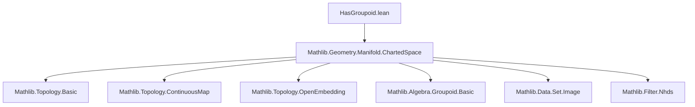
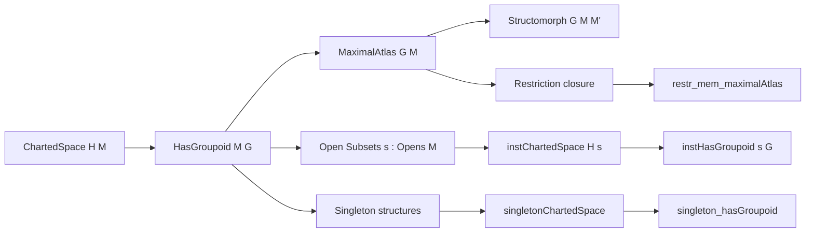
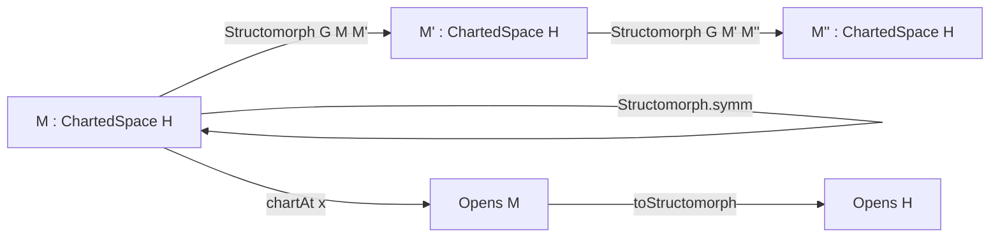

### Technical Brief: `HasGroupoid.lean`

---

#### **1. Key Definitions & Theorems**

| Name | Type / Signature | Purpose |
|------|------------------|---------|
| `HasGroupoid` | `class HasGroupoid (G : StructureGroupoid H) : Prop` | States that all transition maps between atlas charts lie in the structure groupoid `G`. |
| `StructureGroupoid.compatible` | `theorem` | Reformulation of `HasGroupoid.compatible` using dot notation for easier access. |
| `hasGroupoid_of_le` | `theorem` | Monotonicity: if `G₁ ≤ G₂` and `M` has `G₁`, then `M` has `G₂`. |
| `hasGroupoid_inf_iff` | `theorem` | Characterizes compatibility with intersection of groupoids: `G₁ ⊓ G₂` iff both `G₁` and `G₂`. |
| `hasGroupoid_of_pregroupoid` | `theorem` | Constructs `HasGroupoid` from a pregroupoid satisfying a local property. |
| `hasGroupoid_model_space` | `instance` | Model space `H` is compatible with any groupoid `G`. |
| `hasGroupoid_continuousGroupoid` | `instance` | Any charted space is compatible with the continuous groupoid. |
| `StructureGroupoid.maximalAtlas` | `def` | Set of all charts compatible with the atlas (i.e., transitions into/out of atlas lie in `G`). |
| `StructureGroupoid.subset_maximalAtlas` | `theorem` | Atlas ⊆ maximal atlas (under `HasGroupoid`). |
| `StructureGroupoid.compatible_of_mem_maximalAtlas` | `theorem` | Transitions between *maximal* atlas charts lie in `G`. |
| `StructureGroupoid.mem_maximalAtlas_of_eqOnSource` | `lemma` | Maximal atlas is closed under equivalence (`≈`). |
| `restr_mem_maximalAtlas` | `theorem` | If `G` is closed under restriction, restriction of a maximal atlas chart to open set stays in maximal atlas. |
| `singletonChartedSpace` | `def` | Induces charted space structure from a single surjective open partial homeomorphism. |
| `singleton_hasGroupoid` | `theorem` | Such a singleton structure is compatible with any `G` closed under restriction. |
| `instChartedSpace` | `instance` | Open subsets inherit charted space structure. |
| `instHasGroupoid` | `instance` | If `G` is closed under restriction, open subsets inherit `HasGroupoid G`. |
| `StructureGroupoid.subtypeRestr_mem_maximalAtlas` | `lemma` | Restriction of an atlas chart to an open subset lies in the maximal atlas of the subset. |
| `Structomorph` | `structure` | `G`-diffeomorphisms (called *structomorphisms*): homeomorphisms whose local coordinate representations lie in `G`. |
| `Structomorph.refl`, `symm`, `trans` | `def` | Identity, inverse, and composition of structomorphisms. |
| `OpenPartialHomeomorph.toStructomorph` | `def` | Every atlas chart is a structomorphism between its source (open subset of `M`) and target (open subset of `H`). |

---

#### **2. Naming Conventions**

- **Prefixes**:
  - `hasGroupoid_`: properties about `HasGroupoid`.
  - `compatible`: transition maps in groupoid.
  - `maximalAtlas_`: properties of maximal atlas.
  - `singleton_`: single-chart structures.
  - `subtypeRestr_`: restriction to open subsets.
  - `restr_`: shorthand for restriction.
  - `mem_maximalAtlas_`: membership criteria.

- **Suffixes**:
  - `_of_le`, `_of_pregroupoid`, `_iff`: construction/characterization patterns.
  - `_mono`: monotonicity.
  - `_eventuallyEq`: asymptotic equality in neighborhoods.
  - `_symm`: involving inverses.

- **Notable patterns**:
  - `e.symm ≫ₕ e' ∈ G`: transition maps.
  - `e.restr s`, `e.subtypeRestr hs`: restrictions.
  - `chartAt H x`: canonical chart at point `x`.

---

#### **3. Tactic Stack**

Frequently used tactics in proofs:

| Tactic | Usage |
|--------|-------|
| `simp` / `simp only` | Simplifying definitions (e.g., `chartedSpaceSelf_atlas`, `mem_singleton_iff`). |
| `rw` | Rewriting using lemmas (e.g., `trans_assoc`, `restr_trans`, `symm_symm`). |
| `exact`, `refine`, `apply` | Constructing proofs from hypotheses. |
| `calc` / `have` / `set` | Chain of equalities/relations, especially in `compatible_of_mem_maximalAtlas`. |
| `aesop` / `tauto` | Logical reasoning (e.g., `tauto` in `singletonChartedSpace_chartAt_eq`). |
| `convert`, `congr'` | Congruence-based equality proofs. |
| `intro`, `cases`, `rcases` | Introducing/eliminating hypotheses. |
| `eqOnSource`, `mem_of_eqOnSource`, `Setoid.symm` | Reasoning up to equivalence on source. |
| `filter_upwards`, `eventuallyEq_of_mem`, `nhds` | Neighborhood-based arguments (e.g., `chartAt_subtype_val_symm_eventuallyEq`). |

---

#### **4. Proof Logic**

- **Inductive/constructive style**: Most proofs are *direct constructions* (e.g., defining `maximalAtlas`, `singletonChartedSpace`, `Structomorph`).
- **Local-to-global reasoning**: Many proofs (e.g., `compatible_of_mem_maximalAtlas`) use `locality`: show property holds locally around each point.
- **Equivalence-based reasoning**: Heavy use of `≈` (equivalence of partial homeomorphisms) and `mem_of_eqOnSource`.
- **Restriction closure**: Many results assume `[ClosedUnderRestriction G]`, then prove stability under `restr`, `subtypeRestr`.
- **Chart-based arguments**: Charts at points (`chartAt`) are central; proofs often reduce to behavior around `chartAt x`.
- **Monotonicity & lattice reasoning**: `≤`, `⊓`, `⊔` on `StructureGroupoid` used to relate different structures.

---

#### **5. Imports & Dependencies**

- **Core imports**:
  ```lean
  import Mathlib.Geometry.Manifold.ChartedSpace
  ```
- **Key auxiliary modules used**:
  - `TopologicalSpace`, `Topology` (for open sets, neighborhoods, continuity).
  - `Set`, `OpenPartialHomeomorph`, `Manifold` (for partial homeomorphisms, atlases).
  - `StructureGroupoid` (implicit via `StructureGroupoid H`).
  - `Opens` (for open subsets as types).

---

#### **6. Mermaid Diagrams**

##### **Dependency Graph (Module-Level)**



##### **Conceptual Overview of Theory Flow**



##### **Structomorphism Category**



---

#### **7. Summary**

This file formalizes the foundational theory of **charted spaces equipped with a structure groupoid**. It introduces the `HasGroupoid` predicate, constructs the **maximal atlas** compatible with a given groupoid, and studies its stability under restriction and equivalence. It also defines **structomorphisms** (groupoid-compatible homeomorphisms) and shows they form a category. Key technical tools include:
- Local reasoning via neighborhoods and `≈`.
- Closure properties of groupoids (especially under restriction).
- Interplay between atlas, maximal atlas, and open subsets.

The theory is designed to support smooth, PL, and other geometric structures in manifold theory, with `HasGroupoid` serving as the unifying abstraction.

--- 

*End of Technical Brief.*
