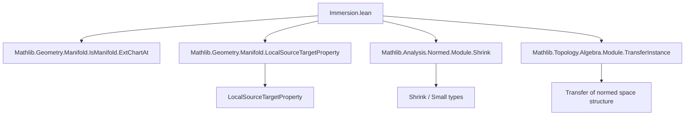

### Technical Brief: Immersion.lean — Smooth Immersions Between Manifolds

---

#### **1. Key Definitions & Theorems**

| Name | Type / Signature | Purpose |
|------|------------------|---------|
| `ImmersionAtProp F I J M N f domChart codChart` | `Prop` | Local property: `f` looks like `u ↦ (u, 0)` in charts `domChart`, `codChart`, via some `E × F ≃L[𝕜] E''`. |
| `IsImmersionAtOfComplement F I J n f x` | `Prop` | `f` is a $C^n$ immersion at `x` w.r.t. fixed complement `F`. Defined via `LiftSourceTargetPropertyAt`. |
| `IsImmersionAt I J n f x` | `Prop` | `f` is a $C^n$ immersion at `x`, *without* fixing complement — existential over `F`. |
| `IsImmersionOfComplement F I J n f` | `Prop` | `f` is an immersion at *every* point w.r.t. fixed `F`. |
| `IsImmersion I J n f` | `Prop` | `f` is an immersion at every point, with some (global) complement choice. |
| `IsImmersionAt.congr_of_eventuallyEq` | `f =ᶠ[𝓝 x] g → IsImmersionAt f x → IsImmersionAt g x` | Immersion is a *local* property: stable under eventual equality. |
| `IsImmersionAtOfComplement.congr_F` | `F ≃L[𝕜] F' ↔ IsImmersionAtOfComplement F … ↔ IsImmersionAtOfComplement F' …` | Stability under isomorphic change of complement. |
| `IsOpen.isImmersionAtOfComplement` / `IsOpen.isImmersionAt` | `IsOpen {x | IsImmersionAt… f x}` | The immersion locus is open. |
| `IsImmersionAt.prodMap` / `IsImmersion.prodMap` | `IsImmersionAt f x → IsImmersionAt g x' → IsImmersionAt (f × g) (x, x')` | Product of immersions is an immersion. |
| `IsImmersion.id` | `IsImmersion id` | Identity is an immersion. |
| `IsImmersion.of_opens` | `s : Opens M → y : s → IsImmersionAt (Subtype.val : s → M) y` | Inclusion of open subset is an immersion. |
| `IsImmersionAtOfComplement.small` | `hf.small : Small F` | Complement can be taken in the same universe as `E''`. |
| `IsImmersionAtOfComplement.smallComplement` / `smallEquiv` | `hf.smallComplement : Type u`, `F ≃L[𝕜] hf.smallComplement` | Universe-shrinking tools to avoid free universe parameters. |

---

#### **2. Naming Conventions**

- **Prefixes**:
  - `isImmersionAtOfComplement`: fixed complement version.
  - `isImmersionAt`: no fixed complement (existential).
  - `isImmersionOfComplement` / `isImmersion`: global versions.
- **Suffixes**:
  - `congr_*`: stability under congruence/equivalence.
  - `of_*`: construction lemmas (e.g., `mk_of_charts`, `mk_of_continuousAt`).
  - `mem_*`, `source_*`, `target_*`: chart-related membership/containment facts.
  - `small*`: universe-shrinking constructions.
- **Abbreviations**:
  - `domChart`, `codChart`: domain/codomain chart.
  - `equiv`: linear equivalence witnessing local form.
  - `writtenInCharts`: equation in charts.

---

#### **3. Tactic Stack**

- **Core tactics**:
  - `rw`, `rwa`, `simp`, `simp_rw`, `congr`, `ext`
  - `intro`, `exact`, `assumption`, `apply`, `refine`
  - `have`, `suffices`, `by_cases`
- **Specialized**:
  - `grw`: guarded rewrite (used for rewriting under images/preimages).
  - `grind`: custom automation for trivial set-theoretic reasoning.
  - `fun_prop`: for proving continuity/Measurability goals.
  - `infer_instance`: typeclass inference.
  - ` Classical.*`: for choice (e.g., `Classical.choose`, `Classical.choose_spec`).
- **Structure**:
  - `rw [def_def] at h`: unpack definitions.
  - `use …, …`: construct witnesses for existential goals.
  - `exact LiftSourceTargetPropertyAt.*`: leverage abstract local property machinery.

---

#### **4. Proof Logic**

- **Structure of proofs**:
  1. **Unpack definitions** (`rw [IsImmersionAtOfComplement_def]`).
  2. **Leverage `LiftSourceTargetPropertyAt` interface**:
     - Use `mk_of_*`, `congr_of_eventuallyEq`, `prodMap`, etc.
  3. **Chart-based reasoning**:
     - Work in charts via `extend`, `symm`, `source`, `target`.
     - Use `EqOn` to express local coordinate form.
  4. **Universe management**:
     - Use `small`, `smallComplement`, `smallEquiv` to reduce universe level.
  5. **Equivalence transfer**:
     - `trans_F`, `congr_F`: replace complement via isomorphism.
  6. **Set-theoretic simplifications**:
     - `image_comp`, `preimage_comp`, `PartialEquiv.*_target_eq_source`, etc.

- **Typical flow**:
  ```text
  Goal: IsImmersionAtOfComplement F I J n f x
  → unfold def
  → use domChart, codChart, equiv
  → verify membership (x ∈ domChart.source, f x ∈ codChart.source)
  → verify chart maximality
  → verify source ⊆ preimage(source)
  → verify EqOn condition in extended charts
  ```

---

#### **5. Imports & Scope**

- **Core dependencies**:
  - `Mathlib.Geometry.Manifold.IsManifold.ExtChartAt`
  - `Mathlib.Geometry.Manifold.LocalSourceTargetProperty`
  - `Mathlib.Analysis.Normed.Module.Shrink`
  - `Mathlib.Topology.Algebra.Module.TransferInstance`
- **Scopes opened**:
  - `Topologie`, `ContDiff`, `Function`, `Set`, `Manifold`
- **Universe handling**:
  - Explicit universe `u` for complement space `E''`.
  - `Small.{u} F` used to ensure universe consistency.

---

#### **6. Mermaid Diagrams**

##### **Dependency Graph (Module-Level)**



##### **Conceptual Overview of Immersion Theory**

```mermaid
graph LR
  subgraph Definitions
    A[ImmersionAtProp] --> B[IsImmersionAtOfComplement]
    B --> C[IsImmersionAt]
    C --> D[IsImmersion]
  end

  subgraph Properties
    B --> E[congr_F]
    B --> F[small / smallEquiv]
    C --> G[congr_of_eventuallyEq]
    C --> H[IsOpen locus]
    C --> I[prodMap]
    C --> J[of_opens]
  end

  subgraph Theory Goals (TODO)
    D --> K[contMDiff]
    D --> L[mfderiv injective]
    D --> M[comp]
    D --> N[finite-dim equivalence]
    D --> O[local diffeo ⇒ immersion]
  end

  B -.->|abstracts via| C
  C -.->|abstracts via| D
```

##### **Local Immersion Diagram (Chart-Level)**

```mermaid
graph LR
  M[M] -- f --> N[N]
  chartM[φ : U ⊆ M ↔ V ⊆ H] -- extend --> V × {0} ⊆ E × F
  chartN[ψ : U' ⊆ N ↔ V' ⊆ G] -- extend --> V' ⊆ E''
  chartM -.->|ψ ∘ f ∘ φ⁻¹| chartN
  style chartM fill:#f9f,stroke:#333
  style chartN fill:#9ff,stroke:#333
  style M fill:#ccc,stroke:#333
  style N fill:#ccc,stroke:#333

  note[style=note, label="Local form: ψ ∘ f ∘ φ⁻¹(u) = (u, 0)"]
  note --> chartM
```

---

#### **7. Theory Context & Future Work**

- **Abstract foundation**: Immersions are defined via *local source-target properties*, mirroring submersions.
- **Infinite-dimensional nuance**: Definition avoids differential-based characterizations (not yet available or not equivalent).
- **Submanifold program**: This definition is intended to pair with submersions for local submanifold characterizations (image of immersion ⇔ preimage of submersion).
- **Planned developments** (from `TODO`):
  - Equivalence with `mfderiv` injectivity in finite dimensions.
  - Smoothness (`contMDiff`) of immersions.
  - Composition, inverse function theorem applications.
  - Diffeomorphisms and local diffeomorphisms as immersions.

---

#### **8. References**

- [roigdomingues1992] Juan Margalef-Roig & Enrique Outerelo Dominguez, *Differential topology*.

--- 

*End of Technical Brief.*
