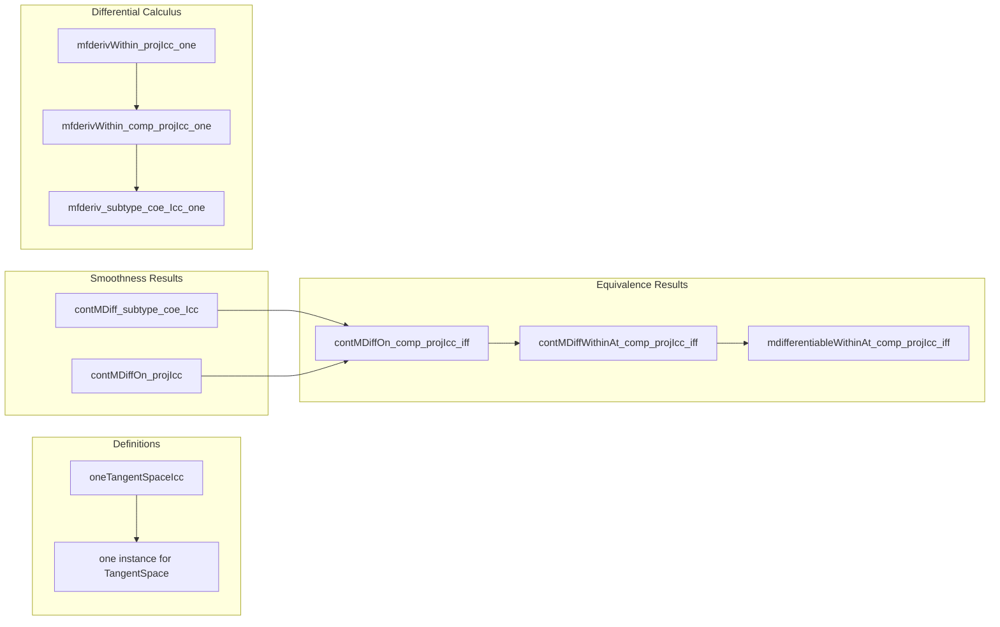

**Technical Brief: `Icc.lean` — Manifold Structure on Real Intervals**

---

### **1. Key Definitions & Theorems**

| Name | Type / Signature | Purpose |
|------|------------------|---------|
| `oneTangentSpaceIcc` | `{x y : ℝ} [Fact (x < y)] → (z : Icc x y) → TangentSpace (𝓡∂ 1) z` | Defines the unit vector in the tangent space of a closed interval $[x, y]$ at $z$, via pushforward of $1 \in T_z \mathbb{R}$ under the projection $\mathbb{R} \to [x, y]$. |
| `contMDiff_subtype_coe_Icc` | `ContMDiff (𝓡∂ 1) 𝓘(ℝ) n (fun z ↦ (z : ℝ))` | The inclusion map $[x, y] \hookrightarrow \mathbb{R}$ is smooth (as a map between manifolds with corners). |
| `contMDiffOn_projIcc` | `ContMDiffOn 𝓘(ℝ) (𝓡∂ 1) n (projIcc x y ...) (Icc x y)` | The projection $\mathbb{R} \to [x, y]$, restricted to $[x, y]$, is smooth. |
| `contMDiffOn_comp_projIcc_iff` | `ContMDiffOn (projIcc x y … ∘ f) ↔ ContMDiff f` | A function $f : [x, y] \to M$ is smooth iff $f \circ \text{projIcc}$ is smooth on $[x, y] \subset \mathbb{R}$. |
| `contMDiffWithinAt_comp_projIcc_iff` | Local version of above, at a point $w \in [x, y]$. |
| `mdifferentiableWithinAt_comp_projIcc_iff` | Equivalence of differentiability (in the manifold sense) of $f$ and $f \circ \text{projIcc}$. |
| `mfderivWithin_projIcc_one` | `mfderivWithin projIcc z 1 = 1` | The differential of the projection sends the unit vector $1 \in T_z \mathbb{R}$ to the unit vector $1 \in T_z [x, y]$. |
| `mfderivWithin_comp_projIcc_one` | `mfderivWithin (f ∘ projIcc) z 1 = mfderiv f z 1` | Chain rule for $f \circ \text{projIcc}$, matching the differential of $f$ at $z$. |
| `mfderiv_subtype_coe_Icc_one` | `mfderiv (Subtype.val) z 1 = 1` | The differential of the inclusion sends $1 \in T_z [x, y]$ to $1 \in T_z \mathbb{R}$. |

---

### **2. Naming Conventions**

- **Prefixes**:
  - `contMDiff*`: smoothness (manifold sense) — `contMDiff`, `contMDiffOn`, `contMDiffWithinAt`.
  - `mfderiv*`: manifold Fréchet derivative — `mfderiv`, `mfderivWithin`, `mfderivWithinAt`.
  - `mdifferentiable*`: manifold differentiability — `mdifferentiableWithinAt`, `mdifferentiableAt`.
- **Suffixes**:
  - `_iff`: equivalence (↔) statements.
  - `_one`: statements involving the unit vector $1$ in tangent spaces.
  - `_projIcc`, `_subtype_coe_Icc`: reference to projection/inclusion maps.
- **Constants**:
  - `𝓘(ℝ)`: standard smooth structure on $\mathbb{R}$.
  - `𝓡∂ 1`: smooth structure on $[x, y]$ as a manifold with corners (1-codimensional boundary).
  - `projIcc x y h`: projection $\mathbb{R} \to [x, y]$, defined piecewise as $\max(x, \min(y, \cdot))$.
  - `Subtype.val`: inclusion $[x, y] \hookrightarrow \mathbb{R}$.

---

### **3. Tactic Stack**

- **Core tactics**:
  - `fun_prop`: propagates smoothness assumptions (e.g., `ContDiff`, `ContMDiff`).
  - `simp?` + `simp only [...]`: simplifies using explicit chart definitions (`IccLeftChart`, `IccRightChart`, `modelWithCornersEuclideanHalfSpace`, etc.).
  - `rw [...]`: rewrites using lemmas like `projIcc_of_mem`, `max_eq_right`, `min_eq_right`.
  - `congr`, `congr 1`: for equality of morphisms/differentials.
  - `filter_upwards`: handles neighborhood filters and membership in neighborhoods.
  - `linarith`: linear arithmetic for inequalities in chart coordinates.
  - `ext i`: extensionality for functions on `Fin 1`.
  - `dsimp`, `convert`, `swap`: for controlled conversion and goal reordering.

---

### **4. Proof Logic**

- **Strategy**:
  - **Chart-wise analysis**: Prove smoothness by checking chart representations (left/right charts for $[x, y]$).
  - **Piecewise formulas**: Use explicit formulas for charts:
    - Left chart: $z \mapsto z - x$,
    - Right chart: $z \mapsto y - z$.
  - **Reduction to `ContDiff` on Euclidean space**: Translate manifold smoothness to classical smoothness via `contMDiffAt_iff` / `contMDiffWithinAt_iff`.
  - **Chain rule & naturality**: For derivative lemmas, use `mfderivWithin_comp_projIcc_one`, `mfderiv_subtype_coe_Icc_one`, and properties of `mfderiv` under composition.
  - **Equivalence proofs**: Use `convert` + `ext` + `simp` to reduce to identities like `projIcc_of_mem`.

- **Induction**: Not used — proofs are direct and local (chart-based).
- **Cases**: `split_ifs` used to handle left/right chart membership (`z < y`, `z ≥ y`).

---

### **5. Imports**

| Module | Role |
|--------|------|
| `Mathlib.Analysis.InnerProductSpace.Calculus` | Provides calculus tools (e.g., `ContDiff`, `fderiv`). |
| `Mathlib.Geometry.Manifold.ContMDiff.Basic` | Core definitions of `ContMDiff`, `ContMDiffOn`, etc. |
| `Mathlib.Geometry.Manifold.Instances.Real` | Defines the smooth structure on $\mathbb{R}$ (`𝓘(ℝ)`) and on intervals (`𝓡∂ 1`). |
| `Mathlib.Geometry.Manifold.MFDeriv.FDeriv` | Manifold Fréchet derivative (`mfderiv`, `mfderivWithin`). |

---

### **6. Mermaid Diagrams**

#### **Dependency Graph (High-Level)**

```mermaid
graph TD
  A[ModelWithCorners ℝ E H] --> B[ChartedSpace H M]
  C[Real manifold theory] --> D[Manifold with corners (𝓘(ℝ), 𝓡∂ 1)]
  D --> E[Smooth maps between intervals and ℝ]
  E --> F[Smoothness of inclusion/projection]
  E --> G[Chain rule for mfderiv]
  G --> H[Equivalence of smoothness via projIcc]
```

#### **Overview of File Structure**



---

### **7. Summary**

This file establishes foundational smooth calculus on closed real intervals $[x, y]$ as a 1-dimensional manifold with corners. It connects the intrinsic manifold structure (`𝓡∂ 1`) with the ambient real line (`𝓘(ℝ)`) via smooth inclusion and projection maps, and proves key chain-rule-type identities for the manifold derivative. The unit vector $1$ in the tangent space is consistently defined across both spaces, and smoothness of functions to/from intervals is characterized via composition with projection/inclusion.

The proofs rely heavily on explicit chart computations and local analysis, avoiding abstract categorical machinery — a pragmatic approach suitable for the current state of `mathlib`. As noted in the `TODO`, future work will leverage smooth embeddings/submersions to simplify and generalize these results.

--- 

Let me know if you'd like a formalized dependency graph (e.g., in `.dot` format) or a breakdown of the `simp` lemmas used.
