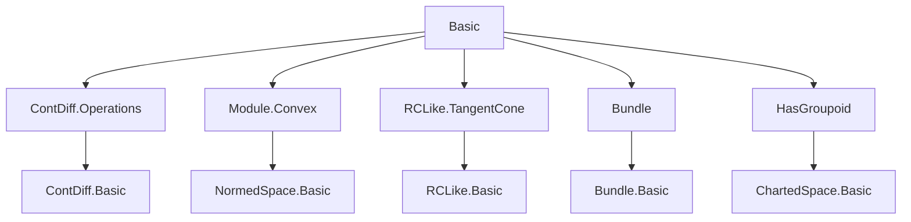
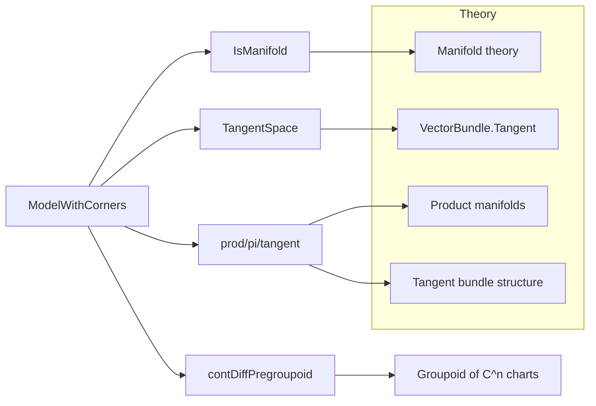
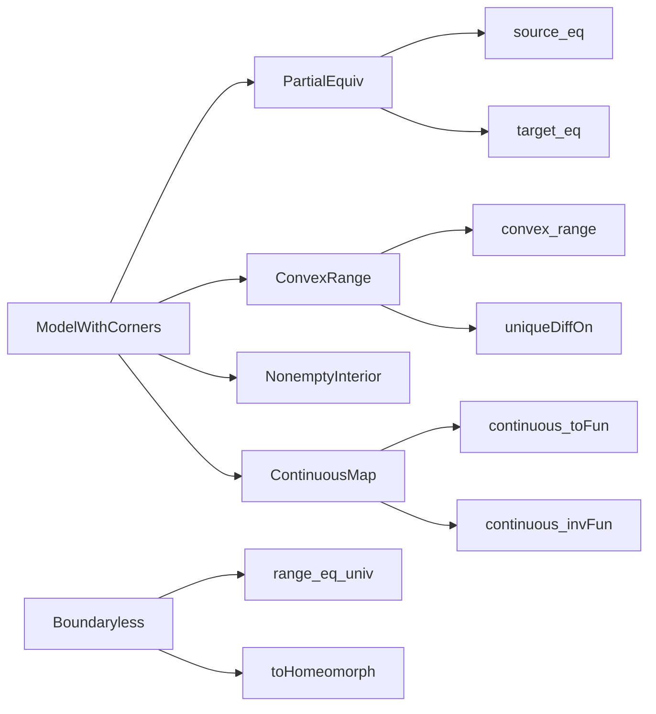

Here is the structured technical brief extracted from the provided Lean 4 file `Basic.lean`:

---

### **1. Key Definitions & Theorems**

| Name | Type / Signature | Purpose |
|------|------------------|---------|
| `ModelWithCorners 𝕜 E H` | `Structure` | Encodes a “model with corners”: a topological embedding `H ↪ E` (via `PartialEquiv`) satisfying regularity (convexity over `ℝ`/`ℂ`, full range otherwise), nonempty interior, and continuity of both directions. |
| `modelWithCornersSelf 𝕜 E` | `ModelWithCorners 𝕜 E E` | Trivial model with corners: identity embedding `E ↪ E`. Notation: `𝓘(𝕜, E)`. |
| `contDiffGroupoid n I` | `Groupoid H` (via `Pregroupoid H`) | Groupoid of local homeomorphisms of `H` that are `C^n` when composed with `I` and `I.symm`. |
| `IsManifold I n M` | `Class` | `M` is a `C^n` manifold modelled on `I : ModelWithCorners 𝕜 E H` iff its atlas has transitions in `contDiffGroupoid n I`. Abbreviates `HasGroupoid M (contDiffGroupoid n I)`. |
| `TangentSpace I x` | `Type*` (type synonym of `E`) | Tangent space at `x : M`, independent of chart. |
| `TangentBundle I M` | `Bundle.TotalSpace E (TangentSpace I)` | Total space of tangent bundle. |
| `ModelWithCorners.prod I I'` | `ModelWithCorners 𝕜 (E × E') (ModelProd H H')` | Product model with corners; used for tangent bundles and product manifolds. |
| `ModelWithCorners.Boundaryless` | `Prop` | Property ensuring `range I = univ`, i.e., no boundary/corners. |
| `ModelWithCorners.toHomeomorph` | `H ≃ₜ E` (if `I.Boundaryless`) | Homeomorphism when model has no boundary. |
| `mfld_simps` lemmas | e.g., `source_eq`, `toPartialEquiv_coe`, `symm_comp_self`, `range_eq_target`, etc. | Simplification rules for `ModelWithCorners` projections and coercions. |

**Notable Theorems**:
- `I.uniqueDiffOn`: `range I` has unique differentiability structure.
- `I.range_eq_closure_interior`: For `ℝ`-model corners, `range I = closure (interior (range I))`.
- `I.isClosedEmbedding`: `I` is a closed embedding.
- `I.continuous`, `I.continuous_symm`, `I.injective`, `I.left_inv`, `I.right_inv`: Basic functional properties.
- `convex_range`: Over `ℝ`, `range I` is convex.
- `range_eq_univ_prod`: Product of boundaryless models is boundaryless.

---

### **2. Naming Conventions**

| Pattern | Examples | Meaning |
|--------|----------|---------|
| `is_` / `Boundaryless` | `ModelWithCorners.Boundaryless` | Property class (not predicate). |
| `of_` | `ofTargetUniv`, `ofConvexRange` | Constructors for `ModelWithCorners` under specific assumptions. |
| `to_` | `toFun'`, `toPartialEquiv` | Projections (coercions to functions or `PartialEquiv`). |
| `symm_` | `symm_apply`, `symm_comp_self`, `symm_map_nhdsWithin_image` | Inverse direction properties. |
| `contDiff_` | `contDiffPregroupoid`, `contDiffGroupoid` | Regularity-based constructions. |
| `prod`, `pi` | `ModelWithCorners.prod`, `ModelWithCorners.pi` | Product/dependent product constructions. |
| `tangent` | `ModelWithCorners.tangent` | Special case of `prod` with trivial second factor. |
| `mfld_simps` | `@[simp, mfld_simps]` | Custom simp set for manifold theory. |

---

### **3. Tactic Stack**

| Tactic | Frequency | Role |
|--------|-----------|------|
| `simp` / `simp_rw` | Very high | Simplify using `mfld_simps`, `source_eq`, `left_inv`, `range_eq_target`, etc. |
| `rw` | High | Rewrite using lemmas like `I.left_inv`, `I.symm_comp_self`, `I.target_eq`. |
| `ext1` / `ext` | Medium | Prove equality of structures or functions. |
| `fun_prop` | Medium | Prove continuity of maps built from continuous components. |
| `by_cases` | Medium | Split on `IsRCLikeNormedField 𝕜` (e.g., `ℝ` vs `ℂ` vs others). |
| `convert` | Medium | Preserve structure while adjusting scalar actions (e.g., `algebraMap_smul`). |
| `rwa`, `rfl`, `refine`, `exact` | High | Basic proof automation. |
| `have`, `set`, `letI` | Medium | Introduce intermediate facts and typeclass instances. |
| `aesop` | Low | Not used in this file. |

---

### **4. Proof Logic**

- **Structure reasoning**: Proofs about `ModelWithCorners` rely heavily on its decomposition into `PartialEquiv` and extra properties (`source_eq`, `convex_range'`, etc.).
- **Case analysis on field type**: Many lemmas split on `IsRCLikeNormedField 𝕜` (e.g., `ℝ`, `ℂ`, or other), using `by_cases`.
- **Continuity & differentiability propagation**: Continuity of `I`, `I.symm`, and compositions (e.g., `ContDiffOn` conditions) are derived via `fun_prop`, `continuous_comp`, etc.
- **Set-theoretic manipulations**: Use of `range`, `preimage`, `interior`, `closure`, `convex`, `uniqueDiffOn` with standard topology lemmas.
- **Typeclass inference**: Heavy use of `letI` and instance synthesis for `RCLike`, `NormedSpace ℝ`, etc., especially in convexity arguments.
- **Inductive/dependent constructions**: `prod`, `pi`, `tangent` are defined via `PartialEquiv` operations (`prod`, `pi`) and verified against all `ModelWithCorners` fields.

---

### **5. Imports**

| Module | Purpose |
|--------|---------|
| `Mathlib.Analysis.Calculus.ContDiff.Operations` | `ContDiff`, `ContDiffOn`, chain rule, etc. |
| `Mathlib.Analysis.Normed.Module.Convex` | Convexity in normed spaces, especially over `ℝ`. |
| `Mathlib.Analysis.RCLike.TangentCone` | `RCLike` fields, `IsRCLikeNormedField`, restriction of scalars. |
| `Mathlib.Data.Bundle` | Bundle definitions (`TotalSpace`, etc.). |
| `Mathlib.Geometry.Manifold.HasGroupoid` | `HasGroupoid`, `Groupoid`, `Pregroupoid`, charted spaces. |

---

### **6. Mermaid Diagrams**

#### **Dependency Graph (Top-Level)**

#### **File Overview**

#### **Model with Corners Structure Hierarchy**

---

### **7. Notation & Scopes**

| Notation | Scope | Meaning |
|---------|-------|---------|
| `𝓘(𝕜, E)` | `Manifold` | `modelWithCornersSelf 𝕜 E` |
| `𝓘(𝕜)` | `Manifold` | `modelWithCornersSelf 𝕜 𝕜` |
| `𝓡 n`, `𝓡∂ n`, `𝓡 corners n` | `Manifold` (in `Instances.Real`) | Standard models for manifolds w/o boundary, w/ boundary, w/ corners. |
| `mfld_simps` | Custom simp set | Manifold-specific simplification rules. |

---

### **8. Implementation Notes (from docstring)**

- **Why not typeclass `I`?** Multiple natural models on same space (e.g., `𝓘(𝕜, E × F)` vs `𝓘(𝕜, E).prod 𝓘(𝕜, F)`) are not definitionally equal, so `I` must be explicit.
- **Why `ModelProd H H'` vs `H × H'`?** Avoids definitional issues in dependent type theory; `ModelProd` is a tagged product type.
- **Tangent bundle model**: `I.prod 𝓘(𝕜, E)` on `(E × E, ModelProd H E)`, not `𝓘(𝕜, E × E)`.
- **No Hausdorff/2nd countable assumptions** in core definitions; added later as needed.

--- 

Let me know if you'd like the same analysis for a specific follow-up file (e.g., `MFDeriv.Basic`, `VectorBundle.Tangent`, or `Instances.Real`).
