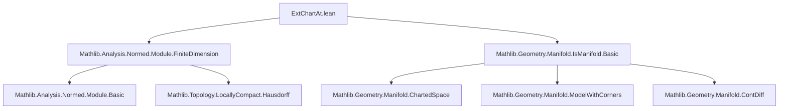

Here is the structured technical brief extracted from `ExtChartAt.lean`:

---

### **1. Key Definitions & Theorems**

| Name | Type / Signature | Purpose |
|------|------------------|---------|
| `extend I f` | `PartialEquiv M E` | Extends a chart `f : M ⇀ H` to a partial equivalence `M ⇀ E` via the model corner `I : H ↪ E`. |
| `extChartAt I x` | `PartialEquiv M E` | The extended chart at `x ∈ M`, defined as `(chartAt H x).extend I`. |
| `extend_coe` | `⇑(f.extend I) = I ∘ f` | Coercion of `extend` to function composition. |
| `extend_coe_symm` | `⇑(f.extend I).symm = f.symm ∘ I.symm` | Coercion of inverse. |
| `extend_source` | `(f.extend I).source = f.source` | Source unchanged by extension. |
| `extend_target` | `(f.extend I).target = I.symm ⁻¹' f.target ∩ range I` | Target is pullback of `f.target` along `I`, intersected with `range I`. |
| `extend_target'` | `(f.extend I).target = I '' f.target` | Alternative description as image under `I`. |
| `isOpen_extend_target` | `IsOpen (f.extend I).target` | Holds if `I` is boundaryless. |
| `contDiffOn_extend_coord_change` | `ContDiffOn … (f.extend I ∘ (f'.extend I).symm) …` | Coordinate change between extended charts is `C^n` on their overlap. |
| `contDiffWithinAt_extend_coord_change` | `ContDiffWithinAt …` | Local version of above, within `range I`. |
| `extChartAt_source` | `(extChartAt I x).source = (chartAt H x).source` | Source of extended chart equals chart source. |
| `extChartAt_target` | `(extChartAt I x).target = I.symm ⁻¹' (chartAt H x).target ∩ range I` | Target of extended chart. |
| `uniqueDiffOn_extChartAt_target` | `UniqueDiffOn 𝕜 (extChartAt I x).target` | Ensures calculus tools apply on target. |
| `isOpen_extChartAt_target` | `IsOpen (extChartAt I x).target` | Holds if `I` is boundaryless. |
| `extChartAt_target_eventuallyEq` | `(extChartAt I x).target =ᶠ[𝓝 …] range I` | Locally coincides with `range I`. |
| `extChartAt_target_subset_closure_interior` | `(extChartAt I x).target ⊆ closure (interior …)` | Technical regularity for boundary points. |
| `interior_extChartAt_target_nonempty` | `(interior …).Nonempty` | Interior of target is nonempty. |

---

### **2. Naming Conventions**

- **Prefixes**:
  - `extend_`: operations on `OpenPartialHomeomorph.extend`.
  - `extChartAt_`: operations on `extChartAt`.
  - `coord_change_`: coordinate changes between charts (e.g., `extend_coord_change_source`).
- **Suffixes**:
  - `_source`, `_target`: refer to source/target sets.
  - `_mem_nhds`, `_mem_nhdsWithin`: neighborhood membership lemmas.
  - `_eventuallyEq`: local equality modulo neighborhoods.
  - `_withinAt`, `_on`: local vs global continuity/differentiability.
- **`mfld_simps`**: used in `@[simp, mfld_simps]` attributes for simplification in manifold contexts.

---

### **3. Tactic Stack**

Frequently used tactics in proofs:
- `rw`, `simp_rw`, `simp`: rewriting and simplification (especially with `mfld_simps`).
- `exact`, `refine`, `apply`: constructing proofs.
- `intro`, `cases`, `obtain`: destructuring.
- `filter_upwards`, `eventually_of_forall`, `eventuallyEq`: filter/neighborhood reasoning.
- `mfld_set_tac`: custom tactic for set-theoretic manipulations in manifold context.
- `aesop`, `tauto`, `linarith`: for routine logical/linear arithmetic goals.
- `congr`, `conv`: for structural proof rewriting.
- `nontrivially_normed_field`-related simplifications via `NormedSpace`, `NontriviallyNormedField` instances.

---

### **4. Proof Logic**

- **Inductive/structural reasoning**: Most proofs proceed by unfolding definitions (`extend`, `extChartAt`, `chartAt`) and applying properties of `PartialEquiv`, `ModelWithCorners`, and continuity/differentiability.
- **Neighborhood-based arguments**: Many lemmas use `𝓝`, `𝓝[s]`, `eventuallyEq`, and `mem_nhdsWithin` to reason locally.
- **Image/preimage manipulations**: Heavy use of `image_eq`, `preimage_comp`, `left_inv`, `right_inv`.
- **Boundaryless vs general case**: Many results split on `I.Boundaryless`, where `range I = univ`, simplifying targets.
- **Chain of equivalences**: Proofs often chain equivalences like:
  ```
  map (f.extend I) (𝓝[s] y) = 𝓝[f '' s] … ↔ … ↔ ContinuousWithinAt …
  ```

---

### **5. Imports**

- `Mathlib.Analysis.Normed.Module.FiniteDimension`: finite-dimensional normed spaces, local compactness.
- `Mathlib.Geometry.Manifold.IsManifold.Basic`: foundational manifold theory, charts, atlases, `ChartedSpace`, `maximalAtlas`.

---

### **6. Theory Dependencies & Overview**

#### **Mermaid Diagram: Module Dependencies**



#### **Mermaid Diagram: Theoretical Flow**

```mermaid
graph LR
  M[ModelWithCorners I : H ↪ E] --> N[Charts chartAt H x : M ⇀ H]
  N --> O[Extended charts extChartAt I x : M ⇀ E]
  O --> P[Coordinate changes extChartAt I x' ∘ (extChartAt I x)⁻¹]
  P --> Q[ContDiffOn / ContDiffWithinAt regularity]
  Q --> R[Manifold properties: locally compact, finite-dimensional]
```

#### **Key Theory Goals**
- Extend charts to the ambient vector space `E` (not just `H`) to enable calculus (e.g., derivatives).
- Ensure coordinate changes remain `C^n` despite non-open targets.
- Connect topological properties of the manifold (e.g., local compactness) to those of the model space (e.g., finite-dimensionality, local compactness of `𝕜`).

---

Let me know if you'd like a formal dependency graph (e.g., `.dot` format) or a summary of how this file fits into the broader `Mathlib` manifold hierarchy.
