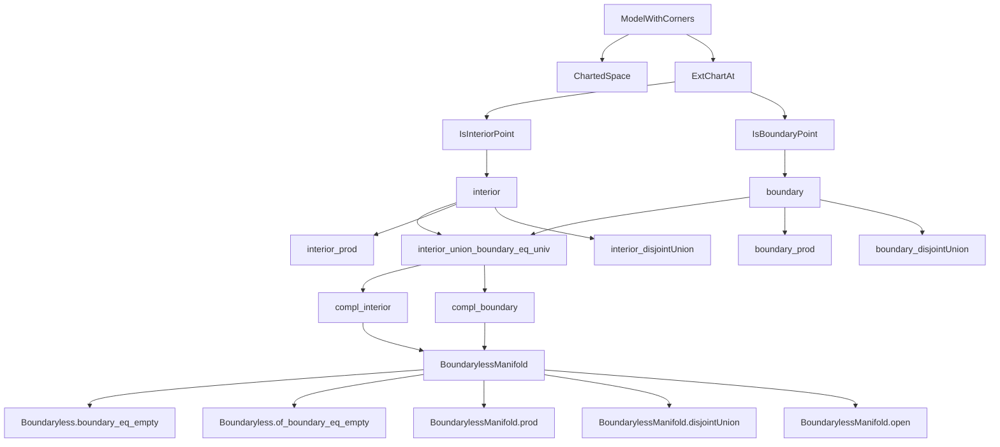
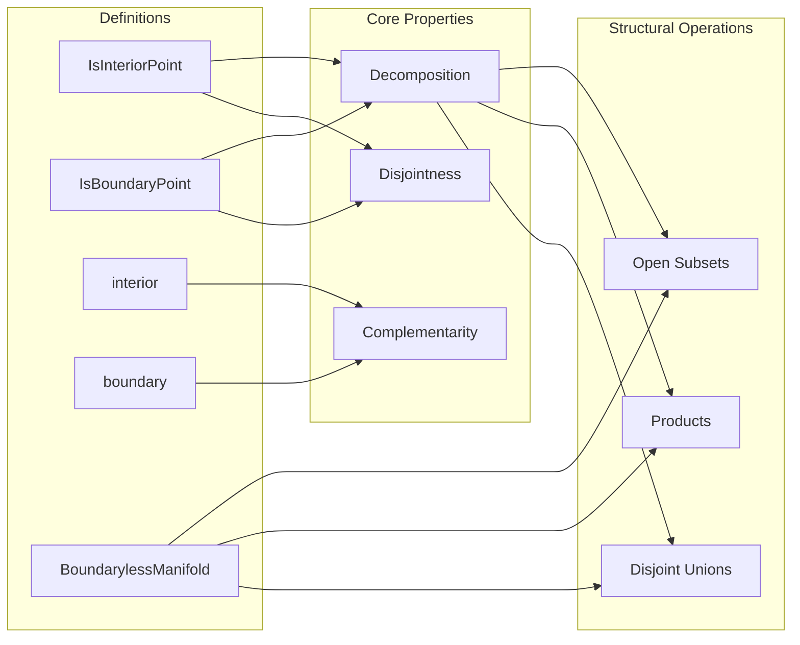

### Technical Brief: `InteriorBoundary.lean`

---

#### **1. Key Definitions & Theorems**

| Name | Type / Signature | Purpose |
|------|------------------|---------|
| `IsInteriorPoint (x : M)` | `Prop` | $x$ is an interior point iff its image under the extended chart lies in the interior of the model space: $\mathrm{extChartAt}_I(x)(x) \in \mathrm{interior}(\mathrm{range}\, I)$. |
| `IsBoundaryPoint (x : M)` | `Prop` | $x$ is a boundary point iff its image under the extended chart lies in the frontier of the model space: $\mathrm{extChartAt}_I(x)(x) \in \mathrm{frontier}(\mathrm{range}\, I)$. |
| `interior I M` | `Set M` | Set of all interior points of $M$. |
| `boundary I M` | `Set M` | Set of all boundary points of $M$. |
| `BoundarylessManifold I M` | `Prop` | Typeclass asserting every point of $M$ is an interior point (i.e., $\partial M = \emptyset$). |
| `isInteriorPoint_iff` | `I.IsInteriorPoint x ↔ extChartAt I x x ∈ interior (extChartAt I x).target` | Equivalence between abstract definition and chart-based condition. |
| `isBoundaryPoint_iff` | `Iff.rfl` | Trivial equivalence for boundary points. |
| `isInteriorPoint_or_isBoundaryPoint` | `∀ x, I.IsInteriorPoint x ∨ I.IsBoundaryPoint x` | Every point is either interior or boundary. |
| `interior_union_boundary_eq_univ` | `(I.interior M) ∪ (I.boundary M) = univ` | Decomposition of $M$ into interior and boundary. |
| `disjoint_interior_boundary` | `Disjoint (I.interior M) (I.boundary M)` | Interior and boundary do not overlap. |
| `compl_interior` | `(I.interior M)ᶜ = I.boundary M` | Boundary is complement of interior. |
| `compl_boundary` | `(I.boundary M)ᶜ = I.interior M` | Interior is complement of boundary. |
| `interior_prod` | `(I.prod J).interior (M × N) = (I.interior M) ×ˢ (J.interior N)` | Interior commutes with product. |
| `boundary_prod` | `(I.prod J).boundary (M × N) = univ ×ˢ (J.boundary N) ∪ (I.boundary M) ×ˢ univ` | Boundary of product is union of “side” boundaries. |
| `interior_disjointUnion` | `(I.interior (M ⊕ M')) = inl '' (I.interior M) ∪ inr '' (I.interior M')` | Interior distributes over disjoint union. |
| `boundary_disjointUnion` | `(I.boundary (M ⊕ M')) = inl '' (I.boundary M) ∪ inr '' (I.boundary M')` | Boundary distributes over disjoint union. |
| `Boundaryless.boundary_eq_empty` | `[BoundarylessManifold I M] ⇒ I.boundary M = ∅` | Boundaryless ⇒ empty boundary. |
| `Boundaryless.iff_boundary_eq_empty` | `I.boundary M = ∅ ↔ BoundarylessManifold I M` | Equivalence between boundaryless and empty boundary. |
| `Boundaryless.of_boundary_eq_empty` | `I.boundary M = ∅ ⇒ BoundarylessManifold I M` | Empty boundary ⇒ boundaryless. |
| `interior_open` | `I.interior u = (↑) ⁻¹' I.interior M` | Interior of open subset is preimage of interior of ambient manifold. |
| `boundary_open` | `I.boundary u = (↑) ⁻¹' I.boundary M` | Boundary of open subset is preimage of boundary of ambient manifold. |
| `BoundarylessManifold.open` | `[BoundarylessManifold I M] ⇒ BoundarylessManifold I u` | Open subsets of boundaryless manifolds are boundaryless. |
| `BoundarylessManifold.prod` | `[BoundarylessManifold I M] × [BoundarylessManifold J N] ⇒ BoundarylessManifold (I.prod J) (M × N)` | Product of boundaryless manifolds is boundaryless. |
| `BoundarylessManifold.disjointUnion` | `[BoundarylessManifold I M] × [BoundarylessManifold I M'] ⇒ BoundarylessManifold I (M ⊕ M')` | Disjoint union of boundaryless manifolds is boundaryless. |

---

#### **2. Naming Conventions**

- **Predicates**: `isInteriorPoint`, `isBoundaryPoint` — unary predicates on points.
- **Sets**: `interior`, `boundary` — defined as sets via `{ x | ... }`.
- **Typeclasses**: `BoundarylessManifold` — asserts global property (no boundary).
- **Lemmas**:
  - `*_iff_*`: characterizations via charts.
  - `*_eq_*`: equalities of sets (e.g., `interior_prod`, `boundary_disjointUnion`).
  - `*_of_*`: implications from structural assumptions (e.g., `of_boundary_eq_empty`).
  - `*_instance`: typeclass instances (e.g., `BoundarylessManifold.prod`).
- **Prefixes**:
  - `is*`: point-level properties.
  - `interior*`, `boundary*`: set-level constructions.
  - `Boundaryless*`: boundaryless-related results.

---

#### **3. Tactic Stack**

| Tactic | Usage Frequency | Purpose |
|--------|------------------|---------|
| `rw` | Very High | Rewriting definitions, equivalences, and lemmas. |
| `simp` / `simp only` | High | Simplifying goals using `compl_interior`, `compl_boundary`, `interior`, `boundary`, etc. |
| `ext1` / `ext` | Medium | Extensionality for sets/functions. |
| `by_contra` | Medium | Contrapositive reasoning (e.g., proving interior/boundary disjointness). |
| `grind` | Medium | Custom tactic (likely from Mathlib’s `Grind` module) for structured rewriting. |
| `exact`, `intro`, `constructor`, `tauto` | Medium | Basic proof automation. |
| `dsimp`, `convert`, `apply` | Low | Fine-grained control during rewriting or construction. |
| `have`, `set` | Medium | Intermediate lemma introduction and variable binding. |

---

#### **4. Proof Logic**

- **Pointwise decomposition**: Prove `isInteriorPoint x ∨ isBoundaryPoint x` using closure identities (`closure_diff_interior`, `isClosed_range`).
- **Disjointness**: Use `disjoint_iff_inter_eq_empty` and properties of `interior` and `frontier` (e.g., `disjoint_interior_frontier`).
- **Set equalities**: Prove via double inclusion (`ext`, `intro`, `change`, `rw`), often reducing to pointwise properties.
- **Product/disjoint union**: Leverage chart behavior under product/disjoint union (`extChartAt`, `chartAt`, `Sum.chartAt`), and use `mem_prod`, `mem_image`, etc.
- **Boundaryless cases**: Reduce to `boundary_eq_empty` via `iff_boundary_eq_empty`, then use `compl_interior` and `interior_eq_univ`.
- **Open subsets**: Use `isInteriorPoint_iff_isInteriorPoint_val`, `u.chartAt_eq`, and properties of subtype restriction.

---

#### **5. Imports**

- `Mathlib.Geometry.Manifold.IsManifold.ExtChartAt`: Provides `extChartAt`, extended charts, and related lemmas.

---

#### **6. Mermaid Diagrams**

##### **Dependency Graph (High-Level)**

##### **Overview of File Structure**

---

#### **7. Summary**

This file formalizes the foundational theory of **interior and boundary** for manifolds with corners, using `extChartAt` to lift model-space notions (`interior`, `frontier`) to the manifold level. It establishes:

- **Decomposition**: $M = \mathrm{int}(M) \sqcup \partial M$,
- **Complementarity**: $\partial M = M \setminus \mathrm{int}(M)$,
- **Stability**: Under products, disjoint unions, and open subspaces,
- **Characterization**: Of boundaryless manifolds via emptiness of boundary.

The formalization is clean, modular, and leverages Lean’s typeclass system (`BoundarylessManifold`) for ergonomic reasoning about manifolds without boundary.

--- 

Let me know if you'd like a **dependency graph of lemmas** or a **proof sketch for a specific theorem** (e.g., `boundary_prod`).
