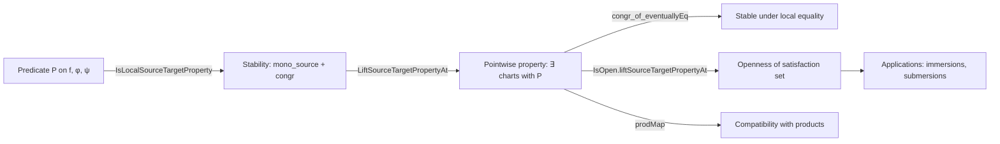

**Technical Brief: `LocalSourceTargetProperty.lean`**

---

### 1. KEY DEFINITIONS & THEOREMS

| Name | Type / Signature | Purpose |
|------|------------------|---------|
| `IsLocalSourceTargetProperty` | `Prop` (for a predicate `P` on functions and chart pairs) | Captures *good behavior* of a local property `P` w.r.t. chart choices: stability under restriction of the source chart (`mono_source`) and under congruence on the function (`congr`). |
| `LocalPresentationAt` | `Structure` | Witnesses that `f` has property `P` at `x` *in specific charts* `φ`, `ψ`. Includes membership, maximality, and inclusion conditions. |
| `LiftSourceTargetPropertyAt` | `Prop` | Lifts `P` to a *pointwise* local property: `f` has the property at `x` iff ∃ charts `φ`, `ψ` such that `P f φ ψ`. |
| `localPresentationAt` | `Noncomputable def` | Chooses a witness (charts) for `LiftSourceTargetPropertyAt`. |
| `domChart`, `codChart` | `Noncomputable def`s | Extract the domain/target chart from a witness. |
| `mk_of_continuousAt` | `lemma` | Simplifies verification: if `f` is continuous at `x`, it suffices to check `P f φ ψ` and point membership — the image inclusion follows. |
| `congr_of_eventuallyEq` | `lemma` | If `f = g` near `x`, and `P` is monotone + congruent, then `f` has `P` at `x` ⇔ `g` has `P` at `x`. |
| `congr_iff_of_eventuallyEq` | `lemma` | Equivalence version of above. |
| `IsOpen.liftSourceTargetPropertyAt` | `lemma` | The set `{x | LiftSourceTargetPropertyAt I J n f x P}` is open (under `IsLocalSourceTargetProperty P`). |
| `prodMap` | `lemma` | Compatibility of `LiftSourceTargetPropertyAt` with product maps: if `f`, `g` have `P`, `Q`, then `Prod.map f g` has `R`, assuming `R` is induced by `P`, `Q`. |

---

### 2. NAMING CONVENTIONS

- **Prefixes**:
  - `is_` / `isLocal_`: for properties (`IsLocalSourceTargetProperty`)
  - `lift_` / `Lift_`: for lifting a chart-dependent property to a pointwise one (`LiftSourceTargetPropertyAt`)
  - `local_`: for local data (`localPresentationAt`, `domChart`, `codChart`)
  - `congr_`: for congruence/stability lemmas
  - `mono_`: for monotonicity (e.g., `mono_source`)
- **Suffixes**:
  - `_At`: for pointwise/local-at-point notions (`LocalPresentationAt`, `LiftSourceTargetPropertyAt`)
  - `_source`, `_target`: for source/target chart components
  - `_mem_maximalAtlas`: for chart membership in the maximal atlas
- **General pattern**: `PropertyNameAt` for pointwise, `IsPropertyName` for structural properties of the predicate.

---

### 3. TACTIC STACK

Frequently used tactics in proofs:

- `grind`: (Lean 4’s `grind` tactic — a combination of `simp`, `linarith`, `aesop`, etc., for routine goals)
- `simp` / `simp only`: simplification, especially with `OpenPartialHomeomorph` projections and products
- `rw`: rewriting using lemmas like `interior_eq_iff_isOpen.mpr`, `preimage_prod_map_prod`
- `exact`, `refine`, `obtain`: standard proof construction
- `trans`: transitivity chaining for subset relations
- `apply`, `intro`, `intro x hx`: standard intro/apply
- `noncomputable def`: for definitional choices requiring classical choice

---

### 4. PROOF LOGIC

Typical proof structure:

1. **Existential witness construction**: Use `⟨…⟩` to build `LocalPresentationAt` or `LiftSourceTargetPropertyAt`.
2. **Chart restriction**: Use `restr_mem_maximalAtlas` and `mono_source` to adjust charts.
3. **Congruence handling**: Use `congr` and `EqOn`/`eventuallyEq` to transfer properties between equal functions.
4. **Continuity simplification**: Use `mk_of_continuousAt` to avoid verifying image containment when continuity is available.
5. **Openness proofs**: Show that for `x` with a witness `(φ, ψ)`, *all* points in `φ.source` inherit the property using the *same* charts — hence openness.
6. **Product lemmas**: Use `prodMap` to lift properties across product manifolds via product charts.

Induction is not used; reasoning is primarily *constructive* with classical choice, and relies on chart calculus and topology of manifolds.

---

### 5. IMPORTS & DEPENDENCIES

- **Core dependency**: `Mathlib.Geometry.Manifold.IsManifold.Basic`
- **Scoped notation**:
  - `Manifold`, `Topology`, `ContDiff`
- **Type class assumptions**:
  - `NontriviallyNormedField`, `NormedAddCommGroup`, `NormedSpace`, `TopologicalSpace`, `ChartedSpace`
  - `IsManifold` (via `IsManifold.mem_maximalAtlas_prod`)
- **Key structures used**:
  - `OpenPartialHomeomorph`, `ModelWithCorners`, `IsManifold.maximalAtlas`
  - `nhds`, `eventuallyEq`, `EqOn`, `preimage`, `interior`, `restr`

---

### 6. MERMAID DIAGRAMS

#### Dependency Graph (Module-Level)

```mermaid
graph TD
  A[LocalSourceTargetProperty.lean] --> B[Mathlib.Geometry.Manifold.IsManifold.Basic]
  B --> C[Mathlib.Geometry.Manifold.ChartedSpace]
  B --> D[Mathlib.Topology.Basic]
  B --> E[Mathlib.Analysis.NormedSpace.Basic]
  A --> F[IsImmersionEmbedding.lean]  %% future usage
  A --> G[SubmersionProperties.lean]  %% future usage
```

#### Overview of Theory Flow



#### Proof Pattern for `IsOpen.liftSourceTargetPropertyAt`

```mermaid
graph TD
  A[x satisfies LiftSourceTargetPropertyAt] --> B[Choose witness (φ, ψ)]
  B --> C[Show all y ∈ φ.source also satisfy it]
  C --> D[Use same (φ, ψ) as witness]
  D --> E[Verify all conditions: source membership, atlas membership, inclusion, P]
  E --> F[Conclude openness]
```

---

### 7. SUMMARY

This file formalizes a *unified abstraction* for local geometric properties of maps between manifolds that depend on compatible chart choices — exemplified by immersions and submersions. It introduces:

- A structural condition (`IsLocalSourceTargetProperty`) ensuring robustness under chart restriction and functional congruence.
- A lifting mechanism (`LiftSourceTargetPropertyAt`) to define pointwise local properties.
- Key lemmas ensuring stability under local equality, openness of the satisfaction set, and compatibility with products.

The formalization is designed for reuse: once a property `P` is shown to satisfy `IsLocalSourceTargetProperty`, all derived lemmas (e.g., openness, congruence, product behavior) apply automatically — significantly reducing redundancy in manifold theory development.

--- 

*End of Technical Brief.*
