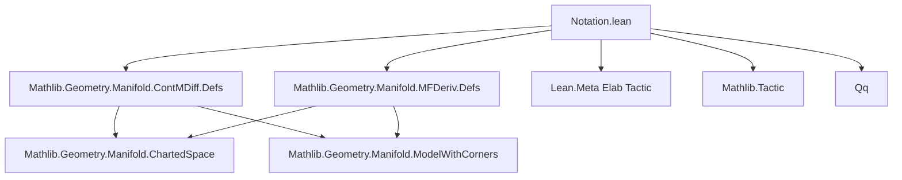
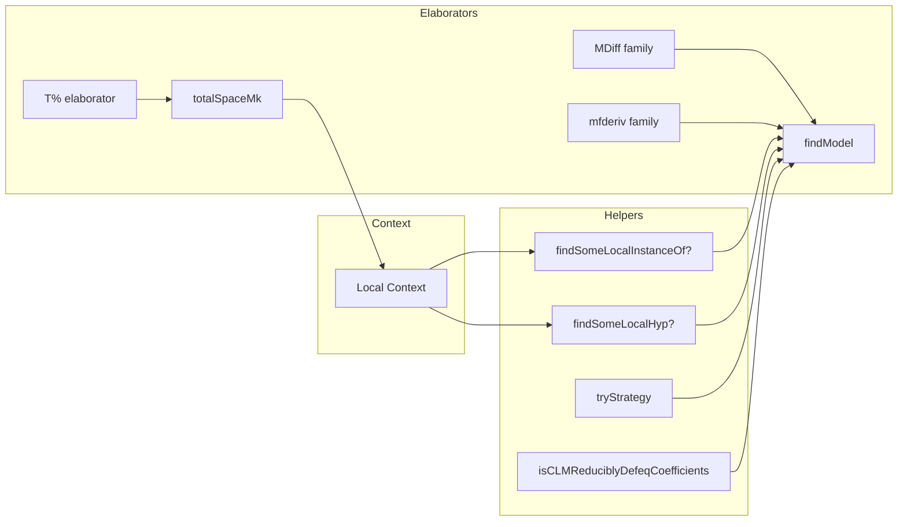

Here's the **technical metadata extraction** for the `Notation.lean` file, formatted as requested:

---

### 1. KEY DEFINITIONS & THEOREMS

| Name | Type / Purpose |
|------|----------------|
| `totalSpaceMk` | `Expr → MetaM Expr` — converts a dependent section `Π x : M, V x` into a non-dependent function `M → TotalSpace V`. Handles trivial bundles, tangent bundles, and general fiber bundles. |
| `findModel` | `Expr → Option (Expr × Expr) → TermElabM Expr` — infers a `ModelWithCorners` instance for a given type expression using local context and structural matching. Supports manifolds, normed spaces, Euclidean spaces, intervals, etc. |
| `findSomeLocalInstanceOf?` | `(Name) → (Expr → Expr → MetaM (Option α)) → MetaM (Option α)` — searches local instances of a given class name, applying a predicate to the instantiated type. |
| `findSomeLocalHyp?` | `(Expr → Expr → MetaM (Option α)) → MetaM (Option α)` — searches local hypotheses (non-instance declarations) for a matching type. |
| `tryStrategy` | `MessageData → TermElabM Expr → TermElabM (Option Expr)` — wraps a strategy function in error handling and tracing; used by `findModel`. |
| `isCLMReduciblyDefeqCoefficients` | `Expr → TermElabM (Option (Expr × Expr × Expr))` — checks if an expression is a space of continuous linear maps over identity ring homomorphism, returning coefficients, domain, codomain. |

**No theorems** are stated in this file — it is purely a *metaprogramming* module for elaboration.

---

### 2. NAMING CONVENTIONS

- **Elaborator prefixes**:
  - `T%` — scoped elaborator for sections → total space.
  - `MDiff`, `MDiffAt`, `MDiff[u]`, `MDiffAt[u]`, `CMDiff`, `CMDiffAt`, etc. — compact notations for manifold differentiability.
  - `mfderiv`, `mfderiv%`, `mfderiv[u]` — manifold derivative notations.
  - `HasMFDerivAt`, `HasMFDerivAt%`, `HasMFDerivAt[s]` — Hasse-style derivative predicates.

- **Internal helper naming**:
  - `findSomeLocal*` — generic helpers for searching local context.
  - `from*` — strategy functions inside `findModel`, e.g., `fromManifold`, `fromTangentBundle`, `fromCLM`.
  - `totalSpaceMk` — main conversion function for `T%`.
  - `tryStrategy` — generic error-tracing wrapper.

- **Tracing keys**:
  - `` `Elab.DiffGeo.MDiff `` — for manifold differentiability elaboration.
  - `` `Elab.DiffGeo.TotalSpaceMk `` — for `T%` elaboration.

---

### 3. TACTIC STACK

| Tactic / Utility | Frequency / Role |
|------------------|------------------|
| `withTraceNode` | High — used in `tryStrategy` to wrap strategies with tracing. |
| `withLocalDeclD` | Medium — used in `totalSpaceMk` to introduce bound variables. |
| `match_expr` | High — used heavily in `findModel` and `totalSpaceMk` for structural matching. |
| `pureIsDefEq`, `isDefEq`, `withReducible` | High — for definitional equality checks, especially to avoid unfolding reducible definitions. |
| `instantiateMVars`, `whnf`, `whnfR` | High — for normalizing expressions before matching. |
| `mkAppM`, `mkAppOptM`, `Term.elabTerm` | High — constructing expressions and elaborating syntax. |
| `catch`, `throw`, `throwError` | High — error handling and reporting. |
| `saveState`, `restore` | Medium — for backtracking in `tryStrategy`. |
| `Term.withoutErrToSorry`, `Term.withSynthesize` | Medium — to control elaboration behavior during strategies. |

---

### 4. PROOF LOGIC (ELABORATION STRATEGY)

The elaborators follow a **deterministic, prioritized search strategy**:

1. **Pattern match** on the input expression’s structure (after `whnf`/`instantiateMVars`).
2. **Search local context** for matching instances or hypotheses using `findSomeLocal*`.
3. **Use definitional equality checks** (at `reducible` transparency) to validate matches.
4. **Construct target expression** using `mkAppM`/`Term.elabTerm`.
5. **Fallback gracefully** (e.g., return original term if no match).
6. **Trace failures** for debugging (via `tryStrategy`).

In `findModel`, the strategy is:
- Try each `from*` function in a fixed order (e.g., `fromTotalSpace`, `fromTangentBundle`, ..., `fromNormedField`).
- Each `from*` function attempts structural matching and context lookup.
- If a strategy succeeds, return its result; otherwise, restore state and try next.
- If all fail, throw an informative error (with hint to enable tracing).

In `totalSpaceMk`, the logic is:
- Match on type of input `e` (e.g., `Bundle.Trivial`, `TangentSpace`, or general fiber bundle).
- For each case, construct `λ x, TotalSpace.mk' ... (e x)` using appropriate bundle data.
- If none match, return `e.headBeta`.

---

### 5. IMPORTS

| Import | Role |
|--------|------|
| `Mathlib.Geometry.Manifold.ContMDiff.Defs` | Provides `MDifferentiable`, `ContMDiff`, etc. — needed for `MDiff`, `CMDiff` notations. |
| `Mathlib.Geometry.Manifold.MFDeriv.Defs` | Provides `mfderiv`, `HasMFDerivAt`, etc. — needed for derivative notations. |
| `Lean.Meta Elab Tactic` | Core metaprogramming infrastructure. |
| `Mathlib.Tactic` | Utilities like `pureIsDefEq`, `isDefEq`, etc. |
| `Qq` — `Quote`/`QuasiQuote` support for syntax construction. |
| `Bundle`, `Manifold`, `ContDiff` — scoped namespaces for bundle and manifold operations. |

---

### 6. DEPENDENCY & OVERVIEW DIAGRAM

#### Mermaid: File Dependency Graph

#### Mermaid: Overview of `Notation.lean`

---

### 7. LIMITATIONS & TODO

- ❌ No support for product manifolds (yet).
- ❌ No delaborators (pretty-printers) for the notations.
- ⚠️ Error messages could be improved (especially for `findModel` failures).
- ⚠️ Edge cases not fully tested (needs test suite).
- 📝 TODO: Add support for guessing models on products (with warning).
- 📝 TODO: Better integration with `isDefEq` vs `reducible` transparency.

---

Let me know if you'd like the **elaborator expansion table** (e.g., `MDiff f` → `MDifferentiable I J f`) formalized as Lean code, or a **test suite sketch**.
