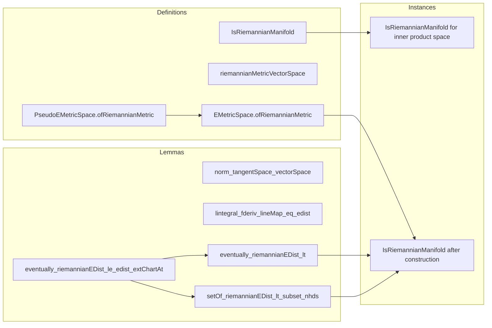

Here is a structured technical brief extracted from the provided Lean 4 file `Basic.lean`, focusing on formal metadata relevant for building a Domain-Specific AI Agent.

---

## **1. KEY DEFINITIONS & THEOREMS**

| Name | Type / Signature | Purpose |
|------|------------------|---------|
| `IsRiemannianManifold I M` | `class Prop` | Records that the extended distance `edist` on a manifold `M` coincides with the Riemannian extended distance `riemannianEDist`, i.e., the infimum of lengths of $C^1$ paths measured via the Riemannian metric. |
| `riemannianMetricVectorSpace F` | `ContMDiffRiemannianMetric` | Canonical smooth Riemannian metric on a real inner product space `F`, using the inner product on each tangent space. |
| `norm_tangentSpace_vectorSpace` | `lemma` | Shows that the norm on tangent spaces of `F` (viewed as a manifold) coincides with the ambient norm. |
| `lintegral_fderiv_lineMap_eq_edist` | `lemma` | Computes the integral length of the straight line segment in an inner product space: $\int_{[0,1]} \| \partial_t \eta(t) \|_e \, dt = \operatorname{edist}(x,y)$. |
| `instance IsRiemannianManifold 𝓘(ℝ, F) F` | `instance` | Proves that an inner product space with its canonical Riemannian structure satisfies the `IsRiemannianManifold` predicate. |
| `eventually_riemannianEDist_le_edist_extChartAt` | `lemma` | Shows local Lipschitz property of the extended chart w.r.t. Riemannian distance: $\operatorname{riemannianEDist}(x,y) \le C \cdot \operatorname{edist}(\chi(x), \chi(y))$ for $y$ near $x$. |
| `eventually_riemannianEDist_lt` | `lemma` | If $y$ is topologically close to $x$, then $\operatorname{riemannianEDist}(x,y) < c$ for any $c > 0$. |
| `setOf_riemannianEDist_lt_subset_nhds` | `lemma` | Any neighborhood of $x$ contains all points within small Riemannian distance — i.e., the Riemannian topology refines the manifold topology. |
| `PseudoEMetricSpace.ofRiemannianMetric` | `def` | Constructs a pseudoemetric space structure on `M` from its Riemannian structure, ensuring the induced topology coincides with the original. |
| `EMetricSpace.ofRiemannianMetric` | `def` | Same as above, but yields an emetric space (T₀ + pseudoemetric ⇒ emetric). |
| `instance IsRiemannianManifold I M` (under `[RegularSpace M]`) | `instance` | Shows that the constructed emetric space satisfies `IsRiemannianManifold I M` by definition. |

---

## **2. NAMING CONVENTIONS**

- **Predicates / Classes**:  
  - `IsRiemannianManifold` — Prop-valued predicate.
  - `RiemannianBundle`, `ContMDiffRiemannianMetric`, `IsContMDiffRiemannianBundle`, `IsContinuousRiemannianBundle` — structural typeclasses for smooth Riemannian data.

- **Metric-related functions**:  
  - `riemannianEDist` — extended Riemannian distance.
  - `pathELength` — length of a path w.r.t. Riemannian metric.
  - `norm_tangentSpace_*`, `ennorm_tangentSpace_*`, `enorm_tangentSpace_*` — norm equivalences on tangent spaces.

- **Chart-related lemmas**:  
  - `mfderiv`, `mfderivWithin`, `extChartAt`, `chartAt` — manifold derivatives and charts.
  - `eventually_*_extChartAt_*` — local control of derivatives in charts.

- **Topology lemmas**:  
  - `eventually_riemannianEDist_*`, `setOf_riemannianEDist_*_subset_nhds` — relate Riemannian and topological neighborhoods.

- **Local instances**:  
  - `normedAddCommGroupTangentSpaceVectorSpace`, `normedSpaceTangentSpaceVectorSpace` — local copies of vector space structure on tangent spaces.

- **Construction functions**:  
  - `ofRiemannianMetric` — endows `M` with a (pseudo)emetric structure.

---

## **3. TACTIC STACK**

Frequently used tactics in proofs:

| Tactic | Usage |
|--------|-------|
| `simp` / `simp only` | Simplify definitions (e.g., `riemannianEDist`, `pathELength`, norms). |
| `rw` / `conv` | Rewrite using lemmas like `edist_comm`, `lintegral_fderiv_lineMap_eq_edist`. |
| `gcongr` / `gcongr'` | Handle inequalities involving integrals and constants. |
| `apply` / `exact` | Apply lemmas or instances (e.g., `riemannianEDist_le_pathELength`). |
| `filter_upwards` | Handle neighborhood filters (e.g., `∀ᶠ y in 𝓝 x`). |
| `convert` / `congr` | Match goals up to definitional equality (e.g., derivative chain rule). |
| `rcases` / `obtain` | Extract witnesses from existential statements (e.g., bounds on derivatives). |
| `setLIntegral_congr_fun`, `setLIntegral_mono'` | Manipulate extended integrals (ENNReal-valued). |
| `enorm_sub_le_lintegral_derivWithin_Icc_of_contDiffOn_Icc` | Control difference via integral of derivative. |
| `mdifferentiableWithinAt`, `mdifferentiableOn` | Verify differentiability conditions for chain rule. |
| `uniqueDiffOn_Icc`, `uniqueMDiffWithinAt_iff_uniqueDiffWithinAt` | Use uniqueness of differentiable structure on intervals. |

---

## **4. PROOF LOGIC**

The logical flow in key proofs follows a pattern:

1. **Reduction to chart coordinates**  
   Use `extChartAt` to pull back geometric objects (paths, distances) to Euclidean space.

2. **Local Lipschitz control**  
   Bound derivatives of charts and their inverses using `eventually_*_lt` lemmas.

3. **Path construction**  
   Construct explicit paths (e.g., straight line in chart, pulled back via `(extChartAt x).symm`) to estimate distances.

4. **Length estimation via chain rule**  
   Apply `mfderivWithin_comp`, `mfderivWithin_eq_fderivWithin`, and integral inequalities (e.g., `enorm_sub_le_lintegral_derivWithin_Icc_of_contDiffOn_Icc`).

5. **Topological equivalence**  
   Prove two inclusions:
   - `eventually_riemannianEDist_lt`: topology ⇒ Riemannian distance small.
   - `setOf_riemannianEDist_lt_subset_nhds`: Riemannian ball ⊆ topological neighborhood (uses closed neighborhoods, derivative bounds, and interval induction).

6. **Construction of emetric space**  
   Use `PseudoEMetricSpace.ofEDistOfTopology`, verifying that the basis of Riemannian balls refines the topology.

7. **Verification of predicate**  
   By definition of `riemannianEDist` as `edist`, `IsRiemannianManifold` holds.

---

## **5. IMPORTS & DEPENDENCIES**

| Module | Purpose |
|--------|---------|
| `Mathlib.Geometry.Manifold.MFDeriv.Atlas` | Manifold derivatives, charts, trivializations. |
| `Mathlib.Geometry.Manifold.Riemannian.PathELength` | Path length in Riemannian manifolds. |
| `Mathlib.Geometry.Manifold.VectorBundle.Riemannian` | Riemannian metrics on vector bundles. |
| `Mathlib.Geometry.Manifold.VectorBundle.Tangent` | Tangent bundle and tangent spaces. |
| `Mathlib.MeasureTheory.Integral.IntervalIntegral.ContDiff` | Integration of derivatives of `ContDiff` functions on intervals. |

**Core dependencies**:  
- `EMetricSpace`, `PseudoEMetricSpace`, `ChartedSpace`, `Manifold`, `RiemannianBundle`, `ContMDiff`, `ENNReal`, `MeasureTheory`.

---

## **6. MERMAID DIAGRAMS**

### **Dependency Graph (High-Level)**

```mermaid
graph TD
  A[ModelWithCorners ℝ E H] --> B[ChartedSpace H M]
  B --> C[Manifold I M]
  C --> D[TangentBundle I M]
  D --> E[RiemannianBundle (TangentSpace I ⋅)]
  E --> F[IsContMDiffRiemannianBundle]
  F --> G[IsRiemannianManifold I M]
  G --> H[EMetricSpace.ofRiemannianMetric]
  H --> I[Topology equivalence]
```

### **Overview of `Basic.lean` Structure**



---

Let me know if you'd like a **formal specification** of `IsRiemannianManifold` in predicate logic, or a **Lean-to-English glossary** of key terms.
