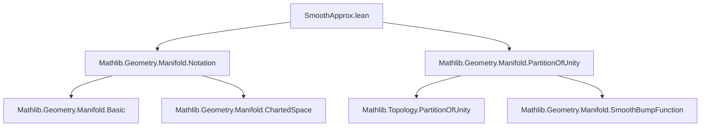
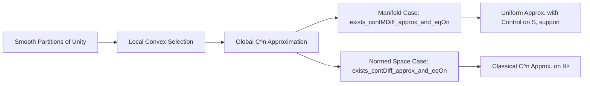

### Technical Brief: `SmoothApprox.lean`

---

#### **1. Key Definitions & Theorems**

| Name | Type / Signature | Purpose |
|------|------------------|---------|
| `t x` | `M → Set F` | A family of convex subsets of the target space $F$, defined per point $x \in M$ to enforce approximation constraints: closeness to $f(x)$, equality on a closed set $S$, and vanishing where $f$ vanishes. |
| `exists_contMDiff_approx_and_eqOn` | `Continuous f → Continuous ε → (∀ x, 0 < ε x) → IsClosed S → U ∈ 𝓝ˢ S → CMDiff[U] n f → ∃ g : C^n, ...` | Main approximation theorem on manifolds: constructs a $C^n$ map $g$ approximating $f$ pointwise within $\varepsilon(x)$, agreeing with $f$ on closed $S$, and satisfying $\mathrm{supp}(g) \subseteq \mathrm{supp}(f)$. |
| `exists_contMDiff_approx` | `Continuous f → Continuous ε → (∀ x, 0 < ε x) → ∃ g : C^n, ...` | Simplified version of the above, dropping the $S$-locality condition (i.e., $S = \emptyset$). |
| `exists_contDiff_approx_and_eqOn` | `Continuous f → Continuous ε → (∀ x, 0 < ε x) → IsClosed S → U ∈ 𝓝ˢ S → ContDiffOn ℝ n f U → ∃ g, ContDiff ℝ n g ∧ ...` | Normed-space specialization of `exists_contMDiff_approx_and_eqOn`, using classical Fréchet differentiability (`ContDiff`). |
| `exists_contDiff_approx` | `Continuous f → Continuous ε → (∀ x, 0 < ε x) → ∃ g, ContDiff ℝ n g ∧ ...` | Simplified normed-space version (no $S$). |

Notation:
- `C^n⟮I, M; 𝓘(ℝ, F), F⟯` denotes $C^n$ maps from manifold $M$ (with model corner $I$) to $F$.
- `CMDiff[U] n f` means $f$ is $C^n$ on open set $U$.
- `ContDiffOn ℝ n f U` is the analogous notion in normed spaces.

---

#### **2. Naming Conventions**

- **Prefixes**:
  - `exists_`: existential existence theorems.
  - `contMDiff_`: manifold-based $C^n$ approximation.
  - `contDiff_`: normed-space-based $C^n$ approximation.
- **Suffixes**:
  - `_and_eqOn`: includes equality-on-$S$ condition.
  - No suffix (e.g., `_approx`): simplified version without $S$-control.

---

#### **3. Tactic Stack**

Frequent tactics used:
- `rcases`, `obtain`, `exact`, `refine`: for destructuring and constructing existentials.
- `by_cases`, `by_contra`, `simp`, `simpa`: case analysis and simplification.
- `eventually_mem`, `eventually_lt`, `eventually_ne`: filter-based reasoning with neighborhoods.
- `convex_ball`, `convex_singleton`, `setOf_const_imp`: convexity arguments.
- `mem_nhdsSet_iff_forall`, `isOpen_compl.eventually_mem`: topology lemmas.
- `contMDiffOn_const`, `contDiffOn_empty`: regularity of constant/empty maps.

---

#### **4. Proof Logic**

**High-level structure** (for `exists_contMDiff_approx_and_eqOn`):

1. **Define target sets** $t(x)$ encoding:
   - $\mathrm{dist}(y, f(x)) < \varepsilon(x)$,
   - $x \in S \Rightarrow y = f(x)$,
   - $f(x) = 0 \Rightarrow y = 0$.

2. **Show convexity** of each $t(x)$ (intersection of convex sets).

3. **Apply `exists_contMDiffMap_forall_mem_convex_of_local`**, a local-to-global selection theorem relying on smooth partitions of unity.

4. **Local construction**:
   - If $x \in S$: use $f$ on neighborhood $U \in \mathcal{N}^s S$ where $f$ is $C^n$.
   - If $x \notin S$: construct a constant map $y \mapsto f(x)$ on a neighborhood where $f$ is close to $f(x)$ and nonzero-locus matches.

5. **Extract properties** from membership in $t(x)$ to get:
   - Approximation bound,
   - Equality on $S$,
   - Support inclusion.

The normed-space versions reduce to the manifold case via `𝓘(ℝ, E)` (identity model corner) and `ContDiff ↔ ContMDiff`.

---

#### **5. Imports**

- `Mathlib.Geometry.Manifold.Notation`: basic manifold notation.
- `Mathlib.Geometry.Manifold.PartitionOfUnity`: existence of smooth partitions of unity (key engine for approximation).

---

#### **6. Mermaid Diagrams**

##### **Dependency Graph (Module-Level)**



##### **Theoretical Overview (Approximation Pipeline)**



##### **Data Flow in Main Proof**

```mermaid
graph LR
  f[Continuous f] --> t[Define t(x)]
  ε[Continuous ε > 0] --> t
  S[Closed S] --> t
  U[Neighborhood of S] --> t
  hfU[f is C^n on U] --> t
  t --> Convex[t(x) convex]
  Convex --> Local[Local sections in t(x)]
  Local --> Global[Global C^n section g]
  g --> Properties[dist < ε, EqOn S, supp g ⊆ supp f]
```

---

#### **7. Summary**

This file leverages smooth partitions of unity to prove *quantitative*, *support-preserving*, and *locality-respecting* approximation of continuous maps by smooth ones on finite-dimensional σ-compact manifolds. It generalizes classical convolution-based approximation by avoiding support thickening and enabling pointwise precision control via a function $\varepsilon : M \to \mathbb{R}_{>0}$. The structure reflects Lean’s modular design: manifold-level results are specialized to normed spaces via canonical model corners.
