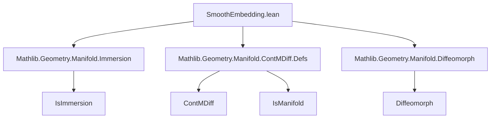

### Technical Brief: `SmoothEmbedding.lean`

---

#### **1. Key Definitions & Theorems**

| Name | Type / Signature | Purpose |
|------|------------------|---------|
| `IsSmoothEmbedding I J n f` | `structure (f : M → N) → Prop` | Defines $ f $ as a $ C^n $ **smooth embedding**: a $ C^n $ immersion + topological embedding. |
| `isImmersion` | `hf.isImmersion : IsImmersion I J n f` | Component of the structure asserting $ f $ is a $ C^n $ immersion. |
| `isEmbedding` | `hf.isEmbedding : IsEmbedding f` | Component asserting $ f $ is a topological embedding (i.e., homeomorphism onto its image). |
| `IsSmoothEmbedding.id` | `IsSmoothEmbedding I I n (@id M)` | Identity map on a $ C^n $-manifold is a smooth embedding. |
| `IsSmoothEmbedding.prodMap` | `IsSmoothEmbedding (I.prod I') (J.prod J') n (Prod.map f g)` | Product of two smooth embeddings is a smooth embedding (w.r.t. product model corners). |
| `IsSmoothEmbedding.of_opens` | `IsSmoothEmbedding I I n (Subtype.val : s → M)` | Inclusion of an open subset $ s \hookrightarrow M $ is a smooth embedding. |
| `proof_wanted contMDiff` | `hf : IsSmoothEmbedding I J n f ⊢ ContMDiff I J n f` | To be proven: smooth embeddings are $ C^n $ maps. |
| `proof_wanted comp` | `hf, hg ⊢ IsSmoothEmbedding I J' n (g ∘ f)` | To be proven: composition of smooth embeddings (between Banach manifolds) is a smooth embedding. |
| `proof_wanted Diffeomorph.isSmoothEmbedding` | `φ : Diffeomorph I I M M' n ⊢ IsSmoothEmbedding I I n φ` | To be proven: diffeomorphisms are smooth embeddings. |

---

#### **2. Naming Conventions**

- **Prefixes**:
  - `isImmersion`, `isEmbedding`: field names in the structure.
  - `isSmoothEmbedding`: main predicate name; used in `mk_iff` to generate `isSmoothEmbedding_iff`.
- **Suffixes**:
  - `prodMap`: product of maps.
  - `of_opens`: construction from open subsets.
- **No `At` suffix**: as noted, smooth embeddings are *global*; no local version (`IsSmoothEmbeddingAt`) is defined.

---

#### **3. Tactic Stack**

Frequently used tactics in this file:

| Tactic | Usage |
|--------|-------|
| `rw [isSmoothEmbedding_iff]` | Rewriting using the `mk_iff`-generated equivalence. |
| `exact ⟨…, …⟩` | Constructing instances of the `IsSmoothEmbedding` structure. |
| `rw`, `exact`, `intro`, `apply` | Basic proof scripting. |
| `prodMap` (as lemma) | Applied directly in `prodMap` proof. |
| `IsImmersion.of_opens`, `IsEmbedding.subtypeVal` | Used in `of_opens` proof. |
| `id` (as lemma) | Used in `id` proof. |

No heavy automation (e.g., `aesop`, `ring`, `simp_rw`) is used yet — proofs are mostly direct.

---

#### **4. Proof Logic**

- **Structure-based reasoning**: Proofs rely on decomposing `IsSmoothEmbedding f` into its two components (`isImmersion`, `isEmbedding`) and proving each separately.
- **Leveraging existing lemmas**:
  - `IsImmersion.id`, `IsImmersion.prodMap`, `IsImmersion.of_opens`
  - `IsEmbedding.id`, `IsEmbedding.prodMap`, `IsEmbedding.subtypeVal`
- **Inductive/constructive style**: Definitions are built from known properties (e.g., open inclusions are embeddings).
- **Missing proofs** (`proof_wanted`) indicate planned extensions:
  - `contMDiff`: needs `hf.isImmersion.contMDiff` (already a lemma for immersions).
  - `comp`: requires `IsImmersion.comp` and `IsEmbedding.comp` (assumed available).
  - `Diffeomorph.isSmoothEmbedding`: expects `IsLocalDiffeomorph.isSmoothEmbedding` as intermediate.

---

#### **5. Imports & Dependencies**

| Import | Purpose |
|--------|---------|
| `Mathlib.Geometry.Manifold.Immersion` | Provides `IsImmersion`, key component of embeddings. |
| `Mathlib.Geometry.Manifold.ContMDiff.Defs` | Provides `ContMDiff`, `IsManifold`, model corners, etc. |
| `Mathlib.Geometry.Manifold.Diffeomorph` | Used only in `proof_wanted Diffeomorph.isSmoothEmbedding`. |

**Core dependencies**: `ModelWithCorners`, `ChartedSpace`, `IsManifold`, `IsImmersion`, `IsEmbedding`.

---

#### **6. Mermaid Diagrams**

##### **Dependency Graph (Module-Level)**



##### **Conceptual Overview of Theory**

```mermaid
graph LR
  subgraph Definitions
    A[IsSmoothEmbedding f]
    A --> B[IsImmersion f]
    A --> C[IsEmbedding f]
  end

  subgraph Properties
    B --> D[ContMDiff f]  %% to be proven
    C --> E[Continuous f]
    C --> F[Homeomorph M ≈ im f]
  end

  subgraph Constructions
    G[id : M → M]
    H[f × g]
    I[s ↪ M]  %% open inclusion
  end

  A -->|id| G
  A -->|prodMap| H
  A -->|of_opens| I

  Diffeomorph -->|Diffeomorph.isSmoothEmbedding| A  %% to be proven
  Immersion.comp & Embedding.comp -->|comp| A  %% to be proven
```

---

#### **7. Summary**

This file formalizes the foundational theory of **smooth embeddings** between $ C^n $ manifolds in Lean 4 (Mathlib). It defines the predicate `IsSmoothEmbedding` as the conjunction of being a $ C^n $ immersion and a topological embedding. Key constructions include identity, product, and open inclusions. Several important properties (e.g., composition, diffeomorphism ⇒ embedding) are marked as `proof_wanted`, indicating active development. The formalization follows the standard mathematical approach: global, structure-based, and leveraging existing lemmas for immersions and embeddings.

--- 

Let me know if you'd like the same analysis for the related files (`Immersion.lean`, `ContMDiff.Defs.lean`, `Diffeomorph.lean`).
