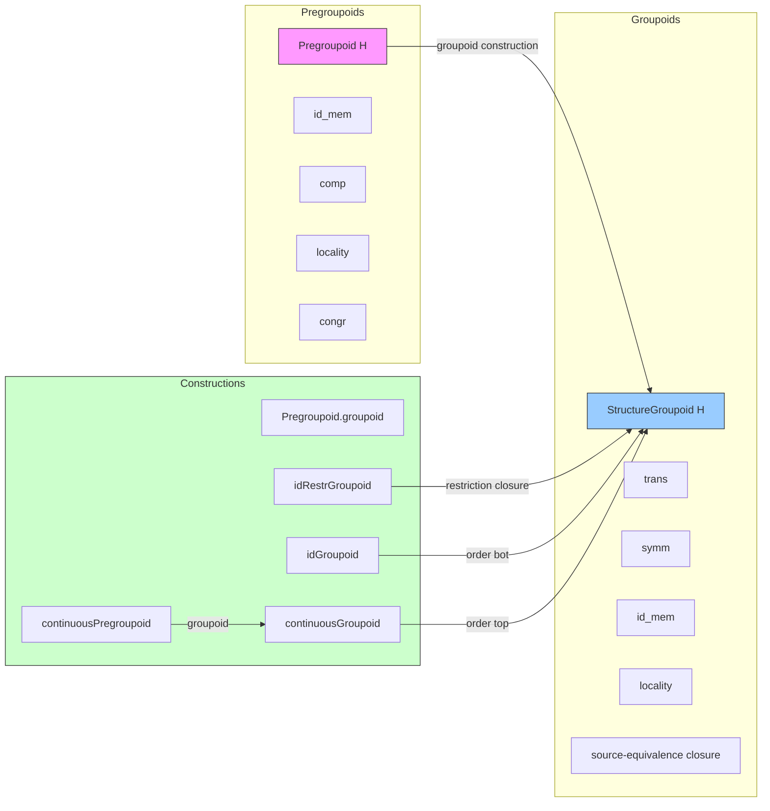
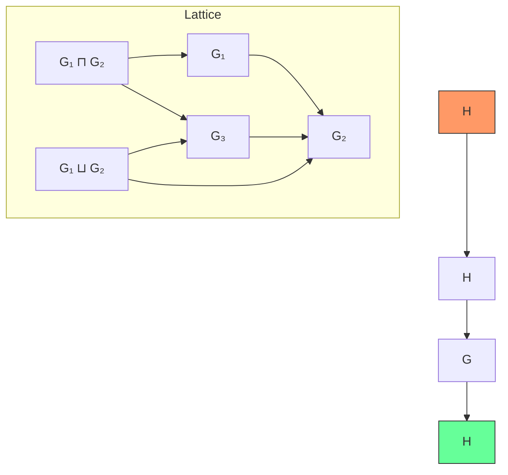

### Technical Brief: `StructureGroupoid.lean`

---

#### **1. Key Definitions & Theorems**

| Name | Type / Signature | Purpose |
|------|------------------|---------|
| `StructureGroupoid H` | `Type u → [TopologicalSpace H] → Type u` | A set of open partial homeomorphisms on `H`, closed under composition, inverse, identity, locality, and equivalence-on-source. |
| `members G` | `Set (OpenPartialHomeomorph H H)` | Underlying set of members of a structure groupoid `G`. |
| `trans'`, `symm'`, `id_mem'`, `locality'`, `mem_of_eqOnSource'` | Axioms of `StructureGroupoid` | Ensure closure under composition, inverse, identity, locality, and source-equivalence. |
| `idGroupoid H` | `StructureGroupoid H` | Minimal groupoid: contains only identity and maps with empty source. |
| `continuousGroupoid H` | `StructureGroupoid H` | Maximal groupoid: all open partial homeomorphisms on `H`. |
| `Pregroupoid H` | `Type u → [TopologicalSpace H] → Type u` | A set of partial maps (not necessarily invertible) stable under composition, identity, locality, and congruence. |
| `Pregroupoid.groupoid PG` | `StructureGroupoid H` | Constructs a groupoid from a pregroupoid by requiring both map and inverse to satisfy the pregroupoid property. |
| `continuousPregroupoid H` | `Pregroupoid H` | Trivial pregroupoid: all partial maps satisfy the property. |
| `idRestrGroupoid H` | `StructureGroupoid H` | Minimal *restriction-closed* groupoid: generated by restrictions of identity to open sets. |
| `ClosedUnderRestriction G` | `Prop` | Class asserting `G` is closed under restriction to open subsets of source. |
| `StructureGroupoid.trans` | `{e e' : OpenPartialHomeomorph H H} → e ∈ G → e' ∈ G → e ≫ₕ e' ∈ G` | Composition closure (non-prime version). |
| `StructureGroupoid.locality` | `(∀ x ∈ e.source, ∃ s, IsOpen s ∧ x ∈ s ∧ e.restr s ∈ G) → e ∈ G` | Locality principle for membership. |
| `mem_groupoid_of_pregroupoid` | `e ∈ PG.groupoid ↔ PG.property e e.source ∧ PG.property e.symm e.target` | Membership characterization for groupoids built from pregroupoids. |
| `closedUnderRestriction_iff_id_le` | `ClosedUnderRestriction G ↔ idRestrGroupoid ≤ G` | Equivalence between restriction-closure and containing the minimal restriction-closed groupoid. |

---

#### **2. Naming Conventions**

- **Prefixes**:
  - `is_`: Not used here.
  - `mem_`: Membership lemmas (e.g., `mem_of_eqOnSource`, `mem_groupoid_of_pregroupoid`).
  - `id_`: Minimal groupoid (`idGroupoid`, `idRestrGroupoid`).
  - `continuous_`: Maximal / trivial structures (`continuousGroupoid`, `continuousPregroupoid`).
  - `groupoid_of_`: Constructions from pregroupoids (`Pregroupoid.groupoid`).
  - `closedUnderRestriction_`: Properties related to restriction closure.

- **Suffixes**:
  - `'` (prime): Axioms in the structure definition (e.g., `trans'`, `locality'`).
  - No-prime: Derived theorems (e.g., `trans`, `locality`).
  - `le_iff`, `mem_iff_of_eqOnSource`: Logical equivalences for order/membership.

- **Infix operators**:
  - `≫ₕ`: Composition of `OpenPartialHomeomorph` (scoped `[Manifold]`).
  - `≫`: Composition of `PartialEquiv`.

---

#### **3. Tactic Stack**

Frequently used tactics in proofs:

| Tactic | Usage |
|--------|-------|
| `rcases`, `rintro`, `cases` | Decompose existential/universal hypotheses or structure members. |
| `simp only [...]` | Simplify using precise lemmas (e.g., `mem_singleton_iff`, `restr_source`, `ofSet_trans_ofSet`). |
| `rw [...]` | Rewrite using equivalences or definitions (e.g., `eqOn`, `symm_toPartialEquiv`). |
| `convert ... using n` | Match goal up to `n`-step definitional equality. |
| `ext` | Extensionality for sets/functions. |
| `rwa [...]` | Rewrite + assumption. |
| `exact`, `apply`, `intro` | Basic proof steps. |
| `have`, `suffices`, `by_cases` | Intermediate lemma introduction or case splits. |
| `aesop`, `tauto` | Not used here — proofs are highly structured and manual. |
| `ring`, `linarith` | Not used — no arithmetic goals. |

---

#### **4. Proof Logic**

- **Inductive/constructive style**: Proofs are mostly *direct constructions* using the axioms of `StructureGroupoid` and `Pregroupoid`.
- **Common pattern**:
  1. Unfold definitions (`members`, `property`, `restr`, `trans`, etc.).
  2. Apply axioms (`trans'`, `symm'`, `locality'`, `congr`, `comp`, etc.).
  3. Use `simp` with precise lemmas to reduce to trivial cases.
  4. For locality: reduce to pointwise local conditions, then apply `locality'`.
  5. For equivalence-on-source: use `mem_of_eqOnSource` or `congr`.
- **Key logical flow**:
  - To prove `e ∈ G`, either:
    - Show `e` is built from axioms (e.g., `trans`, `symm`).
    - Use `locality`: verify local membership.
    - Use `mem_of_eqOnSource`: show `e` is equivalent to a known member.
  - To prove `G₁ ≤ G₂`, show `∀ e, e ∈ G₁ → e ∈ G₂`.
  - To prove `ClosedUnderRestriction G`, use `closedUnderRestriction_iff_id_le` or directly apply `closedUnderRestriction'`.

---

#### **5. Imports**

| Import | Purpose |
|--------|---------|
| `Mathlib.Data.EReal.Operations` | Extended reals (likely for smoothness class definitions elsewhere). |
| `Mathlib.Topology.MetricSpace.Bounded` | Bounded maps (possibly for charted spaces with bounded charts). |
| `Mathlib.Topology.OpenPartialHomeomorph.Composition` | Core theory of `OpenPartialHomeomorph`, including `trans`, `restr`, `≈`, etc. |

> **Note**: This file is part of the *manifold* development in Mathlib. It sets up the foundational categorical structure for defining *charted spaces* and *manifolds with model space `H`*.

---

#### **6. Mermaid Diagrams**

##### **Dependency Graph (Module-Level)**

```mermaid
graph TD
  A[StructureGroupoid.lean] --> B[Mathlib.Data.EReal.Operations]
  A --> C[Mathlib.Topology.MetricSpace.Bounded]
  A --> D[Mathlib.Topology.OpenPartialHomeomorph.Composition]
  A --> E[Mathlib.Geometry.Manifold.ChartedSpace]  %% implied usage
```

##### **Conceptual Overview (Theory Stack)**



##### **Lattice Structure**



> **Note**: `StructureGroupoid H` forms a **complete lattice**, with:
> - `⊥ = idGroupoid H`
> - `⊤ = continuousGroupoid H`
> - `inf = intersection`
> - `sup = generated groupoid from union`

---

#### **7. Summary**

This file formalizes *structure groupoids* — the algebraic-geometric backbone for defining manifolds with prescribed regularity (e.g., smooth, PL, analytic). It introduces:
- A **categorical abstraction** of symmetry classes (via groupoids of local homeomorphisms),
- A **pregroupoid** machinery to build groupoids from non-invertible data (e.g., smooth maps),
- A **complete lattice structure** on groupoids, enabling intersections, joins, and minimal/maximal models.

It is foundational for `Mathlib.Geometry.Manifold.ChartedSpace`, where charted spaces are defined as topological spaces equipped with an atlas valued in a structure groupoid.

--- 

Let me know if you'd like a formalized dependency graph (e.g., for `leanpkg`), or a visualization of the `Pregroupoid.groupoid` construction pipeline.
