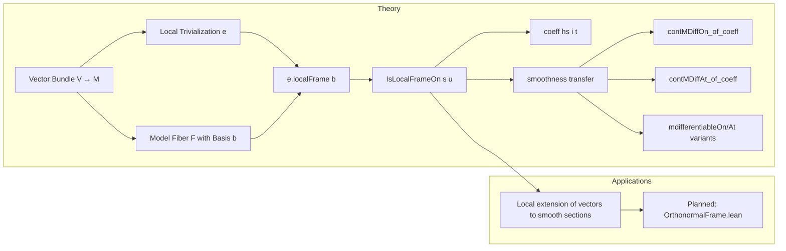

**Technical Brief: `LocalFrame.lean` — Local Frames in Smooth Vector Bundles**

---

### 1. KEY DEFINITIONS & THEOREMS

| Name | Type / Signature | Purpose |
|------|------------------|---------|
| `IsLocalFrameOn` | `structure` | Predicate stating that a family of sections `s : ι → (x : M) → V x` forms a $C^k$ local frame on set `u ⊆ M`: sections are $C^k$ on `u`, and at each `x ∈ u`, the values `s i x` form a basis of the fiber `V x`. |
| `toBasisAt` | `hs.toBasisAt hx : Basis ι 𝕜 (V x)` | For `x ∈ u`, constructs the basis of the fiber `V x` induced by the local frame. |
| `coeff` | `hs.coeff i : (Π x, V x) →ₗ[𝕜] M → 𝕜` | Linear map assigning to each section `t` its `i`-th coefficient function w.r.t. the local frame `s`. Junk value `0` outside `u`. |
| `coeff_sum_eq` | `t x = ∑ i, (hs.coeff i t x) • s i x` | Expansion of a section at a point `x ∈ u` in terms of the local frame. |
| `eventually_eq_sum_coeff_smul` | `∀ᶠ x' in 𝓝 x, t x' = ∑ i, (hs.coeff i t x') • s i x'` | Local expansion holds in a neighborhood of `x ∈ u`. |
| `eq_iff_coeff` | `t x = t' x ↔ ∀ i, hs.coeff i t x = hs.coeff i t' x` | Equality of sections at `x` is equivalent to equality of all coefficients (requires finite-dimensionality). |
| `contMDiffOn_of_coeff` | `(∀ i, CMDiff[u] n (hs.coeff i t)) → CMDiff[u] n (T% t)` | If all coefficients of `t` are $C^n$ on `u`, then `t` is $C^n$ on `u`. |
| `contMDiffAt_of_coeff` | `(∀ i, CMDiffAt n (hs.coeff i t) x) → u ∈ 𝓝 x → CMDiffAt n (T% t) x` | Local smoothness of `t` at `x` follows from smoothness of coefficients. |
| `contMDiffOn_localFrame_baseSet` | `CMDiff[e.baseSet] n (T% (e.localFrame b i))` | Sections of the induced local frame are smooth on the trivialization domain. |
| `isLocalFrameOn_localFrame_baseSet` | `IsLocalFrameOn I F n (e.localFrame b) e.baseSet` | The induced frame from a trivialization and basis is indeed a local frame. |
| `basisAt` | `e.basisAt b hx : Basis ι 𝕜 (V x)` | Basis of fiber `V x` induced by trivialization `e` and model basis `b`. |
| `localFrame` | `e.localFrame b : ι → (x : M) → V x` | Global family of sections (junk outside `e.baseSet`) forming a local frame on `e.baseSet`. |

---

### 2. NAMING CONVENTIONS

- **Predicates**: `IsLocalFrameOn` — standard Lean pattern `Is*` for properties.
- **Constructors/Accessors**:
  - `toBasisAt`, `coeff`, `basisAt`, `localFrame` — nouns for objects.
  - `coeff_sum_eq`, `eq_iff_coeff`, `contMDiffOn_of_coeff`, `contMDiffAt_of_coeff` — `*_of_*`, `*_iff_*`, `*_*_eq` patterns.
- **Lemmas**:
  - `congr`, `mono`, `coeff_congr`, `coeff_eq_of_eq` — standard equality reasoning.
  - `contMDiffOn_*`, `contMDiffAt_*`, `mdifferentiableOn_*`, `mdifferentiableAt_*` — smoothness variants.
- **Trivialization-related**:
  - `basisAt`, `localFrame`, `contMDiffOn_localFrame_baseSet`, `isLocalFrameOn_localFrame_baseSet` — `localFrame_*`, `basisAt_*`.

---

### 3. TACTIC STACK

Frequent tactics used in proofs:

- `simp` / `simp_all` — simplification with `@[simp]` lemmas (e.g., `coeff_apply_of_mem`, `localFrame_apply_of_mem_baseSet`).
- `congr` — for equality of functions/sections.
- `by_cases` — to split on membership `x ∈ u` or `x ∉ u`.
- `exact`, `convert`, `apply`, `intro` — standard proof structure.
- `sum_section`, `smul_section` — from `VectorBundle`/`MDifferentiable` theory.
- `eventually_of_mem`, `congr_of_eventuallyEq` — for neighborhood-based arguments.
- `fintypeOfFiniteDimensional` — extraction of finite index type from finite-dimensionality.
- `aesop` not used (proofs are mostly manual, leveraging algebraic and topological structure).

---

### 4. PROOF LOGIC

**Typical proof pattern**:

1. **Reduction to pointwise algebra**: Use `coeff_apply_of_mem` / `coeff_apply_of_notMem` to reduce to basis representation.
2. **Finite-dimensional reduction**: Use `fintypeOfFiniteDimensional` to get finite indexing set (needed for sums).
3. **Smoothness propagation**:
   - Show each term `(hs.coeff i t) • s i` is $C^n$ using `smul_section`.
   - Sum using `sum_section`.
   - Conclude equality with `t` via `coeff_sum_eq` and `congr`.
4. **Neighborhood arguments**: Use `eventually_eq_sum_coeff_smul` + `congr_of_eventuallyEq` to lift pointwise identities to local smoothness.
5. **Trivialization-induced frames**: Prove `isLocalFrameOn_localFrame_baseSet` by verifying the three conditions:
   - `linearIndependent`: via `basisAt.linearIndependent`.
   - `generating`: via `basisAt.span_eq`.
   - `contMDiffOn`: via `contMDiffOn_localFrame_baseSet`.

---

### 5. IMPORTS & SCOPE

**Primary dependencies**:

- `Mathlib.Geometry.Manifold.Algebra.Monoid` — algebraic structure on manifolds.
- `Mathlib.Geometry.Manifold.Notation` — bundle/section notation (`T%`, `•`, etc.).
- `Mathlib.Geometry.Manifold.VectorBundle.MDifferentiable` — $C^k$ differentiability of sections.
- `Mathlib.Geometry.Manifold.VectorBundle.SmoothSection` — smooth section calculus.

**Scope**:  
Finite-rank smooth vector bundles over a base manifold `M`, with model fiber `F` over a nontrivially normed field `𝕜`.  
The theory is developed for `ContMDiff n` (i.e., $C^n$) sections, with `n : WithTop ℕ∞`.  
The file focuses on *local* smoothness characterizations via frames.

---

### 6. MERMAID DIAGRAMS

#### Dependency Graph (High-Level)

```mermaid
graph TD
  A[VectorBundle F V] --> B[ContMDiffVectorBundle n F V I]
  B --> C[Trivialization F (TotalSpace V)]
  C --> D[Trivialization.basisAt]
  C --> E[Trivialization.localFrame]
  D --> F[IsLocalFrameOn]
  E --> F
  F --> G[IsLocalFrameOn.coeff]
  F --> H[IsLocalFrameOn.contMDiffOn_of_coeff]
  F --> I[IsLocalFrameOn.eq_iff_coeff]
  G --> H
  G --> I
  H --> J[Smoothness criteria for sections]
  I --> J
```

#### Overview of `LocalFrame.lean`



---

### 7. TODO & FUTURE WORK

- Strengthen smoothness equivalences:
  - `contMDiffOn_coeff`: if `t` is $C^n$, then coefficients are $C^n$.
  - `contMDiffAt_iff_coeff`, `contMDiffOn_iff_coeff`, and their `MDifferentiable` analogues.
- Extend to infinite-rank bundles with $C^n$ bundle metrics (Hilbert/Banach).
- Construct local extensions of vectors to smooth sections using frames.

---

### 8. TAGS

`vector bundle`, `local frame`, `smoothness`, `coefficients`, `trivialization`, `contMDiff`, `MDifferentiable`
