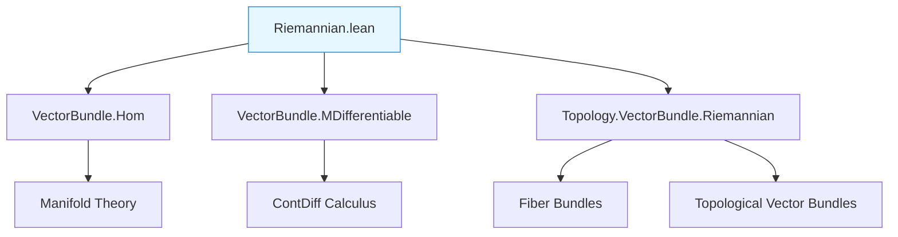
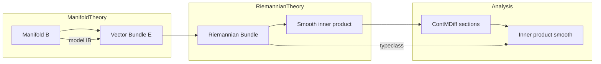

**Technical Brief: Riemannian Vector Bundles in Lean 4 (`Riemannian.lean`)**  
*Based on the source file `Riemannian.lean` (2025, Sébastien Gouëzel)*

---

### 1. KEY DEFINITIONS & THEOREMS

| Name | Type / Signature | Purpose |
|------|------------------|---------|
| `IsContMDiffRiemannianBundle` | `class IsContMDiffRiemannianBundle (IB n F E) : Prop` | Registers that a vector bundle $E \to B$ admits a **smoothly varying** inner product on fibers (i.e., a $C^n$ Riemannian structure). |
| `ContMDiffRiemannianMetric` | `structure` | A concrete smooth family of inner products (i.e., a smooth Riemannian metric), used to construct `RiemannianBundle`. |
| `inner_bundle` lemmas | `ContMDiffWithinAt.inner_bundle`, `ContMDiffAt.inner_bundle`, `ContMDiffOn.inner_bundle`, `ContMDiff.inner_bundle` | If $v, w$ are $C^n$ sections of a Riemannian bundle, then $x \mapsto \langle v(x), w(x) \rangle$ is $C^n$. |
| `MDifferentiable.inner_bundle` lemmas | Analogous to above for $n = 1$ (i.e., Fréchet differentiability) | Ensures differentiability of the scalar product of differentiable sections. |
| `of_le` | `lemma` | Monotonicity in smoothness: if a bundle is $C^n$-Riemannian, then it is $C^{n'}$-Riemannian for $n' \le n$. |
| `instance` for `∞`, `ω`, `0`, `1`, `2`, `3` | `instance` | Automatic weakening of smoothness class (e.g., $C^\infty \Rightarrow C^a$ for any $a \le \infty$). |
| `Trivial.instance` | `instance` | Trivial bundle over $B$ with model fiber an inner product space is Riemannian. |
| `ContMDiffRiemannianMetric.toRiemannianMetric` | `def` | Forgets smoothness to obtain a (topological) Riemannian metric. |
| `RiemannianBundle.instance` | `instance` | From a `ContMDiffRiemannianMetric`, derive `RiemannianBundle E` and `IsContMDiffRiemannianBundle`. |

---

### 2. NAMING CONVENTIONS

- **Prefixes**:
  - `is_` in `IsContMDiffRiemannianBundle` — typeclass naming for properties.
  - `contMDiff` in `ContMDiffRiemannianMetric`, `ContMDiff.inner_bundle` — smoothness class.
  - `inner_` in `inner_bundle` — scalar product of sections.
  - `clm_` in `clm_bundle_apply₂` — continuous linear maps.

- **Suffixes**:
  - `_bundle` — refers to bundle-theoretic scalar product (as opposed to fiberwise inner product).
  - `_at`, `_withinAt`, `_on`, no suffix — standard `ContMDiff`/`MDifferentiable` variants.

- **Notation**:
  - `⟪v, w⟫` → `inner ℝ v w` (local notation for fiberwise inner product).
  - `E x` → fiber over $x$.
  - `TotalSpace F E` → total space of the bundle.

---

### 3. TACTIC STACK

| Tactic | Frequency | Role |
|--------|-----------|------|
| `rcases` / `cases` | High | Extract witness `g` from `IsContMDiffRiemannianBundle.exists_contMDiff`. |
| `simp only [...]` | Very high | Simplify using local definitions (`hg`, `contMDiffWithinAt_totalSpace`, etc.). |
| `exact` / `apply` | High | Apply lemmas like `ContMDiffWithinAt.clm_bundle_apply₂`. |
| `convert` / `ext` | Medium | Prove equality of functions (e.g., in `Trivial.instance`). |
| `norm_cast` | Low | Cast natural numbers in `WithTop ℕ∞`. |
| `rfl` | Medium | Prove definitional equalities (e.g., `hg`). |
| `convert contMDiffAt_const` | Medium | Prove smoothness of constant sections. |

---

### 4. PROOF LOGIC

The logical flow in proofs of `inner_bundle` lemmas follows a **standard pattern**:

1. **Unpack the Riemannian assumption**:  
   Use `rcases h.exists_contMDiff` to get a global smooth section $g : B \to \mathrm{Bilin}(E_b)$ representing the metric.

2. **Reduce to smooth bilinear application**:  
   Express $\langle v(x), w(x) \rangle = g(b(x))(v(x), w(x))$, where $b$ is the base map.

3. **Lift sections to total space**:  
   Use `contMDiffWithinAt_totalSpace` to translate section smoothness into smoothness of maps into `TotalSpace`.

4. **Apply chain rule for bilinear maps**:  
   Use `clm_bundle_apply₂` (or its `MDifferentiable` variant) to combine:
   - smooth base map $b$,
   - smooth bilinear map $g \circ b$,
   - smooth sections $v, w$.

5. **Project back to scalar function**:  
   Use `contMDiffWithinAt_totalSpace` again to extract smoothness of the scalar-valued function.

6. **Monotonicity**:  
   For `of_le`, use `g_smooth.of_le` from `ContMDiff` calculus.

---

### 5. IMPORTS & DEPENDENCIES

| Import | Role |
|--------|------|
| `Mathlib.Geometry.Manifold.VectorBundle.Hom` | Homomorphisms of vector bundles, linear maps in coordinates. |
| `Mathlib.Geometry.Manifold.VectorBundle.MDifferentiable` | Differentiability theory for sections of vector bundles. |
| `Mathlib.Topology.VectorBundle.Riemannian` | Pre-existing Riemannian bundle theory (topological/continuous version). |

**Key dependencies**:
- `FiberBundle`, `VectorBundle`
- `ContMDiff`, `MDifferentiable`
- `InnerProductSpace`, `ContinuousLinearMap`
- `RiemannianMetric`, `ContinuousRiemannianMetric`

---

### 6. Mermaid Diagrams

#### Dependency Graph (Module-Level)

#### Overview of File Structure

#### Theory Context (High-Level)

---

### 7. Summary

This file formalizes **smooth Riemannian vector bundles** in the context of `ContMDiff` (smooth manifold theory). It introduces a typeclass `IsContMDiffRiemannianBundle` to capture smooth variation of the inner product, and proves that the scalar product of smooth sections is smooth — a foundational result for Riemannian geometry on vector bundles (e.g., Levi-Civita connection, curvature). The design avoids diamonds via `RiemannianBundle`, and provides a clean interface for constructing Riemannian structures from smooth families of metrics.

--- 

*End of Technical Brief.*
