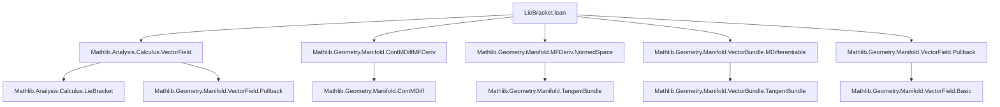

Here is the **technical metadata** extracted from `LieBracket.lean`, structured as requested:

---

### 1. **Key Definitions & Theorems**

| Name | Type / Signature | Purpose |
|------|------------------|---------|
| `mlieBracketWithin` | `Π (V W : Π x, TangentSpace I x) (s : Set M) (x₀ : M), TangentSpace I x₀` | Local Lie bracket of vector fields *within* a set `s`, defined via pullback to model space using charts. |
| `mlieBracket` | `Π (V W : Π x, TangentSpace I x) (x₀ : M), TangentSpace I x₀` | Global Lie bracket (i.e., `mlieBracketWithin` with `s = univ`). |
| `mpullback_mlieBracket` (implicit in `mpullbackWithin_mlieBracketWithin_of_isSymmSndFDerivWithinAt`) | `mpullbackWithin I I' f (mlieBracketWithin I' V W t) s x₀ = mlieBracketWithin I (mpullbackWithin I I' f V s) (mpullbackWithin I I' f W s) s x₀` | Invariance of Lie bracket under `C²` diffeomorphisms with symmetric second derivative. |
| `leibniz_identity_mlieBracket` (not shown in snippet but mentioned in docstring) | `[U, [V, W]] = [[U, V], W] + [V, [U, W]]` | Jacobi (Leibniz) identity for manifold Lie brackets. |

---

### 2. **Naming Conventions**

- **Prefix `m`**: Distinguishes *manifold* notions from *vector space* ones (e.g., `mlieBracket` vs `lieBracket`).
- **Suffix `Within`**: Indicates local behavior relative to a subset `s` (e.g., `mlieBracketWithin`, `mpullbackWithin`).
- **`mpullback` / `mpullbackWithin`**: Pullback of vector fields along maps between manifolds.
- **`mdifferentiable` / `MDifferentiable`**: Manifold-differentiability conditions.
- **`mfderiv` / `mfderivWithin`**: Manifold derivative (pushforward).
- **`extChartAt`**: Chart map centered at a point.

---

### 3. **Tactic Stack**

Frequently used tactics in this file:

| Tactic | Role |
|--------|------|
| `simp` / `simp_rw` | Simplification using definitional equalities and lemmas (e.g., chart inverses, pullback definitions). |
| `rw` | Rewriting using lemmas like `lieBracketWithin_swap`, `mpullback_neg`, etc. |
| `congr` / `congr' 1` | Proving equality of expressions by congruence (especially in `mfderiv`/`pullback` compositions). |
| `abel` | Abelian group simplification (for antisymmetry, linearity). |
| `filter_upwards` | Reasoning about filters (eventual equality, neighborhoods). |
| `have` / `suffices` | Intermediate lemma introduction. |
| `convert` / `exact` | Proof term construction, especially with `extChartAt_to_inv`. |
| `apply` / `exact` | Applying lemmas (e.g., `lieBracketWithin_add_left`). |
| `set ... with h` | Introducing local definitions with names. |

---

### 4. **Proof Logic**

- **Definition via charts**: Lie bracket is defined by pulling vector fields back to the model space via `extChartAt`, computing the standard Lie bracket there (`lieBracketWithin`), and pushing forward back.
- **Local-to-global**: Most lemmas are first proven for `mlieBracketWithin`, then specialized to `mlieBracket` using `univ`.
- **Differentiability assumptions**: Many properties (linearity, Leibniz, etc.) require `MDifferentiableAt`/`MDifferentiableWithinAt` and `UniqueMDiffWithinAt` to ensure well-definedness and compatibility with chart transitions.
- **Invariance under diffeomorphisms**: Proven by reducing to the vector-space case using `IsSymmSndFDerivWithinAt`, then applying `pullbackWithin_lieBracketWithin_of_isSymmSndFDerivWithinAt`.
- **Eventual equality**: Many results use `Filter.EventuallyEq` to show independence of representative vector fields near a point.

---

### 5. **Imports**

| Module | Purpose |
|--------|---------|
| `Mathlib.Analysis.Calculus.VectorField` | Vector fields, Lie brackets in normed spaces (`lieBracketWithin`, `pullbackWithin`). |
| `Mathlib.Geometry.Manifold.ContMDiffMFDeriv` | `ContMDiff`, `mfderiv`, chain rule. |
| `Mathlib.Geometry.Manifold.MFDeriv.NormedSpace` | Tangent spaces, differentiability in normed spaces. |
| `Mathlib.Geometry.Manifold.VectorBundle.MDifferentiable` | `MDifferentiable`, `MDifferentiableWithinAt`. |
| `Mathlib.Geometry.Manifold.VectorField.Pullback` | Pullback of vector fields along smooth maps. |

---

### 6. **Mermaid Diagrams**

#### **Dependency Graph (Module-Level)**



#### **Overview of File Structure**

```mermaid
flowchart LR
  subgraph Definitions
    A[mlieBracketWithin] --> B[mlieBracket]
    B --> C[Basic properties]
  end

  subgraph Properties
    C --> D[Antisymmetry: [V,W] = -[W,V]]
    C --> E[Self-bracket = 0]
    C --> F[Linearity: [c·V,W] = c·[V,W]]
    C --> G[Leibniz rule]
  end

  subgraph Invariance
    H[mpullback_mlieBracket] --> I[Invariance under C² diffeos]
    I --> J[Requires IsSymmSndFDerivWithinAt]
  end

  subgraph Technical Tools
    K[Chart lemmas] --> L[UniqueMDiffWithinAt]
    L --> M[Eventual equality lemmas]
    M --> N[Convergence in neighborhoods]
  end

  A --> C
  H --> I
```

---

Let me know if you'd like a formalized summary in Lean or a LaTeX report version.
