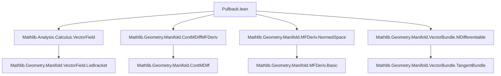

### Technical Brief: Pullback of Vector Fields in Manifolds (Lean 4)

---

#### **1. Key Definitions & Theorems**

| Name | Type / Signature | Purpose |
|------|------------------|---------|
| `mpullbackWithin` | `Π (f : M → M') (V : Π x, TangentSpace I' (f x)) (s : Set M) (x : M), TangentSpace I x` | Pullback of a vector field along a map *within* a set `s`, using `mfderivWithin`. Returns zero if derivative not invertible (junk-value pattern). |
| `mpullback` | `Π (f : M → M') (V : Π x, TangentSpace I' (f x)) (x : M), TangentSpace I x` | Global pullback (i.e., `mpullbackWithin` with `s = univ`). |
| `mfderivWithin`, `mfderiv` | Manifold derivative (within set / at point) | Used to define pullback via inverse of derivative. |
| `IsInvertible.inverse` | Inverse of an invertible continuous linear map | Core operation in pullback definition. |
| `mpullbackWithin_smul`, `mpullbackWithin_add`, etc. | `mpullbackWithin I I' f (c • V) s = c • mpullbackWithin I I' f V s` etc. | Linearity properties of pullback (module homomorphism). |
| `mpullbackWithin_zero`, `mpullback_zero` | `mpullbackWithin I I' f 0 s = 0` etc. | Pullback of zero vector field is zero. |
| `mpullbackWithin_id`, `mpullback_id` | `mpullbackWithin I I id V s x = V x` (under `UniqueMDiffWithinAt`) | Identity pullback recovers original field. |
| `mpullbackWithin_comp_of_left`, `mpullbackWithin_comp_of_right` | Chain rule for pullback under composition | Ensures naturality of pullback when derivatives invertible. |
| `MDifferentiableWithinAt.mpullbackWithin_vectorField_inter` | Regularity: if `V` is `MDifferentiableWithinAt` and `f` is `ContMDiffWithinAt n` with `2 ≤ n` and invertible derivative, then pullback is `MDifferentiableWithinAt`. | Smoothness propagation for pullback. |
| `ContMDiffWithinAt.mpullbackWithin_vectorField_inter` | If `V` is `C^m`, `f` is `C^n`, `m + 1 ≤ n`, derivative invertible ⇒ pullback is `C^m`. | Higher regularity: `C^m` regularity preserved under pullback. |
| `mpullbackWithin_eq_pullbackWithin`, `mpullback_eq_pullback` | `mpullbackWithin` in standard model `𝓘(𝕜, E)` coincides with linear-algebraic `pullbackWithin`. | Compatibility with vector-space pullback. |

---

#### **2. Naming Conventions**

- **Prefix `m`**: Distinguishes *manifold* notions from linear-algebraic ones (`mpullback` vs `pullback`, `mfderiv` vs `fderiv`, `mlieBracket` vs `lieBracket`).
- **Suffix `_within`**: Localized version (e.g., `mpullbackWithin`, `mfderivWithin`).
- **Suffix `_vectorField`**: Used in lemma names to clarify that the vector field structure (as a section of the tangent bundle) is being considered (e.g., `ContMDiffAt.mpullback_vectorField`).
- **`_inter` / `_preimage`**: Distinguish domain restrictions:  
  - `_inter`: pullback defined on `s ∩ f⁻¹' t` (intersection with preimage of domain where `V` is regular).  
  - `_preimage`: pullback defined on full preimage `f⁻¹' t`.
- **`_of_eq` / `_of_mem`**: Lemmas where `y₀ = f x₀` or `f ⁻¹' t ∈ 𝓝[s] x₀` is assumed.

---

#### **3. Tactic Stack**

| Tactic | Usage Frequency | Purpose |
|--------|-----------------|---------|
| `simp` | Very High | Simplify definitions (`mpullbackWithin`, `mfderivWithin`, `inverse`, etc.), especially using `rfl` lemmas. |
| `rw` | High | Rewrite using invertibility, coordinate charts, and `inCoordinates_eq`. |
| `apply` / `exact` | High | Apply lemmas like `MDifferentiableWithinAt.clm_apply_of_inCoordinates`. |
| `filter_upwards` | Medium | Handle neighborhood filters (e.g., `𝓝[s] x₀`). |
| `convert` | Medium | Adjust proofs using `convert using 1` for equality up to definitional equality (e.g., `mfderivWithin_mono`). |
| `congr_of_eventuallyEq_of_mem` | Medium | Prove equality of functions on neighborhoods. |
| `subst` | Low | Eliminate equality hypotheses like `y₀ = f x₀`. |
| `aesop` | Not present | Not used in this file. |
| `ring` / `norm_cast` | Low | Used in instance proofs (e.g., `minSmoothness_monotone`). |

---

#### **4. Proof Logic**

- **Structure**: Proofs follow a *modular regularity pipeline*:
  1. **Linearity**: Show `mpullbackWithin` and `mpullback` are module homomorphisms (via `ext x; simp`).
  2. **Chain Rule**: Prove compatibility with composition using `mfderivWithin_comp` and invertibility.
  3. **Regularity**:
     - Reduce to applying a *general linear-algebraic lemma* (`MDifferentiableWithinAt.clm_apply_of_inCoordinates`, `ContMDiffWithinAt.clm_apply_of_inCoordinates`).
     - Show two components are regular:
       - The vector field `V ∘ f`.
       - The derivative inverse map `x ↦ (mfderivWithin ... x).inverse`.
     - For the derivative inverse:  
       - Use `mfderivWithin_const` (or `mfderivWithin_mono`) to get smoothness of derivative.  
       - Use `IsInvertible.contDiffAt_map_inverse` (smoothness of inversion on `GL(E)`) to lift to smoothness of inverse.
     - Conclude via coordinate chart compatibility (`inCoordinates_eq`).
- **Key Lemmas Used**:
  - `MDifferentiableWithinAt.clm_apply_of_inCoordinates`
  - `ContMDiffWithinAt.clm_apply_of_inCoordinates`
  - `IsInvertible.contDiffAt_map_inverse`
  - `mfderivWithin_comp`, `mfderivWithin_mono`
  - `trivializationAt` and `FiberBundle.mem_baseSet_trivializationAt'` for chart-local reasoning.

---

#### **5. Imports**

| Module | Role |
|--------|------|
| `Mathlib.Analysis.Calculus.VectorField` | Linear-algebraic pullback (`pullback`, `pullbackWithin`) and basic vector field operations. |
| `Mathlib.Geometry.Manifold.ContMDiffMFDeriv` | `ContMDiff`, `mfderiv`, `mfderivWithin`, and their properties. |
| `Mathlib.Geometry.Manifold.MFDeriv.NormedSpace` | Smoothness of linear maps between normed spaces, invertibility, and coordinate charts. |
| `Mathlib.Geometry.Manifold.VectorBundle.MDifferentiable` | Smoothness of sections of vector bundles (e.g., tangent bundle), `MDifferentiableAt`, `MDifferentiableWithinAt`, etc. |

---

#### **6. Mermaid Diagrams**

##### **Dependency Graph (Top-Level)**



##### **Overview of File Structure**

```mermaid
flowchart LR
  subgraph Definitions
    D1[mpullbackWithin] --> D2[mpullback]
    D2 --> D3[Linearity lemmas]
    D3 --> D4[Chain rule lemmas]
  end

  subgraph Regularity
    R1[MDifferentiableWithinAt.mpullbackWithin_vectorField_inter] --> R2[ContMDiffWithinAt.mpullbackWithin_vectorField_inter]
    R2 --> R3[Full versions (preimage, univ)]
  end

  D4 --> R1
  R1 --> R2
```

##### **Proof Strategy Flow (Regularity Lemma)**

```mermaid
flowchart TD
  A[Assume V C^m, f C^n, 2 ≤ n] --> B[Express pullback as ϕ(x)(V(f(x)))]
  B --> C[Show V ∘ f is C^m]
  B --> D[Show ϕ(x) = (mfderivWithin f x).⁻¹ is C^m]
  D --> D1[mfderivWithin is C^m (by mfderivWithin_const)]
  D1 --> D2[Inversion is smooth at invertible maps]
  D2 --> D3[ϕ is C^m]
  C & D3 --> E[Apply clm_apply_of_inCoordinates]
  E --> F[Pullback is C^m]
```

---

#### **7. Theory Context**

- **Scope**: This file formalizes the *pullback operation* for vector fields on smooth manifolds, a foundational tool in differential geometry (e.g., for defining pushforwards, Lie derivatives, flows).
- **Junk-value pattern**: Non-invertible derivative ⇒ pullback = 0. Avoids partiality while keeping definitions total.
- **Smoothness threshold**: Requires `2 ≤ n` for `MDifferentiable`, `m + 1 ≤ n` for `C^m`. This matches the need for `C^2` to ensure invertible derivative implies local diffeomorphism (inverse function theorem).
- **Coordinate-free**: Uses `inCoordinates` to reduce to normed space calculus, preserving generality.
- **Future work**: The file sets up groundwork for Lie brackets (`LieBracket.lean`), flows, and group actions.

--- 

Let me know if you'd like a formalized summary for integration into a domain-specific AI agent (e.g., inference rules, tactic templates, or proof sketch generator).
