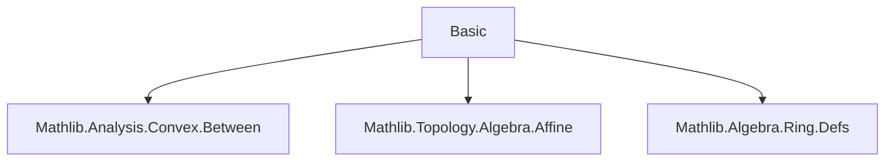
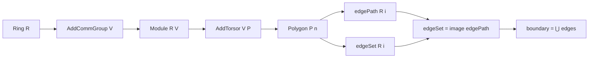

**Technical Brief: Basic.lean — Polygon Definitions in Affine Spaces**

---

### 1. KEY DEFINITIONS & THEOREMS

| Name | Type | Purpose |
|------|------|---------|
| `Polygon P n` | `Type u → ℕ → Type (u+1)` | A structure representing an $n$-vertex polygon in type $P$, defined by a function `Fin n → P` assigning vertices. |
| `CoeFun Polygon P n` | `CoeFun (Polygon P n) (fun _ ↦ Fin n → P)` | Enables notation `poly i` for `poly.vertices i`. |
| `edgePath R poly i` | `R →ᵃ[R] P` | The affine map parametrizing the $i$-th edge as a line segment from `poly i` to `poly (i+1)`. |
| `edgeSet R poly i` | `Set P` | The set of points on the $i$-th edge, defined as the affine segment between `poly i` and `poly (i+1)`. |
| `edgeSet_eq_image_edgePath` | `poly.edgeSet R i = poly.edgePath R i '' Icc (0 : R) 1` | Equates the edge set with the image of the edge path over $[0,1]$. |
| `boundary R poly` | `Set P` | The union of all edge sets: $\bigcup_i \text{edgeSet}_i$. |

---

### 2. NAMING CONVENTIONS

- **Prefixes**:
  - `edge_`: for edge-related constructions (`edgePath`, `edgeSet`).
  - `boundary`: for global polygon boundary.
- **Suffixes**:
  - `_path`: for parametrized (map-based) edges.
  - `_set`: for set-theoretic (image-based) edges.
- **Type parameters**:
  - `R`, `V`, `P` used consistently for base ring, vector space, and affine space respectively.
- **Indexing**:
  - `i : Fin n` used uniformly for vertex/edge indexing.

---

### 3. TACTIC STACK

- **No explicit tactics** appear in definitions or proofs in this file.
- Proofs are *definitionally equal* (`rfl`) — no automation (`aesop`, `simp`, `ring`) needed.
- Relies on:
  - `rfl` for definitional equality (`edgeSet_eq_image_edgePath`).
  - Implicit use of `simp`/`aesop` in `AffineMap.lineMap` and `affineSegment` definitions (from imports).

---

### 4. PROOF LOGIC

- **No inductive or case-based proofs** appear in this file.
- All reasoning is *definitional* or *by construction*:
  - Definitions are direct lifts of geometric intuition (vertices → edges → boundary).
  - The key theorem `edgeSet_eq_image_edgePath` is proven by `rfl`, indicating equality by definition.
- Logical flow:
  1. Define polygon as `Fin n → P`.
  2. Define edge as affine line map.
  3. Define edge set as affine segment.
  4. Show edge set = image of edge path over $[0,1]$.
  5. Define boundary as union of edges.

---

### 5. IMPORTS

| Import | Role |
|--------|------|
| `Mathlib.Analysis.Convex.Between` | Provides `affineSegment`, `Icc`, convexity-related tools. |
| `Mathlib.Topology.Algebra.Affine` | Supplies `AffineMap`, `lineMap`, `AddTorsor`, and affine geometry infrastructure. |
| `Mathlib.Algebra.Ring.Defs` | Supplies `Ring`, `AddCommGroup`, `Module`, foundational algebraic structures. |

---

### 6. DEPENDENCY & THEORY OVERVIEW

#### **Mermaid Diagram: Module Dependencies**

#### **Mermaid Diagram: Theory Flow (Polygon Construction)**

#### **Theory Scope**

- **Domain**: Affine geometry over a ring $R$, with vector space $V$ and affine space $P$.
- **Scope**: Foundations for polygonal reasoning — vertices, edges, and boundaries — in a general affine setting.
- **Intended Use**: Basis for further development (e.g., polygon closure, simplicity, orientation, area).

---

### 7. NOTES

- The `NeZero n` assumption ensures $n > 0$, avoiding degenerate indexing (e.g., `Fin 0`).
- The `PartialOrder R` assumption is required for `affineSegment` and `Icc` to be meaningful.
- The `AffineMap.lineMap` and `affineSegment` functions are imported and assumed to satisfy standard properties (e.g., `lineMap a b 0 = a`, `lineMap a b 1 = b`).

--- 

*End of Technical Brief.*
