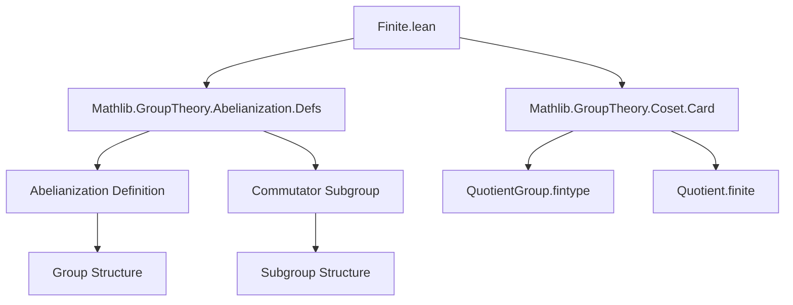

**Technical Brief: `Finite.lean` (Abelianization of Finite Groups)**

---

### 1. Key Definitions & Theorems

| Name | Type / Signature | Purpose |
|------|------------------|---------|
| `Abelianization G` | `Group (Abelianization G)` | The abelianization of a group $G$, defined as the quotient $G / [G, G]$, where $[G, G]$ is the commutator subgroup. |
| `commutator G` | `Subgroup G` | The commutator subgroup of $G$, generated by all commutators $[x, y] = x y x^{-1} y^{-1}$. |
| `QuotientGroup.fintype` | `[H : Subgroup G] [Fintype G] → Fintype (G ⧸ H)` | States that a quotient of a finite group by any subgroup is finite. |
| `Quotient.finite` | `[H : Subgroup G] [Finite G] → Finite (G ⧸ H)` | Analogous to above for finite (not necessarily finite type) groups. |
| `instance [Fintype G] [DecidablePred (· ∈ commutator G)] : Fintype (Abelianization G)` | `Fintype (Abelianization G)` | Proves that if $G$ is finite and membership in the commutator subgroup is decidable, then its abelianization is finite. |
| `instance [Finite G] : Finite (Abelianization G)` | `Finite (Abelianization G)` | Extends the result to the more general case of finite (not necessarily finite type) groups. |

> Note: In Lean, `Fintype` is for *finite types* (i.e., types with a finite universe), while `Finite` is for *finite sets* (i.e., types embeddable into a finite type). The distinction matters in dependent type theory.

---

### 2. Naming Conventions

- **Prefixes**:
  - `commutator_`: for the commutator subgroup.
  - `abelianization_`: for constructions related to abelianization (though not used here, the module name implies it).
- **Suffixes**:
  - `fintype`: for instances proving finiteness of types.
  - `finite`: for instances proving finiteness of sets (in the `Finite` sense).
- **Quotient-related**:
  - `QuotientGroup.fintype`, `Quotient.finite`: standard patterns for finiteness of quotients.

---

### 3. Tactic Stack

- **No explicit tactics** appear in the visible code.
- The proofs are *instance proofs* — they rely on:
  - `exact` (implicit via `:=`)
  - `apply` (via typeclass inference)
  - `rfl` or definitional equality (for `Quotient.finite _`)
- The Lean compiler infers the proofs automatically using:
  - `class_instance` resolution
  - `dec_trivial` (for `DecidablePred` in the first instance, if needed)

> In practice, the proofs are *trivial* — they are direct applications of existing lemmas in Mathlib.

---

### 4. Proof Logic

- **Strategy**: *Typeclass-based lifting*.
  - For the first instance:
    - Use `QuotientGroup.fintype (commutator G)`.
    - Requires `Fintype G` and `DecidablePred (· ∈ commutator G)`.
    - The latter is assumed as a hypothesis.
  - For the second instance:
    - Use `Quotient.finite _`.
    - Requires `Finite G`.
    - No decidability assumption needed (since `Finite` is a property, not a type, and `Quotient.finite` is provable without choice in this setting).

- **Logical Flow**:
  1. Recognize `Abelianization G` ≡ `G ⧸ commutator G`.
  2. Apply known finiteness of quotients.
  3. Conclude via instance inference.

---

### 5. Imports

| Import | Purpose |
|--------|---------|
| `Mathlib.GroupTheory.Abelianization.Defs` | Defines `Abelianization`, `commutator`, and basic properties. |
| `Mathlib.GroupTheory.Coset.Card` | Contains `QuotientGroup.fintype`, `Quotient.finite`, and related cardinality lemmas for coset spaces. |

> These imports provide the foundational definitions and lemmas needed to reason about abelianization and finite quotients.

---

### 6. Mermaid Diagrams

#### Dependency Graph (Module-Level)



#### Overview of File Logic

```mermaid
flowchart LR
  G[Group G] -->|Assume| FintypeG[Fintype G]
  G -->|Assume| Decidable[DecidablePred ∈ commutator G]
  FintypeG & Decidable -->|Apply| QuotFintype[QuotientGroup.fintype]
  QuotFintype -->|Conclude| AbFin[Fintype (Abelianization G)]

  G -->|Assume| FiniteG[Finite G]
  FiniteG -->|Apply| QuotFinite[Quotient.finite]
  QuotFinite -->|Conclude| AbFin2[Finite (Abelianization G)]
```

---

### Summary

This file is a *minimal but precise* formalization of the fact that the abelianization of a finite group is finite. It leverages Lean’s typeclass inference and existing quotient finiteness lemmas to avoid explicit proof scripts. The design reflects Lean’s philosophy: *lean, reusable, and mathematically idiomatic*.

Let me know if you'd like the corresponding Coq or Isabelle/HOL translation, or a formal proof outline in natural deduction style.
