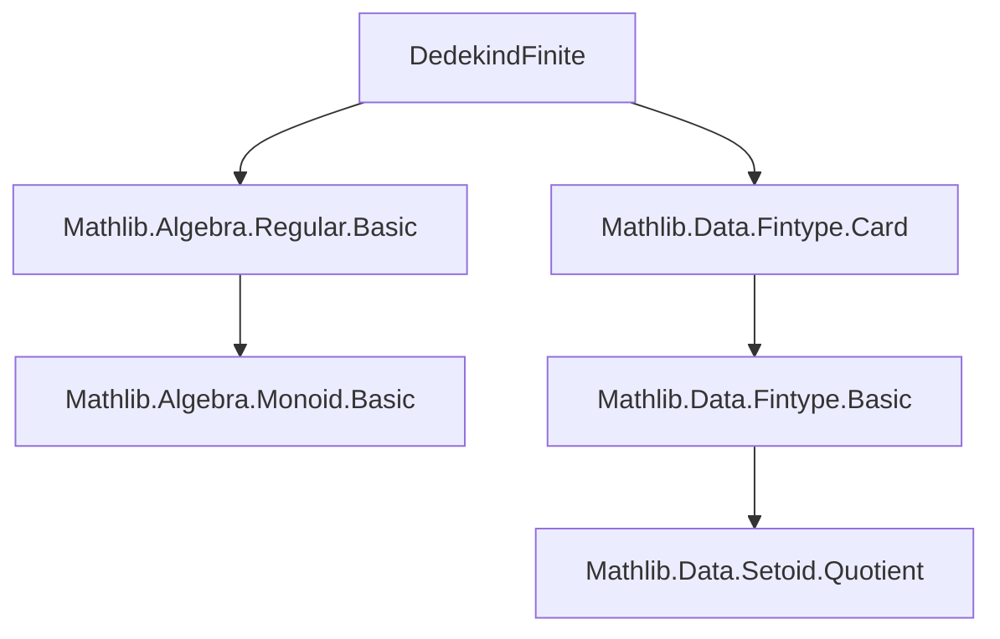
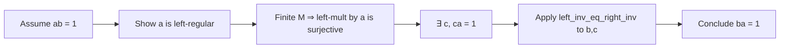

**Technical Brief: `DedekindFinite.lean`**

---

### 1. **Key Definitions & Theorems**

| Name | Type / Signature | Purpose |
|------|------------------|---------|
| `IsDedekindFiniteMonoid` | `class IsDedekindFiniteMonoid (M) [Monoid M] := (mul_eq_one_symm : ∀ {a b : M}, a * b = 1 → b * a = 1)` | A monoid $M$ is *Dedekind-finite* if left-invertible elements are also right-invertible (equivalently, $ab = 1 \Rightarrow ba = 1$). |
| `mul_eq_one_symm` | `∀ {a b : M}, a * b = 1 → b * a = 1` | The defining property of a Dedekind-finite monoid; used to conclude symmetry of one-sided inverses. |
| `isLeftRegular_of_mul_eq_one` | `∀ {a b : M}, a * b = 1 → IsLeftRegular a` | Lemma showing that if $ab = 1$, then left-multiplication by $a$ is injective (i.e., $a$ is left-regular). |
| `Finite.surjective_of_injective` | `∀ {α} [DecidableEq α] [Finite α] {f : α → α}, Function.Injective f → Function.Surjective f` | In finite types, injective endofunctions are surjective. Used to extract a right inverse from left-injectivity. |
| `left_inv_eq_right_inv` | `∀ {a b c : M}, a * b = 1 → c * a = 1 → b = c` | Uniqueness of inverses in monoids: a left inverse equals a right inverse when both exist. |

**Main Theorem (Instance)**:  
`[Monoid M] → [Finite M] → IsDedekindFiniteMonoid M`  
*Every finite monoid is Dedekind-finite.*

---

### 2. **Naming Conventions**

- **Prefixes**:
  - `isLeftRegular_`: Predicate-style naming for algebraic regularity properties (`isLeftRegular_of_mul_eq_one`).
  - `left_inv_`, `right_inv_`: For statements about one-sided inverses (`left_inv_eq_right_inv`).
- **Suffixes**:
  - `_symm`: Indicates symmetry or converse direction (`mul_eq_one_symm`).
- **General pattern**: `verb_object_qualifier` (e.g., `surjective_of_injective`, `mul_eq_one_symm`).

---

### 3. **Tactic Stack**

- `have ⟨c, hbc⟩ := ...`: Use of `rcases`/`obtain` to unpack existential quantifiers.
- `Finite.surjective_of_injective ... 1`: Application of finite-type surjectivity-from-injectivity.
- `rwa [...]`: Rewrite + assumption using a proven equality (`left_inv_eq_right_inv hab hbc`).
- Implicit use of `aesop`-style simplification via `rwa` and `rw` with `←` or `→` in short proofs.

No heavy automation (e.g., `linarith`, `ring`, `norm_num`) appears—proof is mostly algebraic reasoning + finite-type combinatorics.

---

### 4. **Proof Logic**

1. Assume $a, b \in M$ with $ab = 1$.
2. Show $a$ is left-regular (injective as left-multiplication map) via `isLeftRegular_of_mul_eq_one`.
3. Since $M$ is finite, left-multiplication by $a$ is surjective ⇒ ∃ $c$ such that $ca = 1$.
4. Now $a$ has both a left inverse ($c$) and a right inverse ($b$), so by uniqueness (`left_inv_eq_right_inv`), $b = c$, hence $ba = 1$.

**Structure**:  
> *Given $ab = 1$, deduce $ba = 1$ by constructing a left inverse of $a$ (via finiteness), then apply uniqueness of inverses.*

---

### 5. **Imports**

| Module | Role |
|--------|------|
| `Mathlib.Algebra.Regular.Basic` | Provides `IsLeftRegular`, `isLeftRegular_of_mul_eq_one`, and regularity basics. |
| `Mathlib.Data.Fintype.Card` | Provides `Finite.surjective_of_injective`, linking finiteness and cardinality. |

No other dependencies are used—lean and mathlib core are assumed.

---

### 6. **Mermaid Diagrams**

#### Dependency Graph (Module-Level)

#### Theoretical Overview (Proof Flow)

---

### 7. **Domain-Specific AI Agent Notes**

- **Domain**: Abstract algebra (monoids, regular elements, finiteness conditions).
- **Key reasoning patterns**:
  - Use of finiteness to upgrade injectivity → surjectivity.
  - Interplay between one-sided inverses and regularity.
- **Common proof strategies**:
  - Construct auxiliary elements via surjectivity/injectivity.
  - Apply uniqueness lemmas (`left_inv_eq_right_inv`) to identify candidates.
- **Suggested AI capabilities**:
  - Recognize patterns like `a * b = 1 ⇒ IsLeftRegular a`.
  - Suggest finite-type lemmas (`Finite.surjective_of_injective`) when injectivity is derived in a finite context.
  - Prioritize `rwa` over `rw` + `assumption` in short proofs.

--- 

Let me know if you'd like the same analysis for related files (e.g., `DedekindFiniteGroup.lean`, `FiniteDimensional.lean`).
