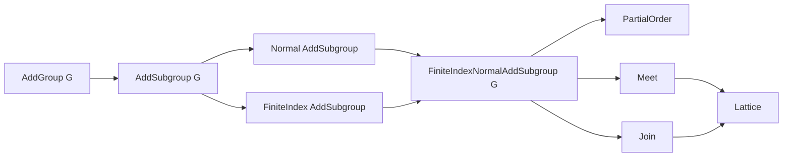

### Technical Brief: `FiniteIndexNormalSubgroup.lean`

---

#### **1. Key Definitions & Theorems**

| Name | Type / Signature | Purpose |
|------|------------------|---------|
| `FiniteIndexNormalSubgroup G` | `Type u` `[Group G] → Type u` | Type of finite-index normal subgroups of `G`, bundled as a `Subgroup G` with proofs of `Normal` and `FiniteIndex`. |
| `FiniteIndexNormalAddSubgroup G` | `Type u` `[AddGroup G] → Type u` | Additive analog: finite-index normal *additive* subgroups. |
| `toSubgroup_injective` | `Function.Injective (fun H ↦ H.toSubgroup)` | Injectivity of the coercion `H ↦ H.toSubgroup`. |
| `instPartialOrderfiniteIndexNormalSubgroup` | `PartialOrder (FiniteIndexNormalSubgroup G)` | Induced partial order via `SetLike`. |
| `instInfFiniteIndexNormalSubgroup` | `Min (FiniteIndexNormalSubgroup G)` | Meet (infimum) given by intersection of subgroups. |
| `instSemilatticeInfFiniteIndexNormalSubgroup` | `SemilatticeInf (FiniteIndexNormalSubgroup G)` | Proves the meet structure forms a semilattice. |
| `instSemilatticeSupFiniteIndexNormalSubgroup` | `SemilatticeSup (FiniteIndexNormalSubgroup G)` | Supremum exists (via join), proven via injectivity. |
| `Lattice (FiniteIndexNormalSubgroup G)` | `Lattice ...` | Combines inf and sup to form a lattice. |
| `ofSubgroup H [H.Normal] [H.FiniteIndex]` | `FiniteIndexNormalSubgroup G` | Bundles a subgroup with normality + finite index into the type. |
| `toSubgroup_ofSubgroup` | `((ofSubgroup H) : Subgroup G) = H` | Coercion of `ofSubgroup` recovers original subgroup. |
| `comap f K` | `G →* H → FiniteIndexNormalSubgroup H → FiniteIndexNormalSubgroup G` | Preimage of a finite-index normal subgroup under a group homomorphism `f`. |
| `toSubgroup_comap` | `((comap f K) : Subgroup G) = K.comap f` | Coercion of `comap` matches subgroup-theoretic preimage. |
| `comap_mono` | `K ≤ L → comap f K ≤ comap f L` | Monotonicity of `comap`. |
| `comap_id`, `comap_comp` | `comap id K = K`, `comap (g ∘ f) K = comap f (comap g K)` | Categorical properties of `comap`. |

---

#### **2. Naming Conventions**

- **Structure fields**: `'` suffix (e.g., `isNormal'`, `isFiniteIndex'`) — standard Lean convention for projections.
- **Typeclass instances**: `inst...` prefix (e.g., `instPartialOrder...`, `instInf...`).
- **Coercion-related**: `toSubgroup_...`, `toAddSubgroup_...`.
- **Functoriality**: `comap_...` (preimage under homomorphism).
- **Bundling/unbundling**: `ofSubgroup`, `toSubgroup_ofSubgroup`.
- **Monotonicity/functoriality**: `mono`, `comp`, `id`.
- **Additive analogs**: `to_additive` attribute used to generate additive versions automatically.

---

#### **3. Tactic Stack**

- `ext`: Used to prove equality of subgroups by extensionality.
- `dsimp`, `rw`, `simp`: Simplification and rewriting.
- `infer_instance`: Automatically fills in class-instance goals (`Normal`, `FiniteIndex`).
- `simpa [hker] using ...`: Simplifies using a hypothesis and applies a lemma.
- `SetLike.coe_injective.semilatticeInf`, `toSubgroup_injective.semilatticeSup`: Leverages `SetLike` and injectivity to transport lattice structures.

---

#### **4. Proof Logic**

- **Structure definitions** rely on `infer_instance` to derive `Normal` and `FiniteIndex` from the bundled `Subgroup`.
- **Lattice structure** is constructed via:
  - `Min`/`Max` for inf/sup (intersection/join),
  - then `SemilatticeInf`/`SemilatticeSup` via injectivity of coercion to `Subgroup G`.
- **`comap` correctness**:
  - Defines preimage as `K.toSubgroup.comap f`.
  - Proves finite index via factorization through quotient:  
    $$
    G \xrightarrow{f} H \xrightarrow{\pi} H / K \Rightarrow \ker(\pi \circ f) = f^{-1}(K)
    $$
    and uses `FiniteIndex` of kernel of any homomorphism to a finite group (here, `H / K` is finite since `K` has finite index).
- **Categorical properties** (`comap_id`, `comap_comp`) follow by `rfl`, as coercion is definitional.

---

#### **5. Imports**

- `Mathlib.GroupTheory.Index`: Provides `Index`, `FiniteIndex`, `Normal`, and related quotient constructions.

---

#### **8. Mermaid Diagrams**

##### **Dependency Graph (Module-Level)**

```mermaid
graph TD
  A[FiniteIndexNormalSubgroup.lean] --> B[Mathlib.GroupTheory.Index]
  A --> C[Standard Library (Prop, Type, etc.)]
  B --> D[GroupTheory.Quotient]
  B --> E[GroupTheory.Subgroup.Basic]
  B --> F[GroupTheory.NormalSubgroup]
```

##### **Overview of Theory & Lattice Structure**

```mermaid
graph LR
  G[Group G] --> H[Subgroup G]
  H --> I[Normal Subgroup]
  H --> J[FiniteIndex Subgroup]
  I & J --> K[FiniteIndexNormalSubgroup G]
  K --> L[PartialOrder]
  K --> M[Meet (⊓)]
  K --> N[Join (⊔)]
  M & N --> O[Lattice]
  K --> P[Comap: Hom → Preimage]
  P --> Q[Functorial: id, comp]
```

##### **Additive Analogs**



---

#### **Summary**

This file constructs the **lattice of finite-index normal subgroups** of a group `G`, equipped with:
- A `PartialOrder`, `Lattice` structure,
- Functorial behavior under group homomorphisms via `comap`,
- Additive analogues for abelian/additive contexts.

It serves as a foundational building block for the **profinite completion** of a group, where the profinite topology is defined via the basis of finite-index normal subgroups.

--- 

Let me know if you'd like the corresponding `FiniteIndexNormalAddSubgroup` theory formalized or extended (e.g., with `map`, `inf`, `sup`, or `quotient` constructions).
