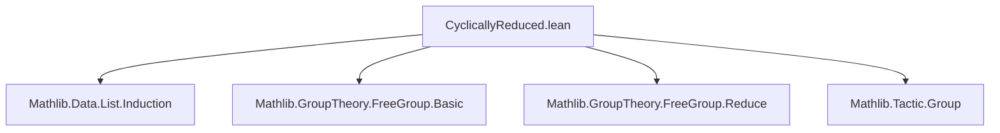
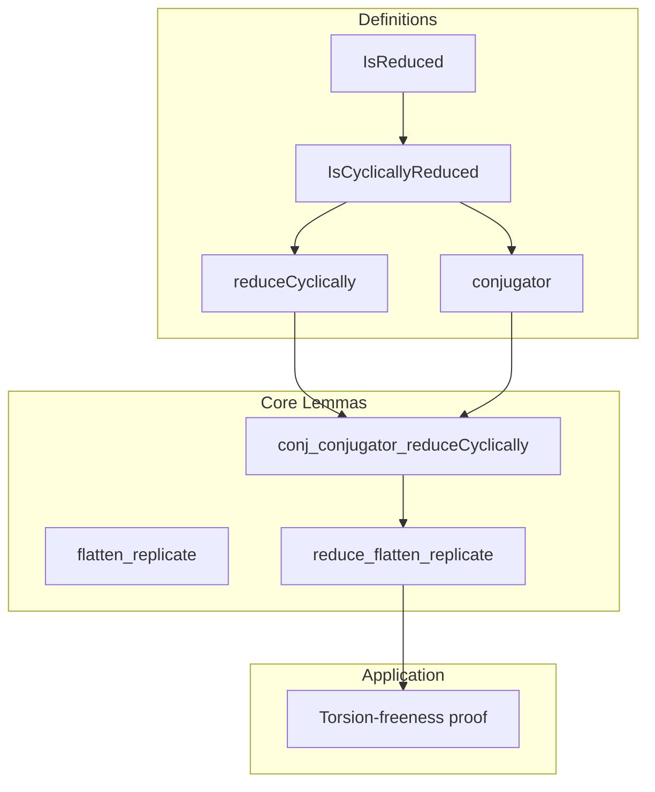

**Technical Brief: `CyclicallyReduced.lean`**

---

### 1. KEY DEFINITIONS & THEOREMS

| Name | Type / Signature | Purpose |
|------|------------------|---------|
| `IsCyclicallyReduced` | `List (α × Bool) → Prop` | Predicate asserting that a word is reduced and its first and last letters do not cancel (empty word included). |
| `isCyclicallyReduced_iff` | `↔`-equivalence | Unfolds definition of `IsCyclicallyReduced`. |
| `isCyclicallyReduced_cons_append_iff` | `↔`-equivalence | Simplifies `IsCyclicallyReduced` for words of the form `b :: L ++ [a]`. |
| `flatten_replicate` | `IsCyclicallyReduced L → IsCyclicallyReduced (L.replicate n).flatten` | Shows that flattening repeated copies of a cyclically reduced word remains cyclically reduced. |
| `reduceCyclically` | `List (α × Bool) → List (α × Bool)` | Normalizes a word by cancelling matching inverse endpoints iteratively; outputs a cyclically reduced word if input is reduced. |
| `conjugator` | `List (α × Bool) → List (α × Bool)` | Extracts the “cancelling prefix/suffix” used in cyclic reduction. |
| `conj_conjugator_reduceCyclically` | `conjugator L ++ reduceCyclically L ++ invRev (conjugator L) = L` | Decomposes any word as a conjugate of its cyclic reduction. |
| `reduce_flatten_replicate` | `IsReduced L → reduce (L.replicate n).flatten = ...` | Describes the reduced form of repeated concatenations of a reduced word. |
| `instance : IsMulTorsionFree (FreeGroup α)` | `∀ n ≠ 0, x^n = y^n → x = y` | Proves free groups are torsion-free via analysis of word representations and cyclic reduction. |

---

### 2. NAMING CONVENTIONS

- **Predicates**: `isCyclicallyReduced`, `isReduced`, `IsMulTorsionFree` — use `is_` or `Is_` prefix.
- **Theorems**: `isCyclicallyReduced_*`, `reduceCyclically.*`, `conjugator.*`, `flatten_replicate`, `conj_conjugator_*`, `reduce_flatten_replicate_*`.
- **Functions**: `reduceCyclically`, `conjugator` — descriptive verbs.
- **Suffixes**: `*_iff`, `*_cons_append`, `*_replicate`, `*_conj_*`, `*_toWord` — indicate structural or logical form.
- **Attributes**: `[to_additive]`, `[simp]`, `[attr := simp]` — used for additive analogues and simplification.

---

### 3. TACTIC STACK

Frequently used tactics in this file:

- `simp` / `simp_all` — for unfolding definitions and simplifying `List`, `Option`, and `Bool` expressions.
- `rw` / `nth_rw` — rewriting using equalities and equivalences.
- `induction ... using List.bidirectionalRec` — structural induction on lists from both ends.
- `split` — for case analysis on `if ... then ... else ...`.
- `exact`, `refine`, `apply` — for constructing proofs of goals.
- `congr_arg` — for lifting equalities through functions (e.g., `toWord`, `List.length`).
- `group` (from `Mathlib.Tactic.Group`) — for simplifying group expressions in `FreeGroup`.
- `grind` — for automated simplification of arithmetic and list length goals.
- `mul_left_cancel₀`, `ne_of_gt`, `ne_of_lt` — for handling non-zero natural number hypotheses.

---

### 4. PROOF LOGIC

The logical flow in proofs follows a pattern:

1. **Induction on list structure** using `List.bidirectionalRec` (for lemmas about `reduceCyclically`, `conjugator`, etc.).
2. **Case analysis** on whether the first and last letters cancel (`if ... then ... else ...`).
3. **Reduction to smaller subwords** via induction hypothesis.
4. **Algebraic manipulation** in `FreeGroup` using `mk`, `toWord`, `mul`, `inv`, `pow`, and group tactics.
5. **Length comparison** to deduce equality of cyclic reductions from equality of powers.
6. **Conjugacy decomposition** (`conj_conjugator_reduceCyclically`) to relate arbitrary words to cyclically reduced ones.
7. **Injectivity argument** for powers: compare lengths of reduced forms of `x^n` and `y^n`, deduce equality of cyclic reductions, then lift back via conjugacy.

The torsion-freeness proof specifically:
- Reduces to comparing `x^(2n) = y^(2n)`.
- Uses `reduce_flatten_replicate` to express reduced forms in terms of `conjugator` and `reduceCyclically`.
- Extracts equality of cyclic reductions via injectivity of list concatenation and cancellation of common parts.
- Concludes `x = y` using the conjugacy decomposition.

---

### 5. IMPORTS

- `Mathlib.Data.List.Induction` — for list induction principles.
- `Mathlib.GroupTheory.FreeGroup.Basic` — basic definitions of free groups.
- `Mathlib.GroupTheory.FreeGroup.Reduce` — reduction theory for words in free groups.
- `Mathlib.Tactic.Group` — tactics for group-theoretic reasoning.

---

### 6. DEPENDENCY & THEORY OVERVIEW

#### Mermaid Diagram: Module Dependencies

#### Mermaid Diagram: Theoretical Flow

#### Theory Scope

This file sits in the hierarchy of free group theory, bridging:
- **Combinatorial word theory** (`IsReduced`, `reduceCyclically`)
- **Algebraic properties** (`FreeGroup`, `pow`, `mk`, `toWord`)
- **Model-theoretic consequences** (`IsMulTorsionFree`)

It is foundational for deeper results about free groups, such as:
- Rigidity of powers and roots,
- Algorithmic normal forms,
- Applications in geometric group theory (e.g., hyperbolicity, JSJ decompositions).

---

### 7. SUMMARY

This module formalizes the notion of *cyclic reduction* in free groups and uses it to prove that free groups are torsion-free in the strong sense: the map $x \mapsto x^n$ is injective for all $n \ne 0$. The key insight is that repeated powers of a word reduce to a conjugate of a repeated cyclically reduced word, and equality of such powers forces equality of the underlying cyclic reductions — hence equality of the original elements. The formalization is highly structured, leveraging bidirectional induction, explicit conjugacy decompositions, and careful length analysis.
