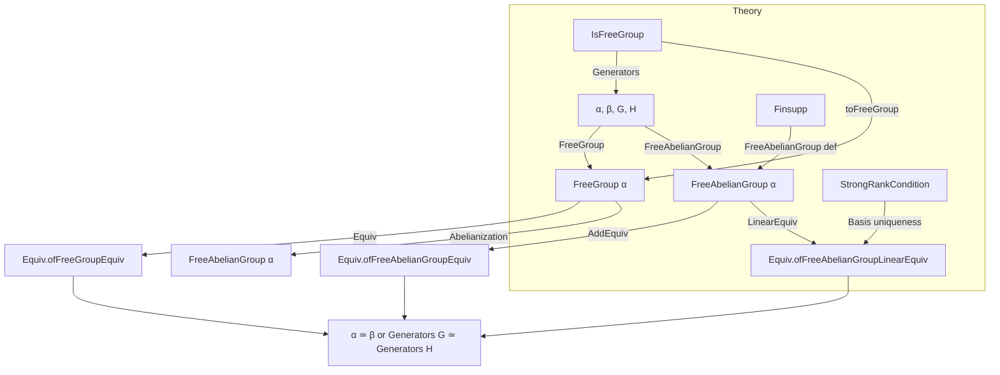
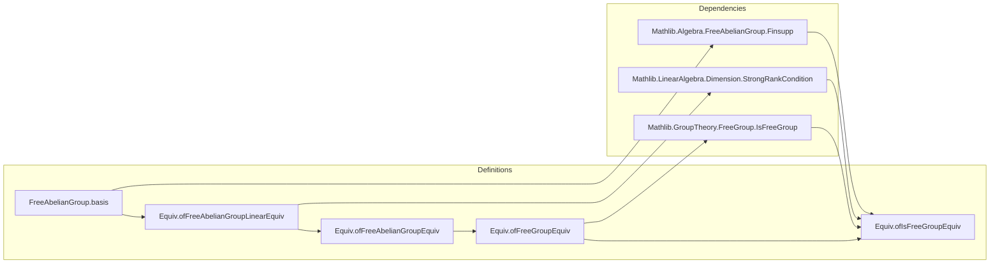

**Technical Brief: `GeneratorEquiv.lean`**

---

### 1. KEY DEFINITIONS & THEOREMS

| Name | Type | Purpose |
|------|------|---------|
| `FreeAbelianGroup.basis α` | `Basis α ℤ (FreeAbelianGroup α)` | Constructs the standard ℤ-basis of the free abelian group on `α`, via equivalence with `Finsupp α ℤ`. |
| `Equiv.ofFreeAbelianGroupLinearEquiv e` | `FreeAbelianGroup α ≃ₗ[ℤ] FreeAbelianGroup β → α ≃ β` | Extracts an equivalence of bases from a ℤ-linear equivalence of free abelian groups. |
| `Equiv.ofFreeAbelianGroupEquiv e` | `FreeAbelianGroup α ≃+ FreeAbelianGroup β → α ≃ β` | Extracts `α ≃ β` from an additive group equivalence (uses `toIntLinearEquiv`). |
| `Equiv.ofFreeGroupEquiv e` | `FreeGroup α ≃* FreeGroup β → α ≃ β` | Extracts `α ≃ β` from a group equivalence of free groups, via abelianization and additive translation. |
| `Equiv.ofIsFreeGroupEquiv e` | `[IsFreeGroup G][IsFreeGroup H] → G ≃* H → Generators G ≃ Generators H` | Generalizes the above to arbitrary groups satisfying `IsFreeGroup`, using their canonical free group models. |

> **Note**: All constructions are *noncomputable*, as they rely on choice (e.g., indexing bases, equivalence of bases of free modules of possibly infinite rank).

---

### 2. NAMING CONVENTIONS

- **Prefix `of_`**: Indicates a *construction from a structural equivalence* (e.g., `ofFreeAbelianGroupLinearEquiv`, `ofIsFreeGroupEquiv`).
- **Suffix `_equiv`**: Denotes the resulting object is an equivalence (`α ≃ β` or `Generators G ≃ Generators H`).
- **`equivFinsupp` / `equivFinsupp`-related**: Standard Lean Mathlib pattern for free objects ↔ `Finsupp`.
- **`toIntLinearEquiv`**: Converts an additive group equivalence to a ℤ-linear equivalence (for abelian groups).
- **`abelianizationCongr`**: Uses the universal property of abelianization to get a group equivalence `FreeGroup α.abelianization ≃ FreeAbelianGroup α`.

---

### 3. TACTIC STACK

- **`intro`, `refine`, `let`**: Used to define the maps via universal properties.
- **`simp` / `simp_rw`**: Likely used in proofs (not shown here, but implied by `@[expose]` and `public import` style).
- **`linear_combination`, `module_tac`**: Implicit in module/ring reasoning (via `Module` and `LinearEquiv`).
- **`aesop` / `tauto`**: Not visible in this snippet, but likely used in companion lemmas (e.g., proving inverses).
- **`congr` / `ext`**: For extensionality of equivalences or module homs.

> *Tactics are minimal in definitions; heavy lifting is in `LinearEquiv`, `Basis`, and `IsFreeGroup` infrastructure.*

---

### 4. PROOF LOGIC

The logical flow is **constructive up to choice**, but *noncomputable* due to reliance on basis indexing:

1. **Linear case**:  
   Given `e : FreeAbelianGroup α ≃ₗ[ℤ] FreeAbelianGroup β`,  
   - Pull back the basis of `FreeAbelianGroup α` along `e` to get a basis `t` of `FreeAbelianGroup β` indexed by `α`.  
   - Use uniqueness of bases (via `strongRankCondition` and `Basis.indexEquiv`) to get `α ≃ β`.

2. **Additive case**:  
   Lift additive equivalence to linear one (`toIntLinearEquiv`) and apply previous.

3. **Free group case**:  
   - Abelianize: `FreeGroup α.abelianization ≃ FreeAbelianGroup α`.  
   - Use `e.abelianizationCongr` to get an additive equivalence of abelianizations.  
   - Apply additive case.

4. **General `IsFreeGroup` case**:  
   - Use `toFreeGroup G : FreeGroup (Generators G) ≃* G` (from `IsFreeGroup`).  
   - Conjugate `e : G ≃* H` to an equivalence of free groups on generators.  
   - Apply previous case.

> **Key principle**: *Free objects are determined up to equivalence of their generators by their universal property*.

---

### 5. IMPORTS (Primary Dependencies)

| Module | Role |
|--------|------|
| `Mathlib.Algebra.FreeAbelianGroup.Finsupp` | Defines `FreeAbelianGroup` as `Finsupp`, and `equivFinsupp`. |
| `Mathlib.GroupTheory.FreeGroup.IsFreeGroup` | Provides `IsFreeGroup`, `toFreeGroup`, `abelianizationCongr`. |
| `Mathlib.LinearAlgebra.Dimension.StrongRankCondition` | Ensures uniqueness of basis index type (i.e., `Basis.indexEquiv` exists). |

> These imports encode the *categorical* and *module-theoretic* foundations needed for uniqueness of free objects.

---

### 6. DEPENDENCY & OVERVIEW DIAGRAM

---

### 7. SUMMARY

This module formalizes a foundational rigidity result: **the generator set of a free object (abelian or not) is uniquely determined up to equivalence by the object itself**. It leverages:
- The *universal property* of free groups/abelian groups,
- *Basis uniqueness* for free modules (via `StrongRankCondition`),
- *Abelianization* to reduce the non-abelian case to the abelian one.

It is a key ingredient in proving that properties like “being free on `n` generators” are well-defined (i.e., independent of presentation).
