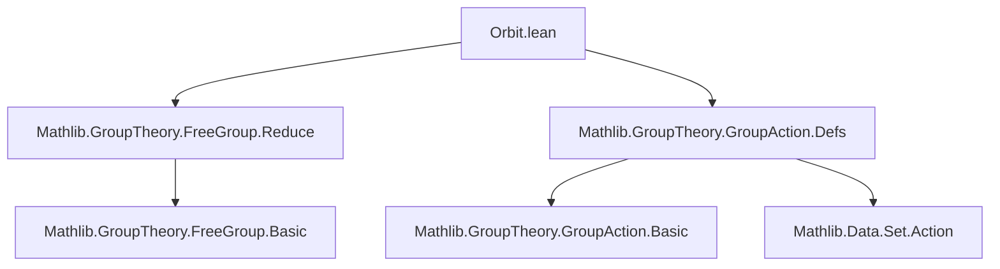

### Technical Brief: `Orbit.lean`

---

#### **1. Key Definitions & Theorems**

| Name | Type / Signature | Purpose |
|------|------------------|---------|
| `startsWith` | `def startsWith (w : α × Bool) : Set (FreeGroup α)` | Defines the subset of the free group consisting of elements whose reduced word begins with `w`. |
| `startsWith.ne_one` | `theorem startsWith.ne_one {w} {g} (h : g ∈ startsWith w) : g ≠ 1` | Shows that no element in `startsWith w` equals the identity. |
| `startsWith.disjoint_iff_ne` | `lemma startsWith.disjoint_iff_ne {w w'} : Disjoint (startsWith w) (startsWith w') ↔ w ≠ w'` | Characterizes disjointness of `startsWith` sets via inequality of their labels. |
| `startsWith.Injective` | `lemma startsWith.Injective` | Proves that `startsWith` is injective as a function of `w`. |
| `startsWith_mk_mul` | `lemma startsWith_mk_mul {w} {g} (h : ¬ g ∈ startsWith (w.1, !w.2)) : mk [w] * g ∈ startsWith w` | Ensures left-multiplication by `mk [w]` lands in `startsWith w` if `g` avoids the complementary `startsWith`. |
| `Orbit.duplicate` | `theorem Orbit.duplicate (x : X) (w : α × Bool)` | Main result: describes how applying `w⁻¹` to the orbit under `startsWith w` yields a union of orbits under all `startsWith v` for `v ≠ w⁻¹`, plus the original point `x`. |

---

#### **2. Naming Conventions**

- **Prefixes**:
  - `startsWith_`: for lemmas/defs about the `startsWith` predicate.
  - `isReduced_cons_cons`: internal helper (from `FreeGroup.Reduce`) used in proofs.
- **Suffixes**:
  - `_def`: for definitions involving `•` or `smul`.
  - `_iff_`: for equivalences (e.g., `disjoint_iff_ne`).
- **Structure**:
  - `mk [w]`: notation for the free group element corresponding to a single-letter word `w`.
  - `!b`: shorthand for `Bool.ofBool b`, used to flip the `Bool` component.

---

#### **3. Tactic Stack**

Frequently used tactics in this file:

| Tactic | Role |
|--------|------|
| `simp` / `simp_all` | Simplification using definitional equalities, especially for `FreeGroup.toWord`, `mk`, and `smul`. |
| `grind` | Custom tactic (from Mathlib) for grinding through decidable equality and simplifications. |
| `rw` / `rw [← ...]` | Rewriting using equalities, often reversing reductions (`←`) to align terms. |
| `match ... with` | Structural induction on words (`l : List α`). |
| `exact`, `refine`, `intro` | Standard proof construction. |
| `by_cases` | Splitting on decidability (e.g., `0 < g.toWord.length`). |
| `ext` | Extensionality for set equality. |
| `convert` / `congr` (implicit via `refine`) | For matching goals up to definitional equality. |

---

#### **4. Proof Logic**

The proof of `Orbit.duplicate` proceeds as follows:

1. **Set extensionality**: `ext i` reduces goal to element-wise equivalence.
2. **Forward direction (`→`)**:
   - Unpacks an element of the LHS: `i = (mk [w])⁻¹ • y`, where `y ∈ orbit (startsWith w) x`.
   - Writes `y = g • x` for `g ∈ startsWith w`.
   - Analyzes `g.toWord` by length:
     - `[]`: leads to contradiction with `startsWith.ne_one`.
     - `[a]`: shows `a = w`, so `(mk [w])⁻¹ • (mk [a] • x) = x`.
     - `a :: b :: l`: uses `startsWith` condition to deduce `a = w`, then rewrites `(mk [w])⁻¹ • (mk [w] * mk (b :: l)) • x = mk (b :: l) • x`, showing membership in `orbit (startsWith (b, b.2)) x`.
3. **Backward direction (`←`)**:
   - Two cases:
     - `i ∈ orbit (startsWith v) x` for `v ≠ w⁻¹`: construct preimage under `(mk [w])⁻¹ • -`.
     - `i = x`: preimage is `mk [w] • x`.

Key logical tools:
- **Word decomposition** of free group elements.
- **Disjointness** of `startsWith` sets for distinct labels.
- **Action compatibility**: `inv_smul_smul`, `mul_smul`.

---

#### **5. Imports**

| Import | Purpose |
|--------|---------|
| `Mathlib.GroupTheory.FreeGroup.Reduce` | Provides `FreeGroup.toWord`, `isReduced`, `mk`, reduction lemmas. |
| `Mathlib.GroupTheory.GroupAction.Defs` | Provides `MulAction`, `orbit`, `smul`, `inv_smul_smul`, etc. |

---

#### **6. Mermaid Diagrams**

##### **Dependency Graph (Module-Level)**



##### **Theoretical Overview (Conceptual Flow)**

```mermaid
flowchart LR
  A[FreeGroup α] --> B[startsWith w ⊆ FreeGroup α]
  B --> C[SMul (startsWith w) X]
  C --> D[Orbit (startsWith w) x]
  D --> E[(mk [w])⁻¹ • Orbit (startsWith w) x]
  E --> F[⋃_{v ≠ w⁻¹} Orbit (startsWith v) x ∪ {x}]
  style E fill:#f9f,stroke:#333
  style F fill:#bbf,stroke:#333
```

##### **Proof Structure of `Orbit.duplicate`**

```mermaid
flowchart LR
  G[ext i] --> H[→: LHS ⊆ RHS]
  G --> I[←: RHS ⊆ LHS]
  H --> J[Unpack y = g • x]
  J --> K[Case analysis on g.toWord]
  K --> L1[[] → contradiction]
  K --> L2[[a] → i = x]
  K --> L3[a::b::l → i ∈ orbit (startsWith (b, b.2)) x]
  I --> M[Two cases: i ∈ orbit v x or i = x]
  M --> N[Construct preimage under (mk [w])⁻¹ • -]
```

---

#### **7. Summary**

This module formalizes a structural property of free group actions: the effect of inverting a generator on the orbit of a point under a *prefix-constrained* subgroup (`startsWith w`). It shows that this operation “redistributes” the orbit into a union over all other generators’ prefix-constrained orbits, plus the original point — a key step in constructing normal forms or analyzing Schreier systems in free groups.

The formalization leverages:
- Decidable equality on `α` (for `startsWith` to be well-defined),
- Word-level reasoning in `FreeGroup`,
- Basic group action theory.

It is foundational for further work on free group actions, Schreier’s lemma, or Bass–Serre theory.
