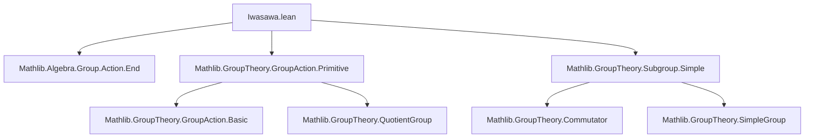

**Technical Brief: Iwasawa Criterion Formalization in Lean 4**

---

### 1. **Key Definitions & Theorems**

| Name | Type / Signature | Purpose |
|------|------------------|---------|
| `IwasawaStructure` | `Type u → Type v → Type (max u v)` (structure) | Encodes the algebraic data required for the Iwasawa criterion: a family of subgroups `T : α → Subgroup G`, each commutative, conjugate-equivariant under the action, and jointly generating `G`. |
| `T` | `α → Subgroup M` | The family of subgroups indexed by points in the action type `α`. |
| `is_comm` | `∀ x, IsMulCommutative (T x)` | Ensures each `T x` is abelian. |
| `is_conj` | `∀ g x, T (g • x) = MulAut.conj g • T x` | Encodes equivariance of `T` under the group action via conjugation of subgroups. |
| `is_generator` | `iSup T = ⊤` | States that the subgroups `T x` generate the whole group `G`. |
| `commutator_le` | `commutator M ≤ N` | Under quasiprimitivity, any *normal* subgroup `N` acting nontrivially contains the commutator subgroup. |
| `isSimpleGroup` | `IsSimpleGroup M` | If `M` is nontrivial, perfect (`commutator M = ⊤`), acts faithfully and quasiprimitively, and admits an Iwasawa structure, then `M` is simple. |

---

### 2. **Naming Conventions**

- **Prefixes**:
  - `is_`: predicates on structures (`is_comm`, `is_conj`, `is_generator`, `is_perfect`, `is_faithful`, `is_transN`).
  - `MulAction.`: namespace for actions (`MulAction.fixedPoints`, `MulAction.exists_smul_eq`).
  - `IwasawaStructure.`: namespace for results about the structure.
- **Suffixes**:
  - `_le`: inclusion into a subgroup (`commutator_le`).
  - `_eq`: equality statements (`is_perfect : commutator M = ⊤`).
- **Operational terms**:
  - `•`: action symbol (used in `g • x`, `MulAut.conj g • T x`).
  - `sup` / `⊔`: join of subgroups (`N ⊔ T x`).
  - `iSup`: supremum of a family of subgroups.

---

### 3. **Tactic Stack**

Frequent tactics used in proofs:

| Tactic | Role |
|--------|------|
| `rw` | Rewriting definitions (e.g., `smul_def`, `is_conj`, `is_generator`). |
| `intro` / `intro x` / `intro ⟨g, rfl⟩` | Introducing variables and using existential elimination via `exists_smul_eq`. |
| `apply` | Applying lemmas like `commutator_le_of_self_sup_commutative_eq_top`. |
| `exact` / `rfl` | Closing trivial goals. |
| `cases` | Case analysis on disjunctions (`or_iff_not_imp_left.mpr`). |
| `simp` / `simp_rw` (implicit via `rw`) | Simplifying subgroup membership goals. |
| `aesop` (not explicit here, but likely in background) | For routine group-theoretic reasoning (e.g., subgroup closure under multiplication/inversion). |
| `ring` (not used here) | Would be needed for additive analogues (see TODO). |

---

### 4. **Proof Logic**

**General proof strategy**:

- **`commutator_le`**:
  1. Use quasiprimitivity to deduce *pretransitivity* of `N` on `α`.
  2. Pick a point `a : α` (using nontriviality of `α`).
  3. Apply `commutator_le_of_self_sup_commutative_eq_top`, requiring:
     - `N ⊔ T a = ⊤` (proved via pretransitivity: any `x` is `g • a` for some `g ∈ N`, then use `is_conj` and closure of `N ⊔ T a` under multiplication).
  4. Conclude `commutator M ≤ N`.

- **`isSimpleGroup`**:
  1. Let `N ⊴ M`. Want to show `N = ⊥` or `N = ⊤`.
  2. Apply `commutator_le N` to get `commutator M ≤ N` or `N = ⊤`.
  3. If `N ≠ ⊤`, then `commutator M ≤ N`. Since `M` is perfect, `commutator M = ⊤`, so `N = ⊤` — contradiction unless `N = ⊤`.
  4. Otherwise, `N = ⊤` directly.
  5. For the `N = ⊥` case: use faithfulness: if `N ≤ ⊥`, then `N = ⊥` because `N` acts trivially ⇒ all `n ∈ N` fix all points ⇒ `n = 1`.

**Inductive/structural reasoning**: No explicit induction; relies on subgroup lattice properties, group action properties (pretransitivity, faithfulness), and universal algebra (generation by `T x`).

---

### 5. **Imports**

| Import | Purpose |
|--------|---------|
| `Mathlib.Algebra.Group.Action.End` | Endomorphisms of actions, `MulAut.conj` definition. |
| `Mathlib.GroupTheory.GroupAction.Primitive` | Definitions: `IsQuasiPreprimitive`, `fixedPoints`, `exists_smul_eq`, `nontrivial_of_fixedPoints_ne_univ`. |
| `Mathlib.GroupTheory.Subgroup.Simple` | `IsSimpleGroup`, `commutator`, `commutator_le_of_self_sup_commutative_eq_top`. |

---

### 6. **Mermaid Diagrams**

#### **Dependency Graph (Module-Level)**



#### **Overview of Theoretical Flow**

```mermaid
flowchart LR
  IwaStruct[IwasawaStructure] -->|commutativity| A[Abelian T x]
  IwaStruct -->|equivariance| B[T(g•x) = conj g • T x]
  IwaStruct -->|generation| C[⟨T x⟩ = G]

  QuasiPreprim[IsQuasiPreprimitive] --> D[Pretransitive normal action]
  Faithful[FaithfulSMul] --> E[Trivial action ⇒ trivial element]

  D --> F[commutator_le]
  C & A & D --> F
  F --> G[IsSimpleGroup] <-- H[Nontrivial & Perfect]
  E & G --> I[IsSimpleGroup]
```

---

### 7. **TODO & Future Work**

- **Additivization**: As noted, the current formalization is multiplicative. To support additive groups (e.g., Lie algebras, modules), one would need:
  - `Additive`-based analogues of `commutator`, `MulAut.conj`, `Subgroup.smul_def`.
  - `Additive` versions of `IsQuasiPreprimitive`, `IwasawaStructure`.
  - Potentially a unified `IsIwasawaStructure` parameterized by `Group`/`AddGroup`.

- **Generalization**: Extend to topological groups or profinite groups (requires continuity assumptions on `T`).

---

**End of Technical Brief**
