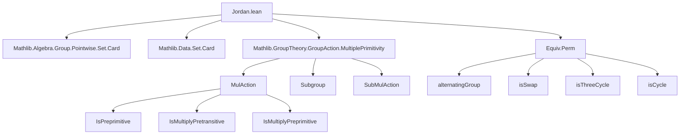

**Technical Brief: Jordan.lean — Formalization of Jordan’s Theorems on Primitive Permutation Groups**

---

### 1. KEY DEFINITIONS & THEOREMS

| Name | Type / Signature | Purpose |
|------|------------------|---------|
| `MulAction.IsPreprimitive` | `Prop` | A `MulAction G α` is *preprimitive* if it is transitive and the only `G`-invariant equivalence relations are the trivial ones (i.e., the action is transitive and the stabilizer is a maximal subgroup). |
| `MulAction.IsMultiplyPretransitive G α n` | `Prop` | The action is *$n$-pretransitive*: for any two $n$-tuples of *distinct* elements, there exists $g \in G$ mapping one to the other iff they have the same stabilizer subgroup. Generalizes 2-transitivity. |
| `MulAction.IsMultiplyPreprimitive G α n` | `Prop` | Analogous to $n$-pretransitivity but for *partitions* (i.e., $G$ preserves no nontrivial partition into $n$ blocks). |
| `normalClosure_of_stabilizer_eq_top` | `normalClosure (stabilizer G a) = ⊤` | In a 2-pretransitive action on >2 points, the normal closure of any point stabilizer is the whole group. |
| `MulAction.IsPreprimitive.is_two_pretransitive` | `(IsPreprimitive G α) → (IsPretransitive (fixingSubgroup G s) (ofFixingSubgroup G s)) → IsMultiplyPretransitive G α 2` | Jordan’s 1871 criterion: if the fixing subgroup acts primitively on its orbit, then the original action is 2-pretransitive. |
| `MulAction.IsPreprimitive.is_two_preprimitive` | Same as above, but concludes `IsMultiplyPreprimitive G α 2`. | Dual version for primitivity (Wielandt 13.1). |
| `MulAction.IsPreprimitive.isMultiplyPreprimitive` | `(IsPreprimitive G α) → (IsPreprimitive (fixingSubgroup G s) (ofFixingSubgroup G s)) → IsMultiplyPreprimitive G α (n+2)` | Jordan’s multiple primitivity criterion (Wielandt 13.2). |
| `Equiv.Perm.subgroup_eq_top_of_isPreprimitive_of_isSwap_mem` | `(IsPreprimitive G α) → (g.IsSwap) → (g ∈ G) → G = ⊤` | Jordan’s theorem: a primitive subgroup of `Perm α` containing a transposition is the full symmetric group. |
| `Equiv.Perm.alternatingGroup_le_of_isPreprimitive_of_isThreeCycle_mem` | `(IsPreprimitive G α) → (g.IsThreeCycle) → (g ∈ G) → alternatingGroup α ≤ G` | Jordan’s theorem: a primitive subgroup containing a 3-cycle contains the alternating group. |
| `isPretransitive_of_isCycle_mem` | `(g.IsCycle) → (g ∈ G) → IsPretransitive (fixingSubgroup G sᶜ) (ofFixingSubgroup G sᶜ)` | Technical lemma: the fixing subgroup of the complement of a cycle’s support acts transitively on its orbit. |

---

### 2. NAMING CONVENTIONS

- **Prefixes**:
  - `is_`: predicates (e.g., `isPreprimitive`, `isMultiplyPretransitive`, `isSwap`, `isThreeCycle`, `isCycle`).
  - `normalClosure_`: constructions involving normal closures.
  - `fixingSubgroup_`, `stabilizer_`: subgroup constructions.
  - `ofFixingSubgroup`, `ofStabilizer`: coercion to the induced action on the orbit.
- **Suffixes**:
  - `_eq_top`: equality to the full group/subgroup.
  - `_le_...`: subgroup inclusion (e.g., `alternatingGroup_le_...`).
  - `_of_...`: derived from a structure (e.g., `is_two_pretransitive_of_...`, `subgroup_eq_top_of_...`).
- **Pointwise notation**: `•`, `⁻¹`, `*`, `^`, `∩`, `∪`, `ᶜ`, `''`, `⁻¹'` used heavily in set/mul-action calculus.

---

### 3. TACTIC STACK

| Tactic | Frequency | Role |
|--------|-----------|------|
| `rw` / `simp` / `simp_rw` | Very high | Rewriting definitions (`isPreprimitive`, `fixingSubgroup`, `ofFixingSubgroup`, `support`, `ncard`, etc.). |
| `induction` (strong induction on `ℕ`) | High | Central to `is_two_motive_of_is_motive`, `isMultiplyPreprimitive`. |
| `rcases` / `obtain` / `cases` | High | Extracting elements from existential hypotheses (e.g., `⟨a, ha⟩`, `⟨g, hga, hgb⟩`). |
| `apply` / `exact` | High | Applying lemmas and hypotheses. |
| `convert` / `congr_arg` | Medium | Matching goals modulo definitional equality (e.g., `congr_arg` on set equalities). |
| `aesop` / `grind` | Medium | Goal simplification and arithmetic reasoning (`grind` is a custom `ring`/`linarith` combo). |
| `rwa`, `rwa [← ...]` | High | Rewriting with backward direction (e.g., `rwa [← hα]`). |
| `intro` / `intro h` | High | Introducing hypotheses for implications. |
| `ext` | Medium | Extensionality for set/func equality. |
| `norm_num`, `simp only [...]` | Medium | Normalizing numerals and simplifying with explicit lemmas. |

---

### 4. PROOF LOGIC

The proofs follow a **structural induction on the size of a subset $s \subseteq \alpha$**, combined with **case analysis on cardinal arithmetic** (e.g., whether $2|s| < |\alpha|$ or not). Key logical flow:

1. **Base case** (`n = 0`): Reduce to stabilizer actions on singletons; use bijections (`ofFixingSubgroup_of_singleton_bijective`).
2. **Inductive step**:
   - **Case A** (`2|s| < |\alpha|`): Find $a, b \in s$, $g \in G$ such that $a \in g·s$, $b \notin g·s$. Define $t = s ∩ g·s$, which is strictly smaller than $s$. Apply induction hypothesis to $t$.
   - **Case B** (`2|s| ≥ |\alpha|`): Work in the complement $s^c$, find $a, b \in s^c$, $g \in G$ with $a \in g·s^c$, $b \notin g·s^c$, and again define $t = s ∩ g·s$ (now large), apply induction.
3. **Key lemmas**:
   - `is_two_motive_of_is_motive` proves both `is_two_pretransitive` and `is_two_preprimitive` simultaneously via induction.
   - `isMultiplyPreprimitive` uses `is_two_preprimitive` as base case and applies induction with decomposition $s = \{a\} ∪ \operatorname{val}''t$.
4. **Permutation group results**:
   - Use `isPretransitive_of_isCycle_mem` to get transitivity of fixing subgroup on complement of cycle support.
   - Apply `isMultiplyPreprimitive` to get high preprimitivity.
   - Use `alternatingGroup_le` or `eq_top` criteria based on cycle type (swap ⇒ full group; 3-cycle ⇒ alternating group).

---

### 5. IMPORTS & DEPENDENCIES

| Module | Role |
|--------|------|
| `Mathlib.Algebra.Group.Pointwise.Set.Card` | Cardinal arithmetic for pointwise actions, set operations. |
| `Mathlib.Data.Set.Card` | Basic set cardinality (`ncard`, `encard`, `card`, `compl`, `inter`, `union`). |
| `Mathlib.GroupTheory.GroupAction.MultiplePrimitivity` | Core definitions: `IsPreprimitive`, `IsMultiplyPretransitive`, `IsMultiplyPreprimitive`, `fixingSubgroup`, `ofFixingSubgroup`, `stabilizer`, `normalClosure`. |

---

### 6. MERMAID DIAGRAMS

#### Dependency Graph (Top-Level)



#### Overview of `Jordan.lean` Structure

```mermaid
flowchart LR
  subgraph Theory
    A[Jordan’s Theorems]
    A1[2-pretransitivity criterion]
    A2[2-preprimitivity criterion]
    A3[Multiple primitivity criterion]
    A4[Swap ⇒ Symmetric group]
    A5[3-cycle ⇒ Alternating group]
  end

  subgraph Tools
    B[Induction on n = |s|−1]
    C[Case split: 2|s| < |α| vs ≥]
    D[Decomposition s = {a} ∪ t]
    E[Use of Rudio’s Lemma]
  end

  A --> B
  A --> C
  A --> D
  A --> E

  B --> A1
  B --> A2
  B --> A3
  C --> A1
  C --> A2
  D --> A3
  E --> A1
  E --> A2
```

---

### 7. TODO & OPEN PROBLEMS

| Item | Status | Description |
|------|--------|-------------|
| `is_two_preprimitive_strong_jordan` | `proof_wanted` | Stronger version: conclude `IsMultiplyPreprimitive (normalClosure (fixingSubgroup G s)) α 2`. |
| `alternatingGroup_le_of_isPreprimitive_of_isCycle_mem` | `proof_wanted` | General Jordan theorem: if $G \le \operatorname{Sym}(\alpha)$ is primitive and contains a cycle of *prime* order $p$, with $p + 3 \le |\alpha|$, then $A_\alpha \le G$. |
| `eq_top_of_isPreprimitive_of_isSwap_mem` | deprecated alias | Renamed to `subgroup_eq_top_of_isPreprimitive_of_isSwap_mem`. |

---

### 8. SUMMARY

This file formalizes foundational results of **Camille Jordan (1871)** on primitive permutation groups, following Wielandt’s *Finite Permutation Groups*. It introduces and proves:
- **Technical lemmas** linking primitivity of fixing subgroups to higher pretransitivity/preprimitivity of the original action.
- **Classification theorems**: presence of a transposition ⇒ full symmetric group; presence of a 3-cycle ⇒ alternating group.

The proofs rely on **combinatorial set-theoretic arguments**, **strong induction**, and **group-theoretic constructions** (normal closures, fixing subgroups, cycle supports). The formalization is highly structured, with clear separation of the abstract action theory (`MulAction`) and concrete permutation group results (`Equiv.Perm`).
