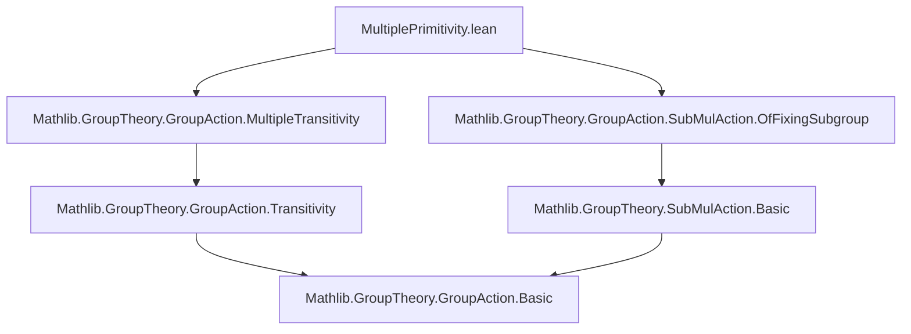
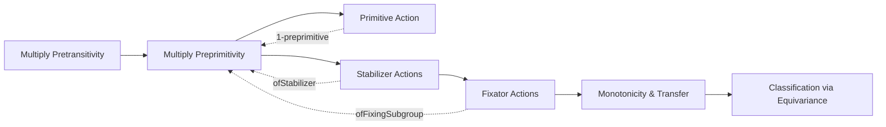

**Technical Brief: `MultiplePrimitivity.lean`**

---

### **1. Key Definitions & Theorems**

| Name | Type / Signature | Purpose |
|------|------------------|---------|
| `IsMultiplyPreprimitive` | `class IsMultiplyPreprimitive (M α : Type*) [Group M] [MulAction M α] (n : ℕ)` | Defines *n*-multiply preprimitive actions: *n*-multiply pretransitive + for all `s : Set α` with `s.encard + 1 = n`, the induced action of `fixingSubgroup M s` on `ofFixingSubgroup M s` is *preprimitive*. |
| `is_zero_preprimitive` | `IsMultiplyPreprimitive M α 0` | Any action is 0-preprimitive (vacuously, since no `s` satisfies `s.encard + 1 = 0`). |
| `is_one_preprimitive_iff` | `IsMultiplyPreprimitive M α 1 ↔ IsPreprimitive M α` | 1-preprimitive ⇔ primitive (standard primitivity). |
| `isMultiplyPreprimitive_ofStabilizer` | `[IsPretransitive M α] → IsMultiplyPreprimitive M α n.succ → IsMultiplyPreprimitive (stabilizer M a) (ofStabilizer M a) n` | If action is `(n+1)`-preprimitive and pretransitive, then stabilizer action is *n*-preprimitive. |
| `isMultiplyPreprimitive_succ_iff_ofStabilizer` | `[IsPretransitive M α] → 1 ≤ n → (IsMultiplyPreprimitive M α n.succ ↔ IsMultiplyPreprimitive (stabilizer M a) (ofStabilizer M a) n)` | Equivalence for `n ≥ 1`: `(n+1)`-preprimitive ⇔ stabilizer is *n*-preprimitive. |
| `ofFixingSubgroup.isMultiplyPreprimitive` | `IsMultiplyPreprimitive M α n → s.ncard + m = n → IsMultiplyPreprimitive (fixingSubgroup M s) (ofFixingSubgroup M s) m` | Fixator of a subset of size `d` in an *n*-preprimitive action is `(n−d)`-preprimitive. |
| `isMultiplyPreprimitive_of_isMultiplyPretransitive_succ` | `↑(n+1) ≤ ENat.card α → IsMultiplyPretransitive M α n.succ → IsMultiplyPreprimitive M α n` | `(n+1)`-pretransitive + enough points ⇒ *n*-preprimitive. |
| `isMultiplyPreprimitive_of_le` | `IsMultiplyPreprimitive M α n → m ≤ n → ↑n ≤ ENat.card α → IsMultiplyPreprimitive M α m` | Monotonicity: higher preprimitivity implies lower. |
| `IsMultiplyPreprimitive.of_bijective_map` | `Function.Bijective f → IsMultiplyPreprimitive M α n → IsMultiplyPreprimitive N β n` | Preprimitivity descends along bijective equivariant maps. |
| `isMultiplyPreprimitive_congr` | `Function.Surjective φ → Function.Bijective f → (IsMultiplyPreprimitive M α n ↔ IsMultiplyPreprimitive N β n)` | Preprimitivity is invariant under isomorphism of actions. |

**Auxiliary lemmas (rewriting primitivity):**
- `isPreprimitive_of_fixingSubgroup_empty_iff`
- `isPreprimitive_ofFixingSubgroup_conj_iff`
- `isPreprimitive_fixingSubgroup_insert_iff`

---

### **2. Naming Conventions**

- **Prefixes:**
  - `is_` / `isMultiplyPreprimitive` / `isPreprimitive`: predicate definitions.
  - `of_` / `ofFixingSubgroup` / `ofStabilizer`: coercion/induced action constructions.
  - `fixingSubgroup`, `stabilizer`: subgroup definitions.
- **Suffixes:**
  - `_iff`: characterizations (biconditionals).
  - `_congr`: invariance under equivalence/isomorphism.
  - `_map`: behavior under equivariant maps.
  - `_insert`, `_union`, `_conj`: structural operations on sets.
- **Notation:**
  - `s.encard`: cardinality in `ℕ∞`.
  - `s.ncard`: finite cardinality (`ℕ`) when `s` is finite.
  - `Subtype.val '' t`: image of `t` under coercion.
  - `fixingSubgroup G s`, `ofFixingSubgroup G s`: fixator subgroup and its action.

---

### **3. Tactic Stack**

Frequently used tactics:
- `aesop`: for automated reasoning with set/group actions.
- `simp` / `rw`: simplification and rewriting using `mk_iff`, congruences, encard lemmas.
- `exact`, `apply`, `intro`, `cases`: standard proof structure.
- `ext`: extensionality for set equality.
- `convert`, `congr_arg`: for equality of structured objects.
- `have`, `suffices`: intermediate claims.
- `set ... with h`: local definitions with equations.
- `apply ... surjective`: leveraging surjectivity of equivariant maps.

---

### **4. Proof Logic**

**General proof strategy:**
1. **Decompose via `mk_iff`**: Reduce to verifying *multiply pretransitivity* and *preprimitivity of fixators*.
2. **Cardinality analysis**: Use `encard`, `ncard`, `Set.encard_insert_of_notMem`, `Set.encard_union_eq` to relate sizes of sets.
3. **Equivariance & conjugation**: Use `fixingSubgroupEquivFixingSubgroup`, `conjMap_ofFixingSubgroup_bijective`, `Set.image_smul` to reduce to canonical cases (e.g., `a ∈ s`).
4. **Induction / case split on `n`**: Especially in monotonicity (`isMultiplyPreprimitive_of_le`) and base cases (`n = 0`, `n = 1`).
5. **Transfer via equivariant maps**: Use `of_bijective_map`, `of_surjective`, `isPreprimitive_congr` to reduce to known actions.

**Typical flow for `isMultiplyPreprimitive_succ_iff_ofStabilizer`:**
- ⇒: Apply `isMultiplyPreprimitive_ofStabilizer`.
- ⇐: 
  - Show `(n+1)`-pretransitivity via `ofStabilizer.isMultiplyPretransitive`.
  - For any `s` with `s.encard + 1 = n+1`, pick `b ∈ s`, conjugate to move `b ↦ a`, define `t = g⁻¹ • s \ {a}`, reduce to stabilizer case via `isPreprimitive_fixingSubgroup_insert_iff`.

---

### **5. Imports & Dependencies**

**Core imports:**
```lean
Mathlib.GroupTheory.GroupAction.MultipleTransitivity
Mathlib.GroupTheory.GroupAction.SubMulAction.OfFixingSubgroup
```

**Implicit dependencies (via `SubMulAction`, `Pointwise`, `Cardinal`, `BigOperators`):**
- `Mathlib.GroupTheory.GroupAction.Basic`
- `Mathlib.GroupTheory.SubMulAction.Basic`
- `Mathlib.Data.Set.Pointwise`
- `Mathlib.Data.ENat.Basic`
- `Mathlib.Data.Cardinal.Finite`
- `Mathlib.Data.Nat.Basic`

---

### **6. Mermaid Diagrams**

#### **Dependency Graph (Module-Level)**



#### **Conceptual Overview (Theory Flow)**



#### **Proof Structure (Inductive Step)**

```mermaid
flowchart LR
  H1[IsMultiplyPreprimitive M α (n+1)] --> H2[IsMultiplyPretransitive M α (n+1)]
  H1 --> H3[∀ s, |s|+1=n+1 ⇒ fixingSubgroup s ↪ ofFixingSubgroup s is primitive]
  H2 --> H4[IsPretransitive M α]
  H4 --> H5[Pick a ∈ α]
  H5 --> H6[Stabilizer action on α\{a}]
  H6 --> H7[IsMultiplyPreprimitive (stabilizer) (n)]
  H3 --> H7 via "insert a"
```

---

### **7. Summary**

This module formalizes *multiply preprimitive actions*, a refinement of *multiply transitive* and *primitive* actions, where primitivity is required not just globally but on fixators of subsets of size `n−1`. It establishes foundational properties (base cases, stabilization, monotonicity, transfer), mirroring the classical theory of primitive permutation groups but in the general setting of group actions on types. The formalization leverages `encard` for cardinal arithmetic in `ℕ∞`, and uses equivariant maps and conjugation to reduce cases, aligning with standard techniques in permutation group theory.
