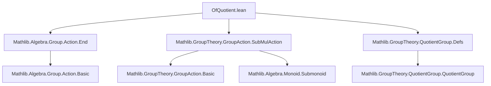
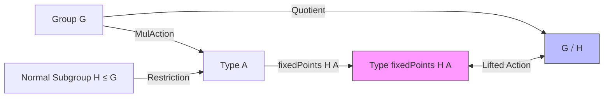

**Technical Brief: `OfQuotient.lean`**

---

### 1. **Key Definitions & Theorems**

| Name | Type / Signature | Purpose |
|------|------------------|---------|
| `MulAction.ofQuotient` (implicit instance) | `MulAction (G ⧸ H) (fixedPoints H A)` | Constructs a `MulAction` of the quotient group $G/H$ on the $H$-fixed points in $A$. |
| `coe_quotient_smul_fixedPoints` | `(g : G) (a : fixedPoints H A) : (g : G ⧸ H) • a = g • a` | States that the action of a coset representative $g$ on a fixed point $a$ coincides with the original action of $g$ in $G$. |
| `quotient_out_smul_fixedPoints` | `(g : G ⧸ H) (a : fixedPoints H A) : g.out • a = g • a` | Confirms that using the `out` representative of a coset yields the same action. |
| `MulDistribMulAction.ofQuotient` (implicit instance) | `MulDistribMulAction (G ⧸ H) (FixedPoints.submonoid H A)` | Lifts a `MulDistribMulAction` of $G$ on a monoid $A$ to a `MulDistribMulAction` of $G/H$ on the $H$-fixed-point submonoid. |
| `MulDistribMulAction.ofQuotient_pow` (via `inferInstanceAs`) | `MulDistribMulAction (G ⧸ H) (α ^* H)` | Special case: lifts action on the $H$-fixed-point submonoid of a type $\alpha$ with `MulDistribMulAction G α`. |

> **Notation**:  
> - `fixedPoints H A` ≡ `Subtype (fun a ↦ ∀ h ∈ H, h • a = a)`  
> - `FixedPoints.submonoid H A` ≡ the submonoid of $H$-fixed points in a monoid $A$ under `MulDistribMulAction`.  
> - `α ^* H` ≡ `FixedPoints.submonoid H α` (scoped notation).

---

### 2. **Naming Conventions**

- **Prefixes**:
  - `coe_`: coercion-related lemmas (e.g., `coe_quotient_smul_fixedPoints`)
  - `quotient_`: lemmas about quotient-specific behavior (e.g., `quotient_out_smul_fixedPoints`)
- **Suffixes**:
  - `_fixedPoints`: refers to actions on fixed-point types
  - `_submonoid`: refers to actions on fixed-point submonoids
- **Instance naming**: Implicit via `instance` declarations; no explicit name, inferred by typeclass resolution.

---

### 3. **Tactic Stack**

| Tactic | Usage Frequency | Role |
|--------|-----------------|------|
| `ext` | High | Proving equality of functions/points in subtype/`Function.End` |
| `funext` | Medium | Extensivity for function equality (e.g., in `ofEndHom` verification) |
| `induction_on` | Medium | Structural induction on quotient elements (e.g., `g.induction_on`) |
| `rw` / `conv_rhs => rw [...]` | Medium | Rewriting using `out_eq`, `rfl` |
| `exact` | Low | Final step in `ofEndHom` proof obligation |
| `inferInstanceAs` | High | Reusing existing instances (e.g., for `MulDistribMulAction` on `α ^* H`) |

---

### 4. **Proof Logic**

- **Core strategy**:  
  1. **Lift the action**: Use `QuotientGroup.lift` to define a monoid homomorphism $G \to \mathrm{End}(H\text{-fix}(A))$ that is constant on $H$-cosets.  
  2. **Verify well-definedness**: Show that if $g \in H$, then $g$ acts trivially on $H$-fixed points (via `a.2 ⟨g, hg⟩`).  
  3. **Check algebraic properties**: For `MulDistribMulAction`, use induction on quotient elements to reduce to $G$-properties (`smul_mul`, `smul_one`).  
  4. **Simp lemmas**: Prove that the lifted action agrees with the original action on representatives (`coe_`, `quotient_out_` lemmas).

- **Induction pattern**:  
  `g : G ⧸ H ⊢ P(g)` is handled by `g.induction_on`, reducing to $g = g' : G$, then applying known $G$-properties.

---

### 5. **Imports**

| Module | Role |
|--------|------|
| `Mathlib.Algebra.Group.Action.End` | Provides `toEndHom`, `ofEndHom`, and `Function.End` machinery |
| `Mathlib.GroupTheory.GroupAction.SubMulAction` | Supplies `fixedPoints`, `FixedPoints.submonoid`, and related structure |
| `Mathlib.GroupTheory.QuotientGroup.Defs` | Provides `QuotientGroup.lift`, `out_eq`, and quotient group basics |

> **Scope**: This file sits in the *group action → quotient → fixed points* chain, bridging representation-theoretic lifting and categorical descent.

---

### 8. **Mermaid Diagrams**

#### **Dependency Graph (File-Level)**



#### **Theoretical Overview (Data Flow)**



#### **Instance Lifting Chain**

```mermaid
flowchart LR
  MulAction G A -->|H-invariance| MulAction (G ⧸ H) (fixedPoints H A)
  MulDistribMulAction G A -->|Submonoid| MulDistribMulAction (G ⧸ H) (FixedPoints.submonoid H A)
  MulDistribMulAction G α -->|Fixed points| MulDistribMulAction (G ⧸ H) (α ^* H)
```

---

**Summary**: This module formalizes the *descent* of group actions to quotient groups on fixed-point substructures — a foundational step for equivariant cohomology, Galois descent, and orbit-counting arguments in Lean. The proofs rely on quotient induction and typeclass inference, with heavy use of `Subtype` structure and `QuotientGroup.lift`.
