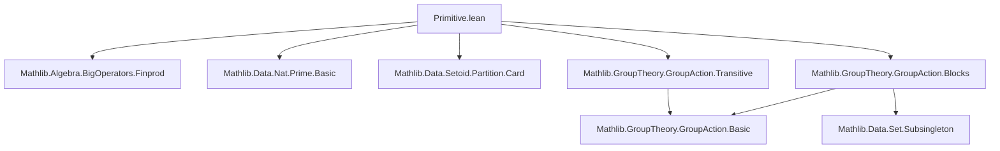
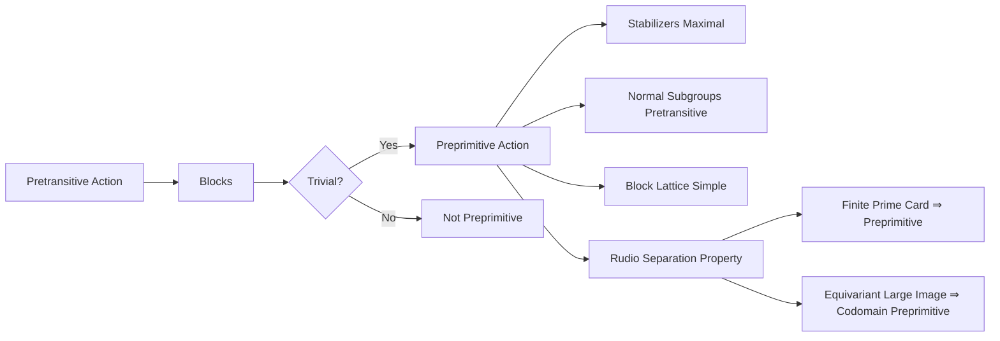

### Technical Brief: Primitive Actions in Lean 4 (`Primitive.lean`)

---

#### **1. Key Definitions & Theorems**

| Name | Type | Purpose |
|------|------|---------|
| `AddAction.IsPreprimitive` | `class [VAdd G X] : Prop extends AddAction.IsPretransitive G X` | Defines *additive preprimitivity*: pretransitive action where all blocks are trivial (subsingleton or full). |
| `MulAction.IsPreprimitive` | `class [SMul G X] : Prop extends IsPretransitive G X` | Multiplicative version: pretransitive action with only trivial blocks. |
| `AddAction.IsQuasiPreprimitive` | `class [AddGroup G] [AddAction G X] : Prop extends AddAction.IsPretransitive G X` | Additive quasipreprimitivity: any normal additive subgroup acting nontrivially acts pretransitively. |
| `MulAction.IsQuasiPreprimitive` | `class [Group G] [MulAction G X] : Prop extends IsPretransitive G X` | Multiplicative quasipreprimitivity: any normal subgroup with no global fixed point acts pretransitively. |
| `isTrivialBlock_of_isBlock` | `∀ {B : Set X}, IsBlock G B → IsTrivialBlock B` | Core property of preprimitivity: every block is trivial. |
| `isSimpleOrder_blockMem_iff_isPreprimitive` | `IsSimpleOrder (BlockMem G a) ↔ IsPreprimitive G X` | Relates preprimitivity to simplicity of the block lattice above a point (for pretransitive actions on nontrivial types). |
| `isCoatom_stabilizer_iff_preprimitive` | `IsCoatom (stabilizer G a) ↔ IsPreprimitive G X` | Wielandt’s Theorem 7.5: preprimitivity ⇔ point stabilizers are maximal subgroups. |
| `IsPreprimitive.isCoatom_stabilizer_of_isPreprimitive` | `IsCoatom (stabilizer G a)` | Consequence: under preprimitivity, stabilizers are maximal. |
| `IsPreprimitive.isQuasiPreprimitive` | `instance [IsPreprimitive M α] : IsQuasiPreprimitive M α` | Preprimitivity ⇒ quasipreprimitivity (Wielandt, Th. 7.1). |
| `of_prime_card` | `IsPretransitive G X → Nat.Prime (Nat.card X) → IsPreprimitive G X` | Pretransitive action on prime-sized set is preprimitive. |
| `of_card_lt` | `IsPretransitive H Y → IsPreprimitive G X → Nat.card Y < 2 * (range f).ncard → IsPreprimitive H Y` | Codomain of equivariant map with large image inherits preprimitivity. |
| `exists_mem_smul_and_notMem_smul` | **Rudio’s Theorem** (Wielandt, Th. 8.1):<br>`IsPreprimitive G X → A.Finite → A.Nonempty → A ≠ univ → a ≠ b → ∃ g, a ∈ g • A ∧ b ∉ g • A` | For nontrivial subsets in preprimitive actions, some translate separates two points. |

---

#### **2. Naming Conventions**

- **Prefixes**:
  - `is_`: predicates on actions (`isPretransitive`, `isTrivialBlock`, `isBlock`, `isSimpleOrder`, `isCoatom`)
  - `of_`: implications from structural or cardinality conditions (`of_prime_card`, `of_card_lt`, `of_surjective`, `of_isTrivialBlock_*`)
  - `mk'`: alternative constructors (`IsPreprimitive.mk'`)
- **Suffixes**:
  - `_iff_*`: characterizations (`_iff_isPreprimitive`, `_iff_isCoatom`)
  - `_of_*`: derived properties (`isQuasiPreprimitive_of_normal`, `isCoatom_stabilizer_of_isPreprimitive`)
- **Module-level**:
  - `AddAction.*` vs `MulAction.*`: additive vs multiplicative variants.
  - `to_additive` attribute used consistently for dual statements.

---

#### **3. Tactic Stack**

Frequently used tactics in proofs:
- `grind`, `simp`, `rw`, `exact`, `intro`, `rcases`, `obtain`, `cases`
- `apply`, `exfalso`, `contrapose!`, `swap`, `convert`
- `set_tac`, `set_ext`, `ext`, `funext`
- `ring`, `linarith`, `nlinarith`, `omega` (for arithmetic in finite cases)
- `apply Or.resolve_left/right`, `apply And.intro`, `apply Iff.intro`
- `rw [Set.*]`, `simp only [mem_*]`, `simp [Set.*]`
- `apply lt_of_*`, `apply le_of_*`, `apply dvd_*`, `apply Nat.*_le_*`
- `apply Set.*_eq_*`, `apply Set.Subsingleton.*`, `apply Set.ncard_*`

---

#### **4. Proof Logic**

- **Induction/Case Analysis**:
  - On emptiness/nonemptiness of sets (`eq_empty_or_nonempty`, `eq_singleton_or_nontrivial`)
  - On subsingleton/fullness of blocks (`subsingleton_or_eq_univ`, `eq_bot_or_eq_top`)
  - On fixed points vs non-fixed points (`notMem_fixedPoints`, `fixedPoints_ne_univ`)
- **Equivalence Proofs**:
  - `isSimpleOrder_blockMem_iff_isPreprimitive`, `isCoatom_stabilizer_iff_isPreprimitive`: bidirectional via `constructor` + `rw` + `simp`.
- **Maximality Arguments**:
  - Use `isCoatom_stabilizer_iff_isPreprimitive` to reduce to block lattice simplicity.
- **Finite Cardinality Reasoning**:
  - Use `ncard_dvd_card`, `ncard_le_card`, `ncard_block_mul_ncard_orbit_eq`, `orbit.ncard_dvd_card`.
- **Equivariant Maps**:
  - Pull/push blocks via `preimage`, `image`, `translate`.
- **Rudio’s Theorem**:
  - Construct intersection `B = ⋂_{g : a ∈ g•A} g•A`, show it’s a block, then apply preprimitivity to deduce `B = {a}`.

---

#### **5. Imports & Scope**

**Primary Dependencies**:
```lean
Mathlib.Algebra.BigOperators.Finprod
Mathlib.Data.Nat.Prime.Basic
Mathlib.Data.Setoid.Partition.Card
Mathlib.GroupTheory.GroupAction.Blocks
Mathlib.GroupTheory.GroupAction.Transitive
```

**Key Concepts Leveraged**:
- `BlockMem`, `IsBlock`, `IsTrivialBlock`, `BlockSystem`
- `stabilizer`, `orbit`, `fixedPoints`
- `IsPretransitive`, `IsSimpleOrder`, `IsCoatom`
- `Set.ncard`, `Fintype`, `Finite`
- `EquivariantMap`, `MulAction.mem_orbit_iff`, `smul_set`

---

#### **6. Mermaid Diagrams**

##### **Dependency Graph (Module-Level)**



##### **Theoretical Overview (Conceptual Flow)**



##### **Proof Strategy Flow (Example: `isCoatom_stabilizer_iff_isPreprimitive`)**

```mermaid
graph TD
  A[Pretransitive + Nontrivial X] --> B[BlockMem G a Simple Order]
  B --> C[Only two blocks through a: {a} or X]
  C --> D[Stabilizer Maximal ⇔ Only two blocks through a]
  D --> E[IsCoatom stabilizer ↔ IsPreprimitive]
```

---

#### **7. Notable Lemmas & Their Roles**

| Lemma | Role |
|-------|------|
| `isTrivialBlock_of_isBlock` | Core definition: blocks ⇒ trivial. |
| `of_isTrivialBlock_base` / `of_isTrivialBlock_of_notMem_fixedPoints` | Construct preprimitivity from local triviality at a point. |
| `isSimpleOrder_blockMem_iff_isPreprimitive` | Bridge between order-theoretic and group-theoretic notions. |
| `isCoatom_stabilizer_iff_isPreprimitive` | Connects to subgroup lattice — key for classification. |
| `IsPreprimitive.isQuasiPreprimitive` | Shows quasipreprimitivity is weaker; used in decomposition arguments. |
| `of_prime_card` | Enables automatic preprimitivity in combinatorial settings. |
| `exists_mem_smul_and_notMem_smul` | Enables separation arguments; foundational for permutation group theory. |

---

#### **8. Comments & Caveats**

- **Degenerate Actions**: Singletons may fail to be blocks if action is degenerate (see comment before `IsBlock.of_subset`). Preprimitivity excludes this via `isTrivialBlock`.
- **Nonemptiness**: Classical definition of *primitive* requires `X ≠ ∅`; this file uses *preprimitive* (no nonemptiness assumption).
- **Finiteness**: Required for `of_prime_card`, `of_card_lt`, and `exists_mem_smul_and_notMem_smul`. Counterexample given for infinite sets (`G = ℤ` on `ℕ`).
- **Priority Instance**: `IsPreprimitive.isQuasiPreprimitive` has `priority := 100` to avoid ambiguity in typeclass inference.

--- 

This module formalizes foundational results on *primitive* and *quasiprimitive* group actions in the style of Wielandt’s *Finite Permutation Groups*, adapted to Lean’s type-theoretic framework and generalized to possibly degenerate actions.
