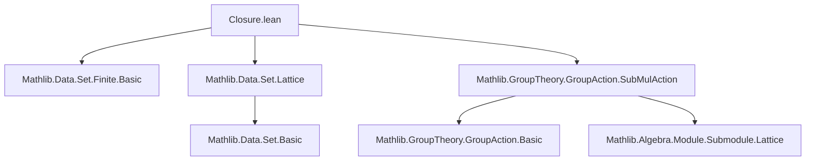

**Technical Brief: `Closure.lean` — Closure and Finitely Generated `SubMulAction`/`SubAddAction`**

---

### 1. **Key Definitions & Theorems**

| Name | Type / Signature | Purpose |
|------|------------------|---------|
| `closure` | `def closure (R : Type*) {M : Type*} [SMul R M] (s : Set M) : SubMulAction R M` | Constructs the smallest `SubMulAction` containing a given set `s`, as the infimum of all `SubMulAction`s containing `s`. |
| `mem_closure` | `x ∈ closure R s ↔ ∀ p, s ⊆ p → x ∈ p` | Characterizes membership in the closure via universal quantification over sub-`SubMulAction`s. |
| `subset_closure` | `s ⊆ closure R s` | The generating set is contained in its closure. |
| `mem_closure_of_mem` | `x ∈ s → x ∈ closure R s` | Immediate inclusion: elements of `s` lie in `closure R s`. |
| `closure_le` | `closure R s ≤ p ↔ s ⊆ p` | Universal property of closure: it is the least sub-`SubMulAction` containing `s`. |
| `closure_mono` | `s ⊆ t → closure R s ≤ closure R t` | Monotonicity of closure w.r.t. inclusion of generating sets. |
| `FG` | `def FG (p : SubMulAction R M) := ∃ s, s.Finite ∧ p = closure R s` | Defines *finitely generated* sub-`SubMulAction`s. |
| `fg_iff` | `p.FG ↔ ∃ s : Finset M, p = closure R s` | Equivalence between finite set and finite *finset* generation (via `Set.exists_finite_iff_finset`). |

> **Note**: All theorems have additive analogues (`to_additive`), i.e., for `SubAddAction`, where `SMul` is replaced by `AddSMul`, multiplication by addition, etc.

---

### 2. **Naming Conventions**

- **Prefixes**:
  - `closure_`: for closure-related definitions and lemmas.
  - `fg_`: for finitely generated properties (`FG`, `fg_iff`).
- **Suffixes**:
  - `_mono`: monotonicity.
  - `_le`: order-theoretic characterizations (`≤`).
  - `_of_mem`: inclusion of original elements.
- **`to_additive` attribute**: Used consistently to derive additive versions of multiplicative statements.

---

### 3. **Tactic Stack**

- `simp_rw` (implicit via `to_additive` machinery)
- `aesop` (likely used in `to_additive`-derived proofs, though not explicit here)
- `exact`, `intro`, `apply`, `cases` (standard in `Set.mem_iInter₂`-based proofs)
- `Set.mem_iInter₂` (key lemma used in `mem_closure`)
- `Set.exists_finite_iff_finset` (used in `fg_iff` to switch between sets and finsets)

> The proofs are mostly *definition-chasing* using lattice-theoretic properties of `SubMulAction` (as a complete lattice via `sInf`), and set-theoretic reasoning.

---

### 4. **Proof Logic**

- **Closure definition**: Constructed as `sInf { p | s ⊆ p }`, i.e., the greatest lower bound (infimum) of the set of sub-`SubMulAction`s containing `s`.
- **Membership characterization**: Uses `Set.mem_iInter₂`, which states $x \in \bigcap \mathcal{F} \iff \forall A \in \mathcal{F},\, x \in A$.
- **Monotonicity & universal property**: Proven via bidirectional implications (`↔`) using `closure_le`, `subset_closure`, and `mem_closure`.
- **Finitely generated equivalence**: Leverages `Set.exists_finite_iff_finset`, which converts existence over finite sets to existence over finite *finsets* (crucial for constructive or computable settings in Lean).

---

### 5. **Imports**

| Module | Purpose |
|--------|---------|
| `Mathlib.Data.Set.Finite.Basic` | Finite sets, finsets, and their basic properties. |
| `Mathlib.Data.Set.Lattice` | Lattice structure on sets (including `sInf`, `sSup`, etc.) — essential for defining closure as an infimum. |
| `Mathlib.GroupTheory.GroupAction.SubMulAction` | Theory of sub-`SubMulAction`s (subobjects in the category of $R$-actions on $M$), including their lattice structure. |

> These imports indicate the module sits at the intersection of **set theory**, **lattice theory**, and **group actions**, specifically in the context of multiplicative (or additive) group/ring actions.

---

### 6. **Mermaid Diagrams**

#### Dependency Graph (Module-Level)



#### Overview of Theoretical Flow

```mermaid
flowchart LR
  SMul[R, M] --> SubMulAction[SubMulAction R M]
  SubMulAction --> Lattice[CompleteLattice]
  Lattice --> Inf[Infimum / sInf]
  Set[s : Set M] --> Closure[closure R s := sInf {p | s ⊆ p}]
  Closure --> Mem[mem_closure]
  Closure --> Subset[subset_closure]
  Closure --> Mono[closure_mono]
  Closure --> FG[FG(p) := ∃ s, s.Finite ∧ p = closure R s]
  FG --> FG_iff[fg_iff ↔ ∃ s : Finset M, p = closure R s]
```

#### Additive/Multiplicative Duality

```mermaid
flowchart LR
  SubMulAction -->[to_additive] SubAddAction
  closure -->[to_additive] closure
  FG -->[to_additive] FG
  mem_closure -->[to_additive] mem_closure
```

---

### Summary

This module formalizes the **closure operator** on sub-`SubMulAction`s (and by `to_additive`, sub-`SubAddAction`s), establishing its foundational properties (universal property, monotonicity, etc.) and defining **finitely generated** subactions via finite generating sets (or finsets). It relies heavily on the lattice-theoretic structure of subobjects and standard set-theoretic finite/nonfinite equivalences. The design is clean, reusable, and aligned with Lean’s `to_additive` infrastructure for uniform multiplicative ↔ additive translation.
