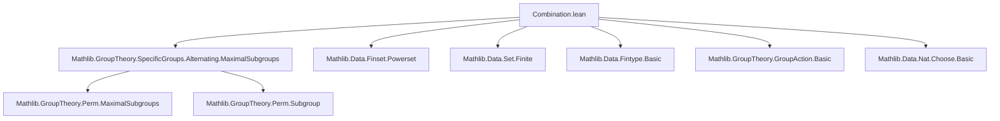

**Technical Brief: `Combination.lean` — API for Combinations under Group Actions**

---

### 1. KEY DEFINITIONS & THEOREMS

| Name | Type / Signature | Purpose |
|------|------------------|---------|
| `Set.powersetCard` | `ℕ → Set (Finset α)` | Type of finite subsets of `α` of cardinality `n`. |
| `Set.powersetCard.subMulAction` | `SubMulAction G (Finset α)` | Constructs a `SubMulAction` of `G` on `powersetCard α n` when `G ↷ α`. |
| `Set.powersetCard.mulActionHom_of_embedding` | `(Fin n ↪ α) →[G] powersetCard α n` | Equivariant map from embeddings `Fin n ↪ α` to `n`-combinations (surjective). |
| `Set.powersetCard.compl` | `powersetCard α n →[G] powersetCard α m` (given `m + n = |α|`) | Equivariant complement map on combinations. |
| `Set.powersetCard.mulActionHom_singleton` | `α →[G] powersetCard α 1` | Equivariant map sending `x ↦ {x}` (bijective). |
| `Set.powersetCard.card` | `Nat.card (powersetCard α n) = (Nat.card α).choose n` | Counts number of `n`-combinations. |
| `Set.powersetCard.isPretransitive` | `IsPretransitive (Perm α) (powersetCard α n)` | Symmetric group acts pretransitively on combinations. |
| `Set.powersetCard.isPretransitive_of_isMultiplyPretransitive` | `IsMultiplyPretransitive G α n → IsPretransitive G (powersetCard α n)` | Lifts `n`-pretransitivity of `G ↷ α` to `G ↷ powersetCard α n`. |
| `Set.powersetCard.isPreprimitive_perm` | `IsPreprimitive (Perm α) (powersetCard α n)` under `1 ≤ n < |α|`, `|α| ≠ 2n` | Stabilizer of an `n`-subset is maximal ⇒ action is preprimitive. |
| `Set.powersetCard.isPretransitive_alternatingGroup` | `IsPretransitive (alternatingGroup α) (powersetCard α n)` for `3 ≤ |α|` | Alternating group acts pretransitively on combinations. |
| `Set.powersetCard.isPreprimitive_alternatingGroup` | `IsPreprimitive (alternatingGroup α) (powersetCard α n)` under `3 ≤ n < |α|`, `|α| ≠ 2n` | Alternating group acts preprimitive on combinations. |

---

### 2. NAMING CONVENTIONS

- **Prefixes**:
  - `powersetCard_`: module-level operations on combinations.
  - `mulActionHom_`: equivariant maps (i.e., `G`-equivariant functions).
  - `coe_`: coercion lemmas (e.g., `coe_smul`, `coe_compl`).
  - `stabilizer_`: stabilizer-related lemmas.
  - `faithful_`: faithfulness of induced actions.

- **Suffixes**:
  - `_of_`: constructions from other structures (e.g., `of_embedding`, `of_isMultiplyPretransitive`).
  - `_iff`: characterizations via equivalences (e.g., `eq_iff_subset`, `nontrivial_iff`).
  - `_iff`: logical equivalences (e.g., `nontrivial_iff`, `eq_empty_iff`).
  - `_surjective`, `_bijective`, `_faithful`: properties of maps or actions.

- **Notable patterns**:
  - `smul_mem'`, `map_smul'`: proofs of equivariance.
  - `coe_` lemmas: relate coercion to underlying operations.
  - `nontrivial`, `nontrivial'`: two variants using `ENat.card` vs `Nat.card`.

---

### 3. TACTIC STACK

Frequently used tactics in proofs:

| Tactic | Usage |
|--------|-------|
| `simp` / `simp only` | Simplification of `Finset`, `Set`, `MulAction`, `Subtype` goals. |
| `rw` / `rwa` | Rewriting using lemmas, often with `mem_iff`, `coe_smul`, `Finset.card_map`, etc. |
| `ext` | Extensionality for functions, sets, finsets. |
| `congr` / `congr'` | Congruence reasoning (e.g., in `mulActionHom_singleton_bijective`). |
| `aesop` | Automated reasoning for simple goals (e.g., in `isPretransitive_alternatingGroup`). |
| `grind` | Custom tactic (likely from `Mathlib.Tactic`) for grinding through arithmetic and set-theoretic goals. |
| `omega` | Solving linear arithmetic (e.g., in `compl` definition). |
| `rcases` / `obtain` | Case analysis and existential extraction (e.g., `exists_mem_notMem`). |
| `contrapose!` | Logical contraposition with simplification. |
| `infer_instance` | Typeclass inference. |
| `apply` / `exact` | Proof construction. |

---

### 4. PROOF LOGIC

**Typical proof structure**:

1. **Reduction to underlying set/finset**:
   - Use `coe_smul`, `stabilizer_coe`, `mem_coe_iff` to reduce to set-theoretic reasoning.
2. **Equivariance checks**:
   - Prove `map_smul'` by expanding definitions (`coe_smul`, `Finset.smul_finset_def`, `Finset.map_map`) and simplifying.
3. **Surjectivity / bijectivity**:
   - Use `Finset.card_map`, `Finset.card_singleton`, `Finset.ext_iff`, and `Function.Embedding.exists_of_card_eq_finset`.
4. **Pretransitivity**:
   - Show surjectivity of `mulActionHom_of_embedding`, then apply `IsPretransitive.of_surjective_map`.
5. **Preprimitivity**:
   - Use `isCoatom_stabilizer_iff_preprimitive`, reduce to `stabilizer_coe`, then apply `Equiv.Perm.isCoatom_stabilizer` or `alternatingGroup.isCoatom_stabilizer`.
6. **Faithfulness**:
   - Use `MulAction.toPerm_injective`, reduce to action on `α` via `mulAction_faithful`.
7. **Cardinality arguments**:
   - Use `powersetCard.card`, `Nat.choose_eq_zero_iff`, `Nat.one_lt_iff_ne_zero_and_ne_one`.

---

### 5. IMPORTS

- `Mathlib.GroupTheory.SpecificGroups.Alternating.MaximalSubgroups`  
  → Provides key results on maximality of stabilizers for alternating groups.

**Implicit dependencies** (via `Mathlib` imports):
- `Mathlib.Data.Finset.Powerset`
- `Mathlib.Data.Set.Finite`
- `Mathlib.Data.Fintype.Basic`
- `Mathlib.GroupTheory.GroupAction.Basic`
- `Mathlib.GroupTheory.GroupAction.Permutations`
- `Mathlib.GroupTheory.Perm.Subgroup`
- `Mathlib.Data.Nat.Choose.Basic`
- `Mathlib.Data.ENat.Basic`

---

### 6. MERMAID DIAGRAMS

#### Dependency Graph (Module-Level)

#### Overview of Theory Flow

---

### 7. SUMMARY

This file formalizes the theory of **combinations** (finite subsets of fixed size) in the presence of a group action. It builds a robust API for:
- Constructing induced actions on combinations,
- Proving equivariance of natural maps (embeddings → combinations, complement, singletons),
- Lifting pretransitivity and faithfulness,
- Proving preprimitivity via maximality of stabilizers (leveraging deep results on alternating groups).

It serves as a foundational module for group-theoretic combinatorics, especially in contexts like the study of primitive permutation groups or design theory.

--- 

*End of Technical Brief.*
