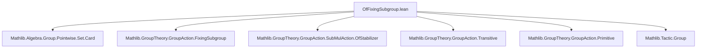

**Technical Brief: `OfFixingSubgroup.lean`**

---

### 1. KEY DEFINITIONS & THEOREMS

| Name | Type / Signature | Purpose |
|------|------------------|---------|
| `ofFixingSubgroup` | `SubMulAction (fixingSubgroup M s) α` | Defines the sub-action of the fixing subgroup on the complement `sᶜ`. |
| `ofFixingSubgroup_carrier` | `(ofFixingSubgroup M s).carrier = sᶜ` | Identifies the underlying set of the sub-action. |
| `mem_ofFixingSubgroup_iff` | `x ∈ ofFixingSubgroup M s ↔ x ∉ s` | Membership characterization. |
| `ofFixingSubgroup_equivariantMap` | `ofFixingSubgroup M s →ₑ[(fixingSubgroup M s).subtype] α` | Canonical equivariant inclusion of the sub-action into the ambient action. |
| `fixingSubgroupInsertEquiv` | `fixingSubgroup M (insert a s) ≃* fixingSubgroup (stabilizer M a) s` | Multiplicative equivalence between fixing subgroups after inserting a point. |
| `ofFixingSubgroup_insert_map` | `ofFixingSubgroup M (insert a s) →ₑ[fixingSubgroupInsertEquiv] ofFixingSubgroup (stabilizer M a) s` | Equivariant map induced by the above equivalence. |
| `fixingSubgroupEquivFixingSubgroup` | `fixingSubgroup M t ≃* fixingSubgroup M s` (when `g • t = s`) | Conjugation-induced equivalence of fixing subgroups under group translation. |
| `conjMap_ofFixingSubgroup` | `ofFixingSubgroup M t →ₑ[fixingSubgroupEquivFixingSubgroup] ofFixingSubgroup M s` | Equivariant map induced by conjugation when `s = g • t`. |
| `ofFixingSubgroup_of_inclusion` | `ofFixingSubgroup M s →ₑ[Subgroup.inclusion] ofFixingSubgroup M t` (when `t ⊆ s`) | Equivariant map induced by set inclusion. |
| `ofFixingSubgroup_of_singleton` | `ofFixingSubgroup M {a} →ₑ[φ] ofStabilizer M a` | Equivariant equivalence between fixing subgroup of a singleton and the stabilizer. |
| `ofFixingSubgroup_of_eq` | `ofFixingSubgroup M s →ₑ[φ] ofFixingSubgroup M t` (when `s = t`) | Equivariant identity map for equal sets. |
| `ofFixingSubgroup.append` | `Fin n ↪ ofFixingSubgroup M s → Fin (s.ncard + n) ↪ α` | Appends an enumeration of the complement to one of `s`. |
| `IsPretransitive.isPretransitive_ofFixingSubgroup_inter` | Criterion for pretransitivity of intersections | Used to lift pretransitivity from `s` to `s ∩ g • s`. |
| `IsPreprimitive.isPreprimitive_ofFixingSubgroup_inter` | Criterion for primitivity of intersections | Used to lift primitivity under same condition. |
| `MulAction.fixingSubgroup_le_stabilizer` | `fixingSubgroup G s ≤ stabilizer G s` | Inclusion of fixing subgroup in stabilizer. |

---

### 2. NAMING CONVENTIONS

- **Prefixes**:
  - `ofFixingSubgroup_`: for constructions involving `ofFixingSubgroup`.
  - `fixingSubgroup_`: for group-theoretic constructions (e.g., `fixingSubgroupInsertEquiv`, `fixingSubgroupEquivFixingSubgroup`).
  - `conjMap_`: for maps induced by conjugation.
  - `ofFixingSubgroup_of_`: for canonical maps between `ofFixingSubgroup`s induced by set-theoretic relations (`inclusion`, `singleton`, `eq`).

- **Suffixes**:
  - `_equivariantMap`: for equivariant maps (often identity on underlying type).
  - `_map`: for equivariant maps not necessarily identity.
  - `_equiv`: for multiplicative (or additive) equivalences.
  - `_bijective`: theorems asserting bijectivity of preceding maps.

- **Other patterns**:
  - `_left`, `_right`: for projections or inclusions in union/intersection contexts.
  - `_append`: for constructions combining enumerations.

---

### 3. TACTIC STACK

Frequently used tactics:
- `simp` (especially with `SetLike.coe_eq_coe`, `subgroup_smul_def`, `mem_fixingSubgroup_iff`)
- `rw` (often with `Set.mem_*`, `Subtype.coe_mk`, `Subtype.ext_iff`)
- `intro`, `exact`, `refine`, `apply`
- `grind` (custom tactic for grinding through simplifications)
- `constructor` (for proving injectivity/surjectivity/bijectivity)
- `ext` (for extensionality in subgroup proofs)
- `group` (from `Mathlib.Tactic.Group`, for simplifying group expressions)
- `aesop` (not explicitly used here, but `grind` likely subsumes its role)

---

### 4. PROOF LOGIC

**General proof strategy**:
- **Structural induction** is *not* used; proofs are mostly **direct** and **computational**, leveraging:
  - `simp`-based simplification of membership conditions (`mem_*`, `not_*`, `Set.*`)
  - `ext` for subgroup equality
  - `congrArg`/`congrFun` for equality of functions
  - `choose`/`exists.elim` for existential witnesses (e.g., in `ofFixingSubgroup_insert_map_bijective`)
- **Equivariance checks** are routine: reduce to `rfl` or `simp` after unfolding definitions.
- **Bijectivity proofs** follow a standard two-step pattern:
  - `constructor`
  - `intro ...; simp only [...] using h`
  - `intro ...; exact ⟨..., rfl⟩`
- **Group-theoretic lemmas** (e.g., `fixingSubgroup_map_conj_eq`) use:
  - `ext` + `simp` + `mem_*` + `MulAut.conj_apply`
  - `group` tactic for simplifying conjugation identities.

**Notable logical flow**:
- In `IsPretransitive.isPretransitive_ofFixingSubgroup_inter`, the proof:
  1. Uses `isPretransitive_iff_base` to reduce to existence of a group element.
  2. Splits cases on whether `x ∈ s` or `x ∈ g • s`.
  3. Uses pretransitivity on `s` to get `k`, then conjugates to get element in `s ∩ g • s`.
  4. Applies `smul_eq_iff_eq_inv_smul` and group simplifications.

---

### 5. IMPORTS

| Module | Purpose |
|--------|---------|
| `Mathlib.Algebra.Group.Pointwise.Set.Card` | Cardinal arithmetic for finite sets, especially `ncard`. |
| `Mathlib.GroupTheory.GroupAction.FixingSubgroup` | Definition and basic properties of `fixingSubgroup`. |
| `Mathlib.GroupTheory.GroupAction.SubMulAction.OfStabilizer` | Construction of `ofStabilizer`, used in `ofFixingSubgroup_of_singleton`. |
| `Mathlib.GroupTheory.GroupAction.Transitive` | Concepts like `IsPretransitive`, used in criteria. |
| `Mathlib.GroupTheory.GroupAction.Primitive` | Concepts like `IsPreprimitive`, used in primitivity criterion. |
| `Mathlib.Tactic.Group` | Tactics for group simplification (`group`, `abel`, etc.). |

---

### 6. DEPENDENCY & THEORY OVERVIEW

#### Mermaid Diagram: Module Dependencies



#### Mermaid Diagram: Theory Flow

```mermaid
graph TD
  FixingSubgroup[FixingSubgroup G s] -->|defines| SubMulAction[SubMulAction (FixingSubgroup G s) α]
  SubMulAction -->|carrier| Complement[sᶜ]
  SubMulAction -->|equivariant maps| AmbientAction[α]
  SubMulAction -->|insert| Stabilizer[Stabilizer M a]
  SubMulAction -->|translation| Conjugation[Conjugation by g]
  SubMulAction -->|inclusion| InclusionMap[t ⊆ s]
  SubMulAction -->|singleton| StabilizerSingleton[{a}]
  SubMulAction -->|equality| IdentityMap[s = t]
  SubMulAction -->|union| IteratedAction[Iterated fixingSubgroup]
  SubMulAction -->|enumeration| AppendMap[Fin embeddings]
  SubMulAction -->|criteria| Pretransitivity[Pretransitivity/Primitivity]
```

#### Summary

This file formalizes the theory of **sub-actions induced by fixing subgroups on complements of invariant subsets**, with a focus on:
- Canonical equivariant maps between such sub-actions,
- Structural equivalences (e.g., under insertion, translation, inclusion),
- Applications to **pretransitivity** and **primitivity criteria** via intersections.

It serves as a technical foundation for deeper results in permutation group theory, especially in contexts involving **finite permutation representations**, **enumeration**, and **group-theoretic decomposition**.

--- 

Let me know if you'd like a formalized dependency graph (e.g., `.dot` format) or a summary of the main lemmas for automated reasoning.
