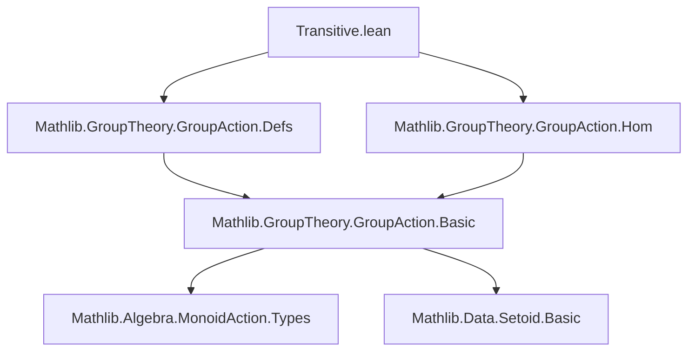

**Technical Brief: `Transitive.lean` (Mathlib Group Action Complements)**

---

### 1. KEY DEFINITIONS & THEOREMS

| Name | Type / Signature | Purpose |
|------|------------------|---------|
| `isPretransitive_iff_base` | `IsPretransitive G X ↔ ∀ x, ∃ g, g • a = x` | Characterizes pretransitivity of a group action by reachability from a fixed basepoint `a`. |
| `isPretransitive_iff_orbit_eq_univ` | `IsPretransitive G X ↔ orbit G a = univ` | Equates pretransitivity with the orbit of any point being the entire space. |
| `IsPretransitive.of_surjective_map` | `Function.Surjective f → IsPretransitive M α → IsPretransitive N β` | Pushes pretransitivity along a surjective equivariant map `f : α →ₑ[φ] β`. |
| `isPretransitive_congr` | `Function.Surjective φ → Function.Bijective f → (IsPretransitive M α ↔ IsPretransitive N β)` | Shows equivalence of pretransitivity under a surjective monoid map and bijective equivariant map. |

> **Note**: `IsPretransitive` is defined as `∀ x y, ∃ g, g • x = y`. It is weaker than transitivity (which requires uniqueness of `g`), but for group actions, pretransitivity *is* transitivity (since inverses give uniqueness).

---

### 2. NAMING CONVENTIONS

- **Prefixes**:
  - `isPretransitive_`: predicates on actions (`isPretransitive_iff_base`, `isPretransitive_congr`)
  - `of_`: implication from a stronger hypothesis to a conclusion (`of_surjective_map`)
- **Suffixes**:
  - `_iff_base`: equivalence with “reachability from a basepoint”
  - `_iff_orbit_eq_univ`: equivalence with full orbit condition
- **Equivariant maps**: `→ₑ[φ]` notation for `φ`-equivariant maps (`f : α →ₑ[φ] β`)
- **Action notation**: `g • a` for multiplicative action; additive version uses `+` and `+ᵥ`.

---

### 3. TACTIC STACK

| Tactic | Usage Frequency | Role |
|--------|-----------------|------|
| `intro` / `intro h` | High | Introduce hypotheses and variables |
| `obtain ⟨…⟩ := …` | High | Destruct existential/universal quantifiers and equivalences |
| `rw [← hx, …]` | High | Rewrite using previously obtained equalities |
| `simp only [map_smulₛₗ]` | Medium | Simplify equivariant map interaction with action |
| `simp_rw [mem_orbit_iff]` | Medium | Rewrite using definitional equivalences (e.g., orbit membership) |
| `apply MulAction.IsPretransitive.mk` | Medium | Construct pretransitivity via definition |
| `apply hf.injective` / `hf.surjective` | Medium | Use bijectivity/surjectivity of maps |
| `exact` / `use` | Medium | Finalize proofs by constructing witnesses or applying lemmas |

---

### 4. PROOF LOGIC

- **Structure of proofs**:
  - **Equivalences** (`↔`): Prove both directions separately (`mp`, `mpr`, or `constructor`).
  - **Existential goals**: Use `obtain ⟨g, hx⟩ := hG x` to extract witnesses from pretransitivity or surjectivity.
  - **Equivariant map arguments**: Lift elements via surjectivity (`obtain ⟨x', rfl⟩ := hf x`), then transport action via `map_smulₛₗ`.
  - **Injectivity arguments**: To prove equality of group elements, apply injectivity of `f` after mapping both sides.

- **Typical flow**:
  1. Unfold `IsPretransitive` (via `mk` or `exists_smul_eq`).
  2. Use surjectivity/bijectivity to reduce to preimage elements.
  3. Apply hypothesis (pretransitivity of source action).
  4. Transport via equivariance (`map_smulₛₗ`) and simplify.

---

### 5. IMPORTS

| Module | Role |
|--------|------|
| `Mathlib.GroupTheory.GroupAction.Defs` | Core definitions: `MulAction`, `IsPretransitive`, `orbit`, `smul`, etc. |
| `Mathlib.GroupTheory.GroupAction.Hom` | Morphisms of actions: `→ₑ[φ]`, equivariant maps, `map_smulₛₗ`, etc. |

> These imports define the foundational language of group/monoid actions and their homomorphisms.

---

### 6. MERMAID DIAGRAMS

#### Dependency Graph (Module-Level)



#### Overview of Theoretical Flow

```mermaid
graph LR
  A[MulAction G X] --> B[IsPretransitive G X]
  B --> C[∀ x, ∃ g, g • a = x] --> D[orbit G a = univ]
  A --> E[MulAction M α]
  A --> F[MulAction N β]
  E -->|φ : M → N| F
  E -->|f : α →ₑ[φ] β| F
  B -->|surj f, hφ| F
  F -->|surj φ, bijective f| E
```

#### Proof Structure (Example: `isPretransitive_congr`)

```mermaid
graph TD
  A[IsPretransitive M α] -->|of_surjective_map| B[IsPretransitive N β]
  C[IsPretransitive N β] -->|congruence step| A
  B --> D[∀ x,y, ∃ n, n • f(x) = f(y)]
  D -->|surj φ| E[∃ g, φ(g) = n]
  E -->|injective f| F[g • x = y]
```

---

### 7. ADDITIONAL NOTES

- **Additive versions**: All theorems have `to_additive` attributes, enabling automatic additive analogues (e.g., `+` instead of `•`, `+ᵥ` for actions).
- **Group vs Monoid**: Theorems in the group case (`G`) use inverses (`g⁻¹`) and uniqueness of transport; monoid case (`M`, `N`) requires surjectivity of `φ` to lift elements.
- **Orbit definition**: `orbit G a = {x | ∃ g, g • a = x}`; `mem_orbit_iff` gives the equivalence used in `isPretransitive_iff_orbit_eq_univ`.

--- 

Let me know if you'd like a formalized dependency graph (e.g., in Lean’s `doc_gen` format) or a summary of related missing lemmas (e.g., transitivity vs. pretransitivity for groups).
