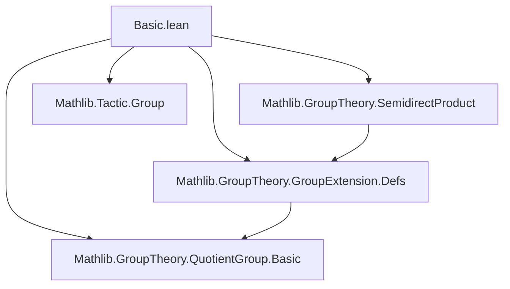
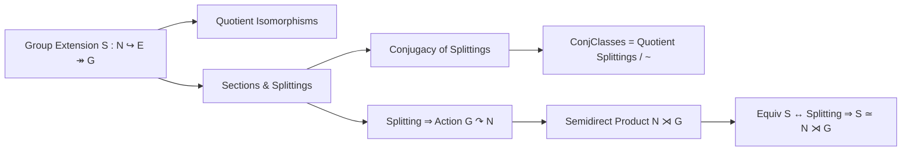

**Technical Brief: Basic.lean — Group Extension Fundamentals in Lean 4**

---

### 1. **Key Definitions & Theorems**

| Name | Type / Signature | Purpose |
|------|------------------|---------|
| `quotientKerRightHomEquivRight` | `E ⧸ S.rightHom.ker ≃* G` | Isomorphism induced by the surjective `S.rightHom` via `QuotientGroup.quotientKerEquivOfSurjective`. |
| `quotientRangeInlEquivRight` | `E ⧸ S.inl.range ≃* G` | Alternative isomorphism using `QuotientGroup.liftEquiv`, leveraging `range_inl = ker rightHom`. |
| `surjInvRightHom` | `S.Section` | A *noncomputable* section constructed via `Function.surjInv` on the surjective `S.rightHom`. |
| `Section.mul_inv_mem_range_inl` | `σ g * (σ' g)⁻¹ ∈ S.inl.range` | Key structural property: difference of two sections lies in the image of `N`. |
| `Section.exists_eq_inl_mul` | `∃ n, σ g = S.inl n * σ' g` | Consequence: any two sections differ by an `N`-factor on the left. |
| `Section.exists_mul_eq_inl_mul_mul` | `∃ n, σ(g₁g₂) = S.inl n * σ(g₁) * σ(g₂)` | Measures failure of a section to be a homomorphism; cocycle condition. |
| `Equiv.ofMonoidHom` | `(f : E →* E')` with commuting diagrams ⇒ `S.Equiv S'` | Constructs extension isomorphism from a homomorphism making diagram commute. |
| `Splitting.conjAct` | `G →* MulAut N` | Action of `G` on `N` by conjugation via a splitting `s`. |
| `Splitting.semidirectProductToGroupExtensionEquiv` | `(SemidirectProduct.toGroupExtension conjAct).Equiv S` | Shows split extensions are equivalent to those induced by semidirect products. |
| `Splitting.semidirectProductMulEquiv` | `N ⋊[conjAct] G ≃* E` | Explicit isomorphism between semidirect product and total group of a split extension. |
| `IsConj.refl`, `symm`, `trans` | `IsConj` is an equivalence relation on splittings | Establishes conjugacy of splittings as an equivalence relation. |
| `IsConj.setoid` | `Setoid S.Splitting` | Enables quotient of splittings by conjugacy. |
| `ConjClasses` | `Quotient (IsConj.setoid S)` | Set of conjugacy classes of splittings — classifies extensions up to splitting equivalence. |

---

### 2. **Naming Conventions**

- **Prefixes**:
  - `quotient*Equiv*`: Isomorphisms from quotient constructions.
  - `surjInv*`: Sections built via surjective inverse.
  - `equivComp`: Composition with an equivalence.
  - `ofMonoidHom`: Construction from a morphism satisfying diagram conditions.
  - `conjAct`: Conjugation action.
  - `semidirectProduct*Equiv*`: Equivalences involving semidirect products.
  - `IsConj.*`: Properties of conjugacy relation on splittings.

- **Suffixes**:
  - `Equiv`: Equivalence of group extensions (i.e., isomorphism in the category of extensions).
  - `Section`: Pertaining to sections of `rightHom`.
  - `Splitting`: Pertaining to splittings (i.e., sections that are homomorphisms).
  - `MulEquiv`: Multiplicative equivalence (i.e., group isomorphism).

- **Infixes**:
  - `*` for group multiplication.
  - `⁻¹` for inverses.
  - `comp` for composition of homomorphisms.

---

### 3. **Tactic Stack**

| Tactic | Frequency | Role |
|--------|-----------|------|
| `simp only [...]` | Very high | Simplification using definitional equalities, especially `rightHom_section`, `map_mul`, `map_inv`, `range_inl_eq_ker_rightHom`. |
| `group` | High | Solves group-theoretic identities (e.g., `mul_inv_cancel`, `inv_mul_cancel`). |
| `rw [...]` | High | Rewriting using lemmas like `eq_inv_mul_iff_mul_eq`, `mul_assoc`, `Function.leftInverse_invFun`. |
| `obtain ⟨n, hn⟩ := ...` | Medium | Extract witnesses from existential statements (e.g., membership in `range_inl`). |
| `congrArg DFunLike.coe` | Medium | Prove equality of homomorphisms by extensionality. |
| `ext` | Medium | Prove equality of functions/morphisms by extensionality. |
| `aesop` | Not present | Not used — proofs are explicit and constructive. |
| `ring` | Not present | Not needed — no commutative ring arithmetic. |

---

### 4. **Proof Logic**

- **Structure**: Most proofs follow a *constructive pattern*:
  1. **Existential witness extraction** (`obtain ⟨n, hn⟩`) from membership in `S.inl.range`.
  2. **Rewriting using kernel-range equivalence**: `S.range_inl_eq_ker_rightHom` is repeatedly used to translate between `range(inl)` and `ker(rightHom)`.
  3. **Group simplification** (`group`, `simp only`) to verify identities like `mul_inv_cancel`, `inv_mul_cancel`.
  4. **Leverage surjectivity/injectivity** of `rightHom`, `inl` via `Function.surjInv_eq`, `Function.leftInverse_invFun`, `S.inl_injective`.
  5. **Diagram chasing** for `Equiv.ofMonoidHom`: verify left/right inverses and commuting conditions.

- **Induction**: Not used — all proofs are algebraic and finite-step.

- **Noncomputability**: Sections and equivalences are defined noncomputably (`noncomputable def`) due to reliance on `Function.surjInv` and choice.

---

### 5. **Imports & Dependencies**

| Import | Role |
|--------|------|
| `Mathlib.GroupTheory.GroupExtension.Defs` | Core definitions: `GroupExtension`, `inl`, `rightHom`, `Section`, `Splitting`, `Equiv`. |
| `Mathlib.GroupTheory.SemidirectProduct` | Semidirect product construction and its universal property. |
| `Mathlib.GroupTheory.QuotientGroup.Basic` | Quotient groups, `quotientKerEquivOfSurjective`, `liftEquiv`. |
| `Mathlib.Tactic.Group` | Tactics like `group`, `abel`, for automated group simplification. |

---

### 6. **Mermaid Diagrams**

#### **Dependency Graph (Module-Level)**

#### **Overview of Theory Flow**

#### **Key Equivalence Chain**

---

### 7. **Summary**

This file formalizes foundational structure theory of group extensions in Lean 4, emphasizing:
- The role of quotient groups in expressing extensions as extensions of quotients.
- The classification of *split* extensions via semidirect products.
- The conjugacy relation on splittings, leading to a well-defined moduli space (`ConjClasses`).

It serves as a *technical backbone* for higher-level classification results (e.g., group cohomology via `ConjClasses`), and is tightly integrated with `Mathlib`’s group-theoretic infrastructure.

--- 

*Prepared for domain-specific AI agent training — focused on formal group theory reasoning.*
