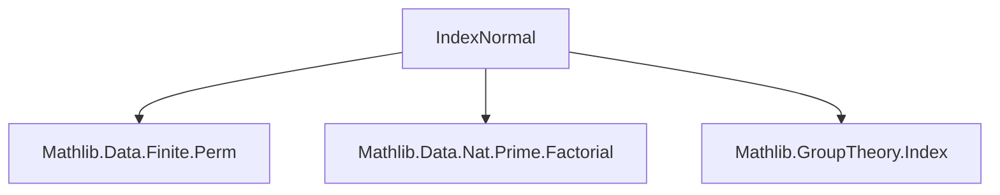

**Technical Brief: `IndexNormal.lean`**

---

### 1. KEY DEFINITIONS & THEOREMS

| Name | Type | Purpose |
|------|------|---------|
| `normal_of_index_eq_one` | `H.index = 1 → H.Normal` | Shows any subgroup of index 1 is normal (no finiteness needed). |
| `normal_of_index_eq_two` | `H.index = 2 → H.Normal` | Shows any subgroup of index 2 is normal (no finiteness needed). Uses `mul_mem_iff_of_index_two`. |
| `normal_of_index_eq_minFac_card` | `H.index = (Nat.card G).minFac → H.Normal` | In a *finite* group `G`, a subgroup whose index equals the smallest prime factor of `|G|` is normal. Core proof uses properties of `normalCore`, divisibility, and factorial bounds. |

---

### 2. NAMING CONVENTIONS

- **Prefixes**:  
  - `normal_of_...`: Indicates the theorem proves normality under a condition.
- **Suffixes**:  
  - `_eq_one`, `_eq_two`, `_eq_minFac_card`: Reflect the index condition used.
- **Core terminology**:  
  - `normalCore`, `relIndex`, `index`, `minFac`, `card`, `toPermHom`, `MulAction`, `MonoidHom`.

---

### 3. TACTIC STACK

Frequently used tactics:
- `rw` / `simp_rw`: Rewriting index equalities and membership criteria.
- `by_cases`: Splitting on `Nat.card G = 0` and `= 1`.
- `convert`: To reuse existing normality proofs (e.g., `H.normalCore_normal`).
- `apply`, `exact`, `infer_instance`: For direct proof steps.
- `dvd_antisymm`, `le_antisymm`: To prove equality of natural numbers via divisibility/inequality.
- `rwa`: Rewriting with assumptions (e.g., `rwa [← Coprime.dvd_mul_right, ...]`).
- `mul_left_inj'`, `index_ne_zero_of_finite`, `finite_of_card_ne_zero`: Leveraging arithmetic and finiteness lemmas.

---

### 4. PROOF LOGIC

The main proof (`normal_of_index_eq_minFac_card`) follows this logical flow:

1. **Case split** on `Nat.card G = 0` or `= 1`, reducing to `index = 2` or `index = 1`, handled by prior lemmas.
2. Assume `Nat.card G ≥ 2`, so `G` finite and `H.index` is a prime `p` (by `minFac_prime`).
3. Reduce to proving `H.normalCore.relIndex H = 1`, i.e., `H.normalCore` has index 1 in `H`, implying equality and hence normality of `H`.
4. Use the identity:  
   $$
   [H : H^\triangleleft] = [G : H^\triangleleft] / [G : H]
   $$
   where $H^\triangleleft = \mathrm{normalCore}(H)$.
5. Show $[G : H^\triangleleft] \mid [G : H]!$ via embedding into permutations:  
   $G \curvearrowright G/H$ gives a homomorphism $G \to \mathrm{Sym}(G/H) \cong S_p$, and $\ker = H^\triangleleft$.
6. Use factorial divisibility and primality of $p$ to show $[G : H^\triangleleft] = p$, hence $[H : H^\triangleleft] = 1$.

---

### 5. IMPORTS

- `Mathlib.Data.Finite.Perm`: Permutations on finite types.
- `Mathlib.Data.Nat.Prime.Factorial`: Factorial and prime factorization facts (e.g., `coprime_factorial_iff`).
- `Mathlib.GroupTheory.Index`: Index of subgroups, core, coset actions.

---

### 6. DEPENDENCY & THEORY OVERVIEW

#### Mermaid Diagram: Module Dependencies



#### Mermaid Diagram: Theoretical Flow

```mermaid
graph LR
  A[Subgroup H ≤ G] --> B{Index conditions}
  B -->|index = 1| C[normal_of_index_eq_one]
  B -->|index = 2| D[normal_of_index_eq_two]
  B -->|finite G, index = minFac(|G|)| E[normal_of_index_eq_minFac_card]
  E --> F[Use normalCore]
  F --> G[Embed G → Sym(G/H)]
  G --> H[Kernel = normalCore]
  H --> I[Divisibility & factorial bounds]
  I --> J[normalCore = H ⇒ H.Normal]
```

---

### 7. KEY LEMMAS & TOOLS USED

- `index_eq_one`: Characterizes index-1 subgroups.
- `mul_mem_iff_of_index_two`: Membership criterion for index-2 subgroups.
- `normalCore_eq_ker`, `index_ker`: Relates core to kernel of coset action.
- `index_dvd_of_le`, `relIndex_mul_index`: Index arithmetic.
- `minFac_prime`, `minFac_dvd`, `minFac_le_of_dvd`: Prime factor facts.
- `card_subgroup_dvd_card`: Lagrange’s theorem for subgroups.
- `Nat.coprime_factorial_iff`: Coprimality with factorial.

---

### 8. SUMMARY

This module formalizes classical results about when subgroups of small index must be normal. It combines elementary group theory (coset actions, core, Lagrange) with number-theoretic tools (prime factorization, factorial divisibility). The proof of the main theorem is nontrivial, relying on bounding the index of the core using permutation group theory and factorial arithmetic.
