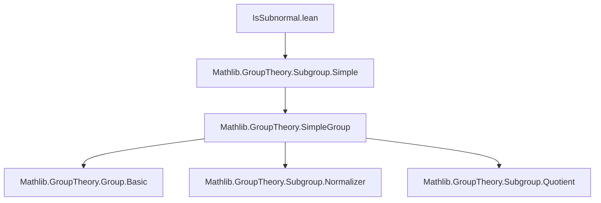
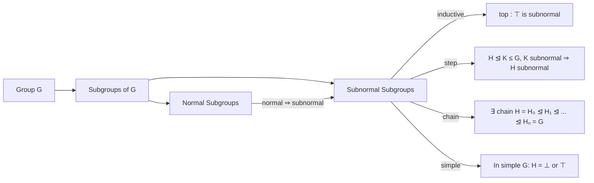
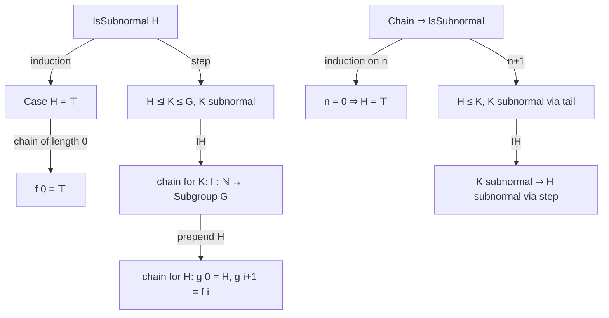

### Technical Brief: `IsSubnormal.lean`

---

#### **1. Key Definitions & Theorems**

| Name | Type / Signature | Purpose |
|------|------------------|---------|
| `IsSubnormal` | `inductive IsSubnormal : Subgroup G → Prop` | Inductive predicate defining subnormal subgroups: either `H = ⊤`, or `H ⊴ K ≤ G` with `K` subnormal. |
| `AddSubgroup.IsSubnormal` | `inductive IsSubnormal : AddSubgroup G → Prop` | Additive analogue of `IsSubnormal`. |
| `Normal.isSubnormal` | `H.Normal → IsSubnormal H` | Every normal subgroup is subnormal (via `step` with `K = ⊤`). |
| `bot` | `IsSubnormal (⊥ : Subgroup G)` | Trivial subgroup is subnormal (since `⊥ ⊴ ⊤`). |
| `normal_of_isSimpleGroup` | `IsSimpleGroup G → IsSubnormal H → H.Normal` | In a simple group, any subnormal subgroup is normal. |
| `eq_bot_or_top_of_isSimpleGroup` | `IsSimpleGroup G → IsSubnormal H → H = ⊥ ∨ H = ⊤` | In a simple group, only `⊥` and `⊤` are subnormal. |
| `iff_eq_top_or_exists` | `IsSubnormal H ↔ H = ⊤ ∨ ∃ K, H < K ∧ IsSubnormal K ∧ (H.subgroupOf K).Normal` | Alternative inductive characterization: either top or strictly contained in a proper normal subnormal subgroup. |
| `exists_normal_and_le_and_lt_top_of_ne` | `H.IsSubnormal → H ≠ ⊤ → ∃ K, K.Normal ∧ H ≤ K ∧ K < ⊤` | Proper subnormal subgroups lie in a proper normal subgroup. |
| `lt_normal` | `H.IsSubnormal → H = ⊤ ∨ ∃ K, K.Normal ∧ H ≤ K ∧ K < ⊤` | Disjunction: either whole group or lies in a proper normal subgroup. |
| `isSubnormal_iff` | `IsSubnormal H ↔ ∃ n, ∃ f : ℕ → Subgroup G, Monotone f ∧ (∀ i, (f i ≤ f i+1).Normal) ∧ f 0 = H ∧ f n = ⊤` | Chain characterization: finite increasing chain from `H` to `⊤` with each step normal. |
| `trans'` | `{H : Subgroup K} → IsSubnormal H → IsSubnormal K → IsSubnormal (H.map K.subtype)` | Transitivity via pullback/pushforward along subtype. |
| `trans` | `H ≤ K → IsSubnormal (H.subgroupOf K) → IsSubnormal K → IsSubnormal H` | Standard transitivity: if `H ⊴◃ K ⊴◃ G`, then `H ⊴◃ G`. |

---

#### **2. Naming Conventions**

- **Prefixes**:
  - `isSubnormal_`: for lemmas about `IsSubnormal`.
  - `normal_`: for normality-related lemmas (e.g., `normal_bot`, `normal_of_isSimpleGroup`).
  - `eq_bot_or_top_`: for results about subnormal subgroups in simple groups.
- **Suffixes**:
  - `_of_isSimpleGroup`: results assuming `IsSimpleGroup`.
  - `_iff`: equivalence lemmas.
  - `_trans` / `_trans'`: transitivity lemmas (with/without explicit subtype).
- **Inductive constructors**:
  - `top`, `step`: standard for inductive definitions.

---

#### **3. Tactic Stack**

Frequently used tactics:
- `induction hN with | top | step ...`: structural induction on `IsSubnormal`.
- `obtain rfl | h := eq_or_ne H ⊤`: case split on equality with `⊤`.
- `grind`: custom tactic (likely `grind` from Mathlib’s `Grind` module for automated reasoning).
- `simp`, `simp only`, `simp_rw`: simplification, especially with `normal_subgroupOf_iff_le_normalizer`, `normalizer_eq_top_iff`, etc.
- `refine`, `exact`, `apply`: for constructing proofs stepwise.
- `monotone_nat_of_le_succ`, `monotone_iff_forall_lt`: for verifying monotonicity of sequences.

---

#### **4. Proof Logic**

- **Inductive structure**: Proofs over `IsSubnormal` use induction on its two constructors (`top`, `step`).
- **Case analysis**: On whether a subgroup equals `⊤` or not (`eq_or_ne H ⊤`), or whether a simple group’s subnormal subgroup is `⊥` or `⊤`.
- **Chain construction**: For `isSubnormal_iff`, the `mp` direction builds a chain by induction; the `mpr` direction uses induction on chain length `n`.
- **Transitivity**: Proven via `trans'` (map along subtype) and then specialized to `trans` using `map_subgroupOf_eq_of_le`.
- **Simple groups**: Leverage `IsSimpleGroup.eq_bot_or_eq_top` on normal subgroups (since subnormal ⇒ normal in simple groups).

---

#### **5. Imports**

- `Mathlib.GroupTheory.Subgroup.Simple`: Provides `IsSimpleGroup`, basic facts about simple groups and their subgroups.

---

#### **8. Mermaid Diagrams**

##### **Dependency Graph (Module-Level)**

##### **Conceptual Overview of Theory**

##### **Proof Strategy Flow (for `isSubnormal_iff`)**

--- 

This module formalizes subnormality in a way that is both *inductively convenient* and *classically equivalent* (via `isSubnormal_iff`), enabling clean reasoning about composition series, solvability, and simplicity.
