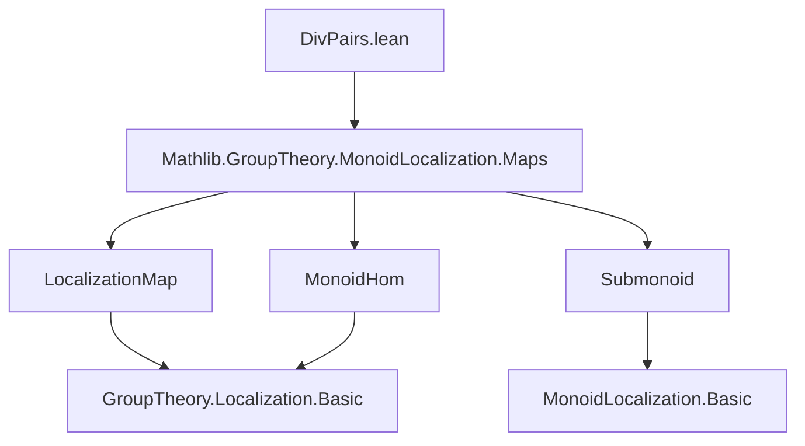
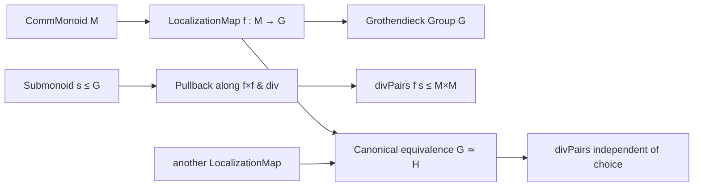

**Technical Brief: `DivPairs.lean`**

---

### 1. **Key Definitions & Theorems**

| Name | Type / Signature | Purpose |
|------|------------------|---------|
| `divPairs` | `def divPairs (f : ⊤.LocalizationMap G) (s : Submonoid G) : Submonoid (M × M)` | Constructs the submonoid of pairs `(a, b) ∈ M × M` such that `f a / f b ∈ s`, i.e., the preimage of `s` under the monoid homomorphism induced by `f × f` followed by division in the Grothendieck group. |
| `mem_divPairs` | `lemma x ∈ divPairs f s ↔ f x.1 / f x.2 ∈ s` | Membership characterization: a pair belongs to `divPairs f s` iff its image under `f`-quotient lies in `s`. |
| `divPairs_comap` | `lemma divPairs g (.comap (g.mulEquivOfLocalizations f).toMonoidHom s) = divPairs f s` | Independence of the choice of localization map: changing from `f` to `g` via the canonical equivalence preserves `divPairs`. |

> **Note**: The to-additive version (not shown in full) defines `subPairs` for additive notation: `f a - f b ∈ s`.

---

### 2. **Naming Conventions**

- **Prefixes**:
  - `divPairs`: compound noun naming the construction (division → pairs).
  - `mem_`: standard Lean convention for membership lemmas.
  - `comap`: standard for preimage under a monoid homomorphism.
- **Suffixes**:
  - `Pairs`: indicates the domain is a product type (`M × M`).
- **Functional style**:
  - Arguments ordered as `(f s)` or `(f g s)` to support currying and local scope.
- **To-additive annotations**:
  - `@[to_additive ...]` used to generate additive analogues (`subPairs`, `-` instead of `/`).

---

### 3. **Tactic Stack**

- `simp`: heavily used for simplification, especially in `mem_divPairs` (`rfl`) and `divPairs_comap`.
- `ext`: extensionality to prove equality of submonoids (pointwise membership).
- `rfl`: for definitional equality (e.g., `mem_divPairs`).
- Implicit use of:
  - `LocalizationMap.toMonoidHom`
  - `divMonoidHom`, `.prodMap`, `.comap` — from `Mathlib.GroupTheory.MonoidLocalization.Maps`.

> No heavy automation (e.g., `aesop`, `ring`, `linarith`) appears — proofs are mostly definitional or rely on `simp`-normalization.

---

### 4. **Proof Logic**

- **`mem_divPairs`**: Immediate by definition (`rfl`) — `divPairs` is defined as a `comap`, and membership in a `comap` is definitional.
- **`divPairs_comap`**:
  1. Extend to pointwise equality (`ext`).
  2. Unfold definitions (`divPairs`, `comap`, `mulEquivOfLocalizations`, `toMonoidHom`).
  3. Simplify using `simp` — relies on properties of localization equivalences and monoid homomorphisms.
  4. Goal reduces to identity: the two ways of pulling back `s` (via `f` or via `g`) coincide due to naturality of localization equivalence.

> Core idea: **functoriality of localization and independence of choice of localization map**.

---

### 5. **Imports**

- `Mathlib.GroupTheory.MonoidLocalization.Maps`: provides:
  - `LocalizationMap`, `LocalizationMap.toMonoidHom`
  - `divMonoidHom`
  - `mulEquivOfLocalizations`, `mulEquivOfLocalizations.toMonoidHom`
  - `Submonoid.comap`, `prodMap`

> This module sits in the hierarchy of **Grothendieck group constructions** and **submonoid localization**.

---

### 6. **Mermaid Diagrams**

#### **Dependency Graph (Module-Level)**



#### **Theoretical Overview (Conceptual Flow)**



#### **Structure of `divPairs` Construction**

```mermaid
graph LR
  M×M --> prodMap[f×f] --> G×G
  G×G --> divMonoidHom --> G
  s[Submonoid s ≤ G] --> comap --> divPairs ≤ M×M
```

---

### 7. **Domain Context**

- **Area**: Commutative algebra / category theory, specifically **localization of monoids/groups**.
- **Role**: Enables defining submonoids of “divisible pairs” relative to a submonoid in the localized group — foundational for constructing localized submonoids or subgroups (e.g., in sheaf theory, valuation theory, or Grothendieck group constructions with constraints).
- **Future work**: The `TODO` suggests future `simp`-normalization of `LocalizationMap.toMonoidHom`, which would make `mem_divPairs` automatically simplifiable.

--- 

Let me know if you'd like the additive version (`subPairs`) formalized or further elaborated.
