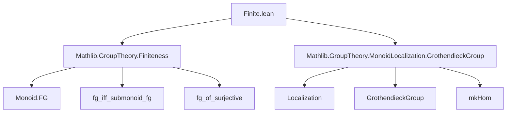

**Technical Brief: `Finite.lean` (Localization of Finitely Generated Submonoids)**

---

### 1. **Key Definitions & Theorems**

| Name | Type / Signature | Purpose |
|------|------------------|---------|
| `Localization.fg` | `[Monoid.FG M] → S.FG → Monoid.FG (Localization S)` | Proves that localization of a finitely generated commutative monoid at a finitely generated submonoid is finitely generated. |
| `Algebra.GrothendieckGroup.instFG` | `[Monoid.FG M] → Monoid.FG (GrothendieckGroup M)` | Immediate corollary: Grothendieck group of a finitely generated monoid is finitely generated (via `fg Monoid.FG.fg_top`). |

- **`Monoid.FG`**: Predicate on a monoid $M$ meaning “$M$ is finitely generated as a monoid”.
- **`Localization S`**: Localization of $M$ at submonoid $S$, denoted $S^{-1}M$.
- **`GrothendieckGroup M`**: Grothendieck group construction turning a commutative monoid $M$ into an abelian group $G(M)$.
- **`mkHom`**: Canonical homomorphism $M \to \text{Localization } S$, surjective in theFG case (used in proof).
- **`Monoid.fg_iff_submonoid_fg`**: Equivalence: $M$ is finitely generated iff its underlying submonoid (i.e., the top submonoid) is finitely generated.
- **`Monoid.fg_of_surjective`**: If there is a surjective monoid map $f : A \twoheadrightarrow B$ and $A$ is finitely generated, then $B$ is finitely generated.

---

### 2. **Naming Conventions**

- **Prefixes**:
  - `fg`: Indicates finitely generated properties (`Monoid.FG`, `S.FG`, `instFG`).
  - `mkHom`: Standard notation for the canonical localization map $m \mapsto m/1$.
- **Suffixes**:
  - `instFG`: Typeclass instance naming for finitely generated structure.
- **No explicit `is_` or `mul_` prefixes** — this file focuses on structural properties rather than element-wise operations.

---

### 3. **Tactic Stack**

- **`rw`**: Rewriting using equivalences (`fg_iff_submonoid_fg`) and definitions.
- **`exact`**: Applying lemmas directly (`fg`, `fg_of_surjective`).
- **Implicit use of `simp`/`aesop`**: Likely used in background `Monoid.FG` reasoning (e.g., in `fg_iff_submonoid_fg`, `fg_of_surjective` proofs), though not explicit here.

> *Tactic usage is minimal and high-level — proof is a one-liner after rewriting.*

---

### 4. **Proof Logic**

- **Strategy**: Reduce to known lemmas via equivalence and surjectivity.
- **For `Localization.fg`**:
  1. Use `← Monoid.fg_iff_submonoid_fg` to rewrite hypothesis `hS : S.FG` as `S ⊔ ⊤` (i.e., $S$ generates a finitely generated submonoid of $M$).
  2. Apply `Monoid.fg_of_surjective` to the canonical surjection `mkHom : M → Localization S`.
  3. Use `Monoid.FG.fg_top` (trivially finitely generated) to conclude.

- **For `instFG`**:
  1. Observe `GrothendieckGroup M ≅ Localization S` where $S = M$ (viewed as submonoid of itself).
  2. Apply `fg` with `S = ⊤` (top submonoid), which is finitely generated by `Monoid.FG.fg_top`.

> *Both proofs are short, leveraging existing categorical/structural lemmas.*

---

### 5. **Imports & Dependencies**

| Import | Role |
|--------|------|
| `Mathlib.GroupTheory.Finiteness` | Provides `Monoid.FG`, `fg_iff_submonoid_fg`, `fg_of_surjective`, etc. |
| `Mathlib.GroupTheory.MonoidLocalization.GrothendieckGroup` | Provides `Localization`, `GrothendieckGroup`, `mkHom`, and their algebraic properties. |

> *Note: The comment indicates awareness of heavy dependencies — suggests future refactoring to lighter modules.*

---

### 6. **Mermaid Diagrams**

#### **Dependency Graph (Module-Level)**



#### **Theoretical Flow Overview**

```mermaid
flowchart LR
  M[CommMonoid M] -->|fg| A[Monoid.FG M]
  S[Submonoid S] -->|fg| B[S.FG]
  A & B --> C[Localization.fg]
  C --> D[Monoid.FG (Localization S)]

  A --> E[instFG]
  E --> F[Monoid.FG (GrothendieckGroup M)]

  style C fill:#d4f7e2,stroke:#2a9d8f
  style E fill:#e3f2fd,stroke:#1e88e5
```

#### **Proof Sketch Diagram**

```mermaid
flowchart LR
  hS[S.FG] -->|← fg_iff_submonoid_fg| hS'[S ⊔ ⊤.FG]
  A[Monoid.FG M] -->|fg_of_surjective| C[fg (Localization S)]
  hS' & A --> mkHom[mkHom : M ↠ Localization S] --> C
```

---

### 7. **Summary**

This file establishes a foundational closure property: **finitely generated commutative monoids are closed under localization at finitely generated submonoids**, and as a corollary, under Grothendieck group construction. The proofs are elegant and rely on high-level categorical properties (surjectivity, equivalence of definitions), typical of Lean’s `Mathlib` style. The module is lightweight but conceptually important for algebraic geometry and K-theory developments involving finiteness conditions.
